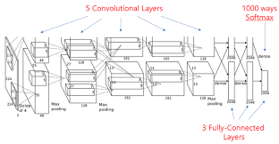
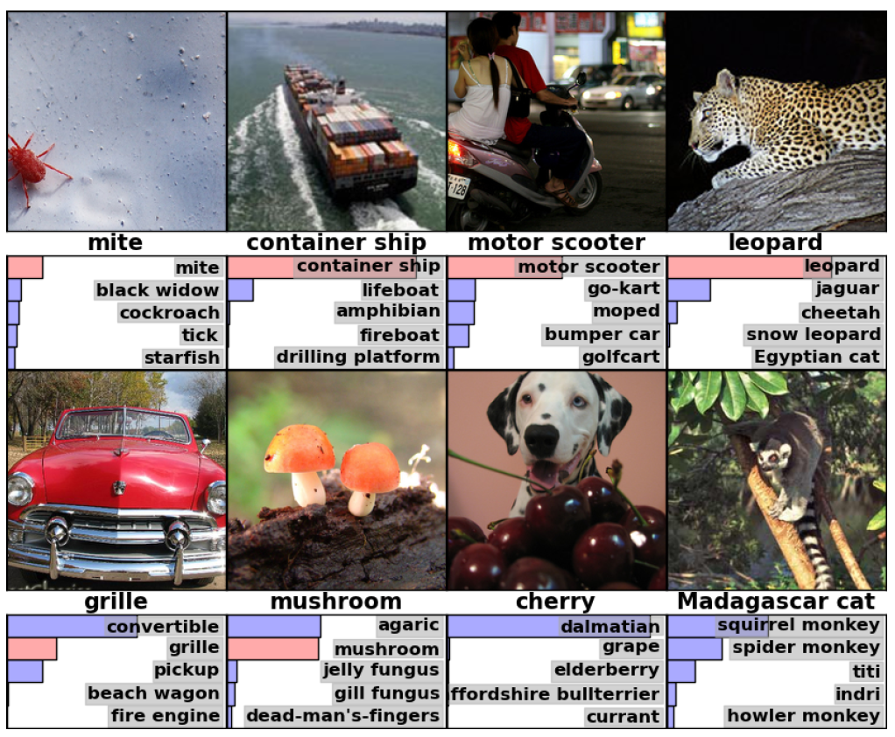

# AlexNet

- ### AlexNet 기본구조

  - 

  - conv layer, max-pooling layer, dropout layer 5개

  - 약 65만개의 뉴런, 6000만개의 free parameter, 6억 3000만개의 connection

  - 학습하는데 일주일넘게 걸림

  - fully connected layer 3개

  - 2개의 GPU (GTX580)를 사용 : 3GB 메모리 한계에 맞춤

    - GPU-1 : 주로 컬러와 상관없는 정보를 추출하기 위한 kernel을 학습
    - GPU-2 : 주로 컬러와 관련된 정보를 추출하기 위한 kernel을 학습

  - nonlinearity function : ReLU

  - batch stochastic gradient descent

    

- ### AlexNet 성능향상을 위한 노력

  - ReLU

    - 신경망의 활성함수로 biological neuron을 모델링하기 위해 nonlinear함수로 sigmoid 함수를 사용했었다. 하지만 매우 느리다. 심지어 tanh함수도 느리다. AlexNet 같이 망이 엄청큰 경우 학습속도에 치명적인 영향을 준다. ReLU을 사용하면 6배 빨리진다고 한다.

  - Overlapped pooling

    - 통상적으로 pooling을 할 때 겹치는 부분은 없게 하는데 AlexNet은 2x2 window대신 3x3 window을 사용하고 stride를 2로 했다.이 방식을 통해 top-1 과 top-5의 에러율을 각각 0.4%, 0.3% 줄일 수 있었으며, overfitting에 빠질 가능성도 더 줄일 수 있다고 주장한다.

  - Local Response Normalization 

    - ReLU을 사용하면 입력단의 normalization이 필요가 없어진다. ReLU은 입력단의 비례하여 그대로 증가한다. 이는 lateral inhibition(강한 자극이 주변 약한 자극이 전달되는것을 방해효과)와 같은 얻을 수 있기에 generalization 관점에서는 훨씬 더 좋아진다.

  - Overfitting 을 막기 위해

    - AlexNet의 free parameter의 개수는 6000만개에 이르기 때문에 overffing 문제로 고생할 수 있다. 그래서 학습 영상수를 늘리기 위해 data augmentation, dropout방법을 사용했다.

      

- ### AlexNet 결과

  - 