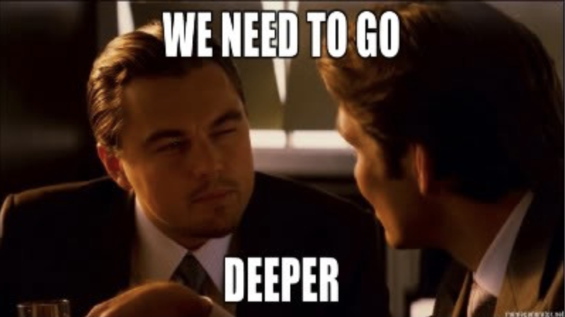
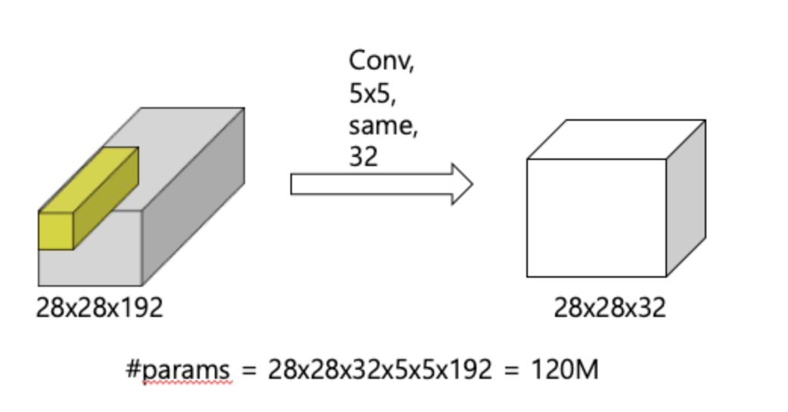
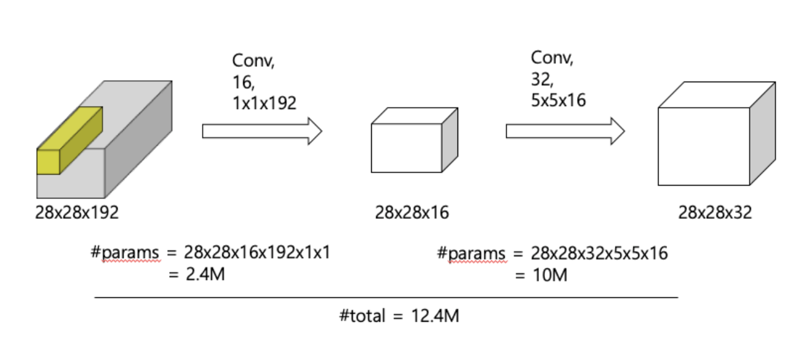
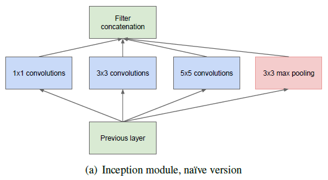
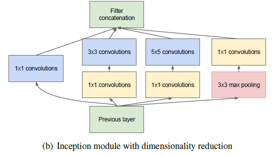
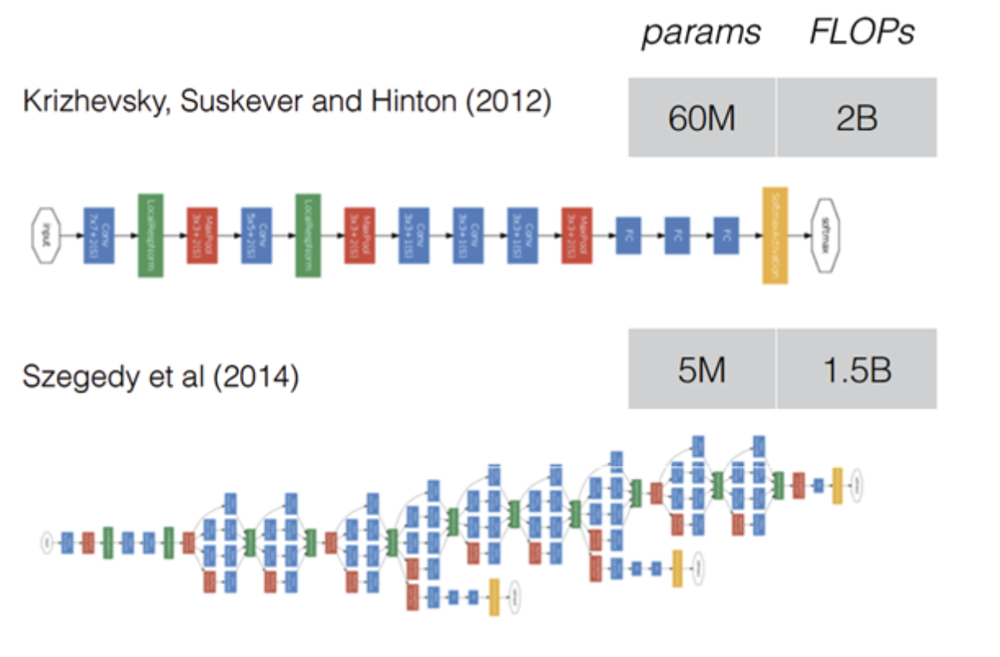
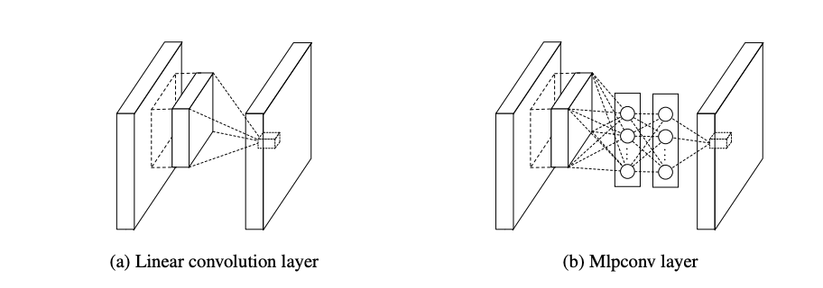

# GoogleNet

- ### AlexNet 보다 더 깊게깊게 : VGGNet(2014), GoogleNet(2015)

  - vgg는 다음 시간에 

  - googleNet : 보통 convolution layer에 한가지 conv filter을 사용한다. 하지만, googleNet은 여러종류의 filter와 pooling을 도입하였다. 개별 layer을 두텁게 확장시켰다.  (inception module)

  - 

    

- ### 더 깊어지면 부작용은 없는가? 

  - free parameter 개수 증가로 overfitting 문제 발생 

  - 연산량 증가

  - so, 모바일이나 embedded 시스템에 CNN을 활용하기 어렵다. 연산능력 메모리 사용등 훨씬 제한될것이다. 단순히 망을 깊게 만든느게 아니라 *구조적인 변화* 가 필요하다.

    

- ### GoogLeNet 의 Incption module

  - #### 1x1 convolution layer을 사용

    - 1. channel 수 감소
      2. 계산량 감소
      3. 비선형성

    - 1*1 사이즈를 사용한다는 것은 한 픽셀만 고려하기 때문에 패턴 인식보다는 dimension reduction 이라는 전처리 용도로 생각해야 한다.

    - 

    - 

      

  - #### inception modules

    - 

    - without 1x1 convolution layer

    - 

    - with 1x1 convolution layer

      

  - #### AlexNet 과 GoogLeNet 비교

    - 망의 깊이는 더 깊지만 free parameter의 개수가 1/2개이다. 전체 연산량도 적다.
    - 
    - 구글팀은 망을 더 깊게 만들어 성능 향상을 하면서도, 연산량을 증가시키지 않은 CNN구조를 개발하기 위해 많은 연구를 했다.

    

  - ### GoogleNet 이 참고한 논문 

    - [network in network](https://arxiv.org/pdf/1312.4400.pdf)
      - NIN 설계자는 convolution layer가 local receptive filed에서 featrue을 뽑아내는 능력은 우수하지만, filter의 특징이 linear하기 때문에 non-linear한 성질을 갖는 feature을 추출하는데 어려움이 있다고 지적했다.이를 극복하기 위해 feature map의 개수를 늘려야 하는데 이러면 연산량이 늘어난다는 문제점이 있다. 
      - 이를 위해 micro neural network를 설계하였다.
      - 
      - GoogleNet도 인셉션 모듈을 총 9개 사용했다.개념적으로 NIN과 맥이 닿는다. 

