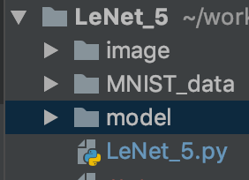
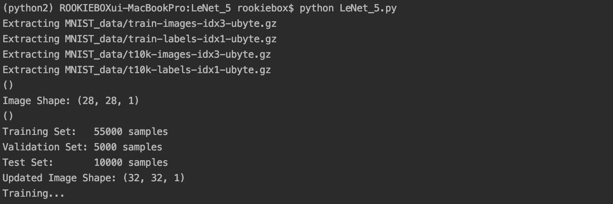
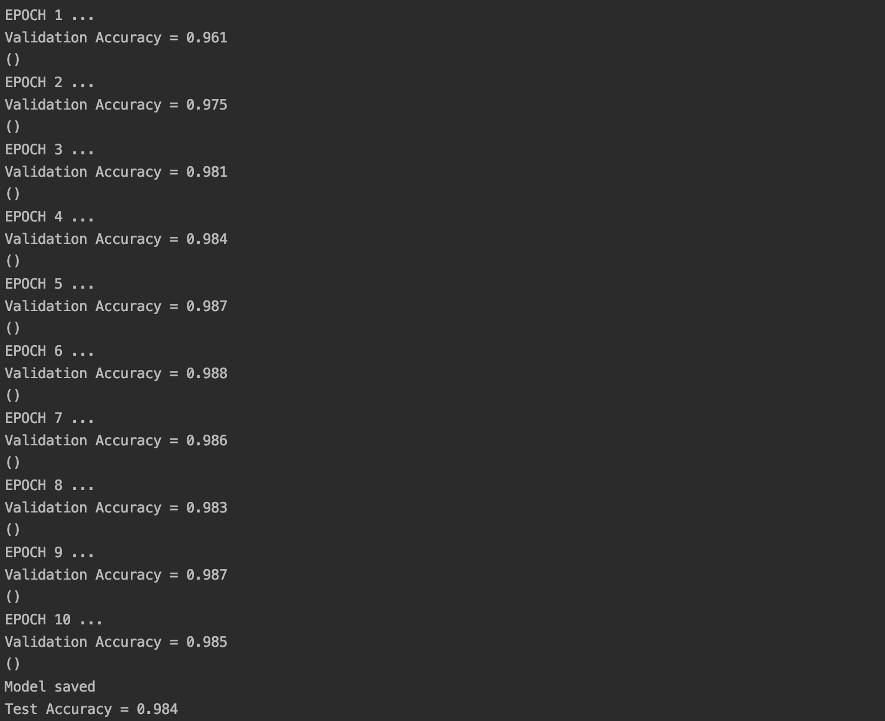
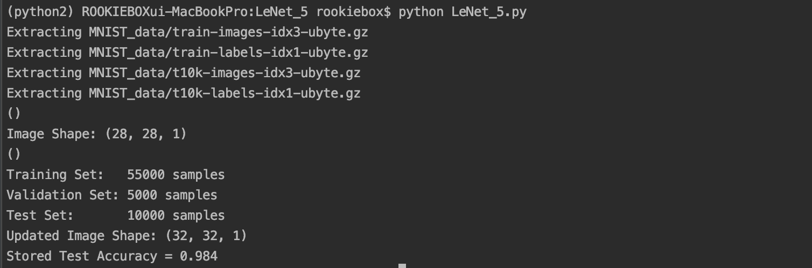

# week22_LeNet5_implementation
[소스 파일 위치: LeNet_5.py](https://github.com/jominjimail/python_proj/tree/master/LeNet_5) 

소스 파일이 있는 directory에 *model* 이라는 directory를 만들어 줘야 함



## 환경

- Python 2.7.15 :: Anaconda custom (64-bit)

- import tensorflow as tf
  tf.__ version __
  '0.9.0'

- ```python
  from tensorflow.examples.tutorials.mnist import input_data
  ```


## 모델 구현

- ````python
  def LeNet(x):
      # Hyperparameters
      mu = 0
      sigma = 0.1
      layer_depth = {
          'layer_1': 6,
          'layer_2': 16,
          'layer_3': 120,
          'layer_f1': 84
      }
  ````

  - mu: mean

    

- ### Layer1

- ```python
  # TODO: Layer 1: Convolutional. Input = 1@32x32. Output = 6@28x28.
  conv1_w = tf.Variable(tf.truncated_normal(shape=[5, 5, 1, 6], mean=mu, stddev=sigma))
  conv1_b = tf.Variable(tf.zeros(6))
  conv1 = tf.nn.conv2d(x, conv1_w, strides=[1, 1, 1, 1], padding='VALID') + conv1_b
  # TODO: Activation.
  conv1 = tf.nn.relu(conv1)
  
  # TODO: Pooling(Subsampling). Input = 6@28x28. Output = 6@14x14.
  pool_1 = tf.nn.max_pool(conv1, ksize=[1, 2, 2, 1], strides=[1, 2, 2, 1], padding='VALID')
  
  ```

  - 잘린(절단)정규분포(truncated normal distribution) - 정규분포에서 일부 구간을 잘라낸 분포

  - conv1_2 == filter == 5x5

  - **ksize**: A list or tuple of 4 ints. The size of the window for each dimension of the input tensor.

  - ```python
    tf.nn.conv2d(
        input,
        filter,
        strides,
        padding,
        use_cudnn_on_gpu=True,
        data_format='NHWC',
        dilations=[1, 1, 1, 1],
        name=None
    )
    ```

- ### Layer2

- ```python
  # TODO: Layer 2: Convolutional. Input = 6@14x14. Output = 16@10x10.
  conv2_w = tf.Variable(tf.truncated_normal(shape=[5, 5, 6, 16], mean=mu, stddev=sigma))
  conv2_b = tf.Variable(tf.zeros(16))
  conv2 = tf.nn.conv2d(pool_1, conv2_w, strides=[1, 1, 1, 1], padding='VALID') + conv2_b
  # TODO: Activation.
  conv2 = tf.nn.relu(conv2)
  
  # TODO: Pooling. Input = 16@10x10. Output = 16@5x5.
  pool_2 = tf.nn.max_pool(conv2, ksize=[1, 2, 2, 1], strides=[1, 2, 2, 1], padding='VALID')
  
  # TODO: Flatten. Input = 16@5x5. Output = 400 == 16*5*5
  fc1 = flatten(pool_2)
  
  ```

- ### Layer 3,4,5

- ```python
  # TODO: Layer 3: Fully Connected. Input = 400. Output = 120.
  fc1_w = tf.Variable(tf.truncated_normal(shape=(400, 120), mean=mu, stddev=sigma))
  fc1_b = tf.Variable(tf.zeros(120))
  fc1 = tf.matmul(fc1, fc1_w) + fc1_b # basic multiple
  # TODO: Activation.
  fc1 = tf.nn.relu(fc1)
  
  # TODO: Layer 4: Fully Connected. Input = 120. Output = 84.
  fc2_w = tf.Variable(tf.truncated_normal(shape=(120, 84), mean=mu, stddev=sigma))
  fc2_b = tf.Variable(tf.zeros(84))
  fc2 = tf.matmul(fc1, fc2_w) + fc2_b
  # TODO: Activation.
  fc2 = tf.nn.relu(fc2)
  
  # TODO: Layer 5: Fully Connected. Input = 84. Output = 10.
  fc3_w = tf.Variable(tf.truncated_normal(shape=(84, 10), mean=mu, stddev=sigma))
  fc3_b = tf.Variable(tf.zeros(10))
  logits = tf.matmul(fc2, fc3_w) + fc3_b
  
  ```


## 데이터 전처리

- ```python
  def reformat(dataset, labels):
   dataset = dataset.reshape((-1, image_size, image_size, num_channels)).astype(np.float32)
   return dataset, labels
  ```

  - ```python
    mnist = input_data.read_data_sets("MNIST_data/")
    X_train, y_train = mnist.train.images, mnist.train.labels
    X_train, y_train = reformat(X_train, y_train)
    ```

    - moist.train.images 의 shape가 (784, ) 여서 (28x28x1)로 reshape 해줌
    - validation, test도 reshape 해줌

    

- ```python
  # Pad images with 0s
  X_train = np.pad(X_train, ((0, 0), (2, 2), (2, 2), (0, 0)), 'constant')
  X_validation = np.pad(X_validation, ((0, 0), (2, 2), (2, 2), (0, 0)), 'constant')
  X_test = np.pad(X_test, ((0, 0), (2, 2), (2, 2), (0, 0)), 'constant')
  ```

  - Layer 1: Convolutional. Input = 1@32x32 을 맞추기 위해 padding 추가
  - 32x32x1 이 됨


## tf.train.Saver를 이용해서 CNN 모델과 파라미터를 저장하고 불러오기

- ```python
  import os
  SAVER_DIR = os.getcwd()+'/model'
  SAVER_DIR_2 = SAVER_DIR+'/train'
  saver = tf.train.Saver()
  ckpt = tf.train.get_checkpoint_state(SAVER_DIR)
  ckpt_2 = tf.train.latest_checkpoint(SAVER_DIR)
  ```

  - os.getcwd는 현재 자신의 디렉터리 위치를 리턴해줌

  - SAVER_DIR : 저장할 위치를 지정해줌, checkpoint 위치

  - SAVER_DIR_2 : train 에 이용됨

  - ckpt : restore 에 이용됨

  - ckpt_2 : resotre 에 이용됨

    

- ```python
  # 세션을 열어 실제 학습을 진행
  with tf.Session() as sess:
      # 모든 변수들을 초기화
      sess.run(tf.initialize_all_variables())
      # 만약 저장된 모델과 파라미터가 있으면 이를 불러오고 (Restore)
    	# Restored 모델을 이용해서 테스트 데이터에 대한 정확도를 출력하고 프로그램을 종료합니다.
      if ckpt and ckpt.model_checkpoint_path:
          saver.restore(sess, ckpt_2)
          test_accuracy = evaluate(X_test, y_test)
          print("Stored Test Accuracy = {:.3f}".format(test_accuracy))
          sess.close()
      	exit()
  
      num_examples = len(X_train)
  
      print("Training...")
      print()
      # Epoch마다 training 데이터셋에 대한 정확도를 출력하고 tf.train.Saver를 이용해서 모델과 파라미터를 저장
      for i in range(EPOCHS):
          for offset in range(0, num_examples, BATCH_SIZE):
              end = offset + BATCH_SIZE
              batch_x, batch_y = X_train[offset:end], y_train[offset:end]
              sess.run(training_operation, feed_dict={x: batch_x, y: batch_y})
  
  
          validation_accuracy = evaluate(X_validation, y_validation)
          print("EPOCH {} ...".format(i + 1))
          print("Validation Accuracy = {:.3f}".format(validation_accuracy))
          print()
          saver.save(sess, SAVER_DIR_2, global_ste
  ```

  - Saver 의 save 모듈을 이용해 모델을 저장할 때, Saver 는 **Checkpoint State Protocol Buffer** 를 /saved/checkpoint 파일에 담아 저장하고, 새로운 job으로 학습할 때 마다 업데이트해 저장한다.

  - 첫번째 정보 : model_checkpoint_path : 가장 최근에 저장된 job.ckpt 파일의 path 정보

  - 두번째 정보 : all_model_checkpoint_paths : 최근에 저장된 job_i.ckpt 파일들의 path 정보 list

  - all_model_checkpoint_paths 의 가장 마지막 원소는 model_checkpoint_path 와 동일하다.

  - ckpt = tf.train.get_checkpoint_state(SAVER_DIR)

    - 첫번째 정보 사용법 : ckpt.model_checkpoint_path
    - 두번째 정보 사용법 : ckpt.all_model_checkpoint_paths

    

## 결과

- 처음 train





- 이후 train



- 폴더


- checkpoint


