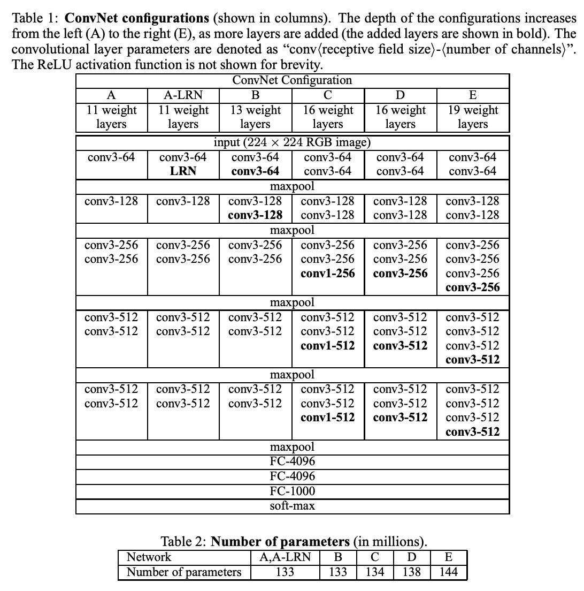
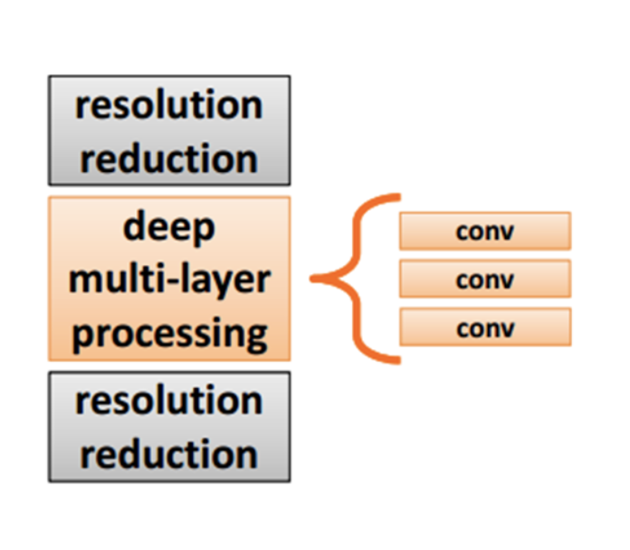
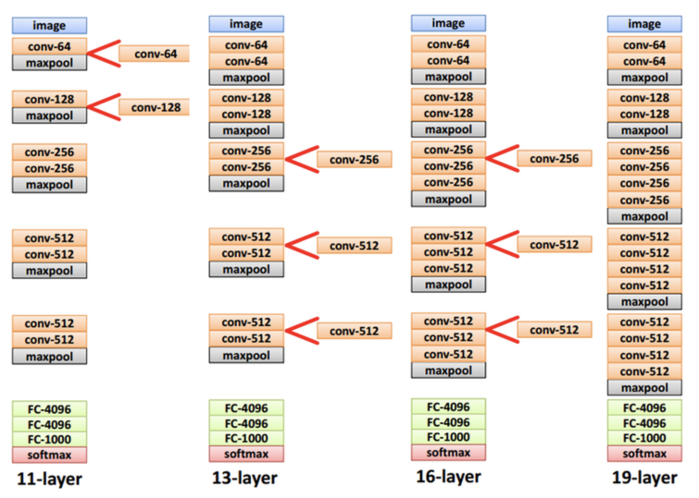
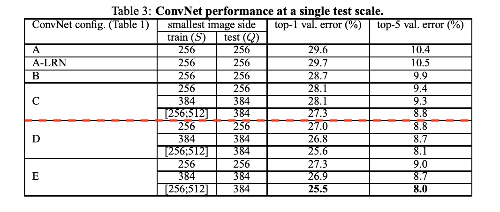
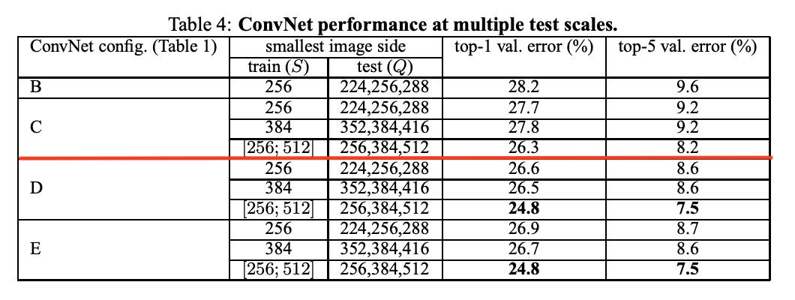
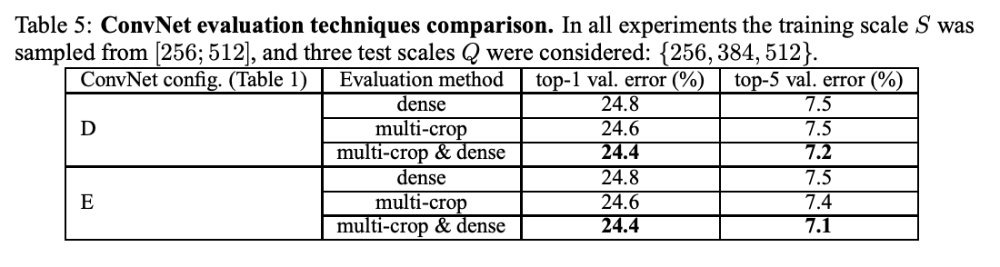

# VGG Net

2014년 ILSVRC 대회에서 2위를 했지만, 1위를 한 GoogleNet 보다 구조적으로 훨씬 간단해서 이해가 쉽고 변형이 용이하기에 더 많이 사용된는 모델이다.

[논문 참고](https://arxiv.org/abs/1409.1556)

## VGG 구조

- 망의 깊이가 어떤 영향을 주는지 궁금했다. 그래서 가장 간단하고 작은  3x3 receptive field을 사용했다.
- 아래 table 1이 저자들이 만든 6개의 구조이다.
- 224 × 224 RGB image을 입력으로 받아드려 conv layer, pooling layer, fc layer을 거친다.  The convolution stride is fixed to 1 pixel
- All hidden layers are equipped with the rectification (ReLU (Krizhevsky et al., 2012)) non-linearity.
- VGG 의 단점은 아래 table 2에 볼 수 있듯이 파라미터의 개수가 너무 많다는 것이다. 가장 단순한 A 모델의 파라미터 개수가 133 million 으로 엄청 많다. 이 이유는 fc layer가 최종단에 3개나 붙는데 이 부분에서만 파라미터의 개수가 122million이라고 한다. (googlenet은 fc 가 없다고 한다.)
- A : 기본 구조 11 layer
- A-LRN : A에다 LRN 추가
- B : A 구조에 conv layer 추가 13 layer
- C : B 구조에 1x1 conv layer 추가 16 layer
- D : B 구조에 3x3 conv layer 추가 16 layer
- E : D 구조에서 3x3 conv laeyr 추가 19 layer

- conv < receptive field size >-< number of channels >
- The ReLU activation function is not shown for brevity

## VGG 특이한 점

- VGG 구조중 A-LRN은 Local Response Nomalization 을 적용한 구조인데, 예상과 달리 별효과가 없어 사용하지 않는다.

  > First, we note that using local response normalisation (A-LRN network) does not improve on the
  > model A without any normalisation layers. We thus do not employ normalisation in the deeper
  > architectures (B–E).

- 1x1 conv 가 적용되긴 하지만 적용되는 목적이 GoogleNet이나 NIN처럼 차원을 줄이려는 목적이 아니라 차원을 유지하면서 ReLU을 이용하여 추가적인 non-linearity을 확보하기 위함이다.

  >Notably, in spite of the same depth, the configuration C (which
  >contains three 1 × 1 conv. layers), performs worse than the configuration D, which uses 3 × 3 conv.
  >
  >layers throughout the network. This indicates that while the additional non-linearity does help (C is
  >better than B), it is also important to capture spatial context by using conv. filters with non-trivial receptive fields (D is better than C).

- vanishing/exploding gradient 문제로 학습이 어려워질 수 있는데 먼저 간단한 구조인 구조-A를 학습시킨 후 더 깊은 나머지 구조를 학습할 때는 처음 4 layer와 마지막 fc layer은 구조-A의 학습 결과로 초기값을 설정한 후 학습을 시켜 이 문제를 해결했다. (GoogleNet은 auxiliary classifier을 사용하여 이 문제를 해결)

- It is easy to see that a stack of two 3×3 conv. layers (without spatial pooling in between) has an effective receptive field of 5×5; three such layers have a 7 × 7 effective receptive field.

  >First, we incorporate three non-linear rectification layers instead of a single one, which makes the decision function more discriminative.
  >Second, we decrease the number of parameters assuming that both the input and the output of a three-layer 3 × 3 convolution stack has C channels, the stack is parametrised by 3(3^2 C^2) = 27C^2 weights; at the same time, a single 7 × 7 conv. layer would require 7
  >^2 C^2 = 49C^2 parameters, i.e.81% more

## 더 자세히 보기 CONVNET CONFIGURATIONS

- 보통 conv layer 다음으로 해상도를 줄이기 위한 pooling layer가 오는데 여기서는 receptive field의 크기가 3x3인 filter을 여러개를 stack 하는 구조를 선택하였다. 

- 2개를 쌓으면 5x5 convolution이 되고, 3개를 쌓으면 7x7 convolution이 된다.

- 추가적으로, 파라미터의 수가 줄어들고, 이로 인해 학습 속도가 빨라진다. 

- layer수가 많아질수록 non-linearity가 더 증가하기 때문에 좀 더 유용한 feature을 추출할 수 있다. 

- 실제로, 5x5 1개로 구현하는 것보다 3x3 2개로 구현하는 편이 결과가 더 좋다.

- 아래는 구조 발전 뱡향이다.

  

## 성능 개선 방법 CLASSIFICATION FRAMEWORK

- 3x3 convolution이라는 단순한 구조로부터 성능을 끌어내기 위해 training 과 testing에 많은 공을 들였다. 

- training 

  - data augmentation 

  - VGG에서는 training scale을 'S'로 표시하며, single-scale training 과 multi-scaling training을 지원한다. 

  - single 의 경우 S= 235 or S=382 2개의 scale을 지원하고 multi의 경우 S를 Smin=256~Smax=512 범위에서 무작위로 sclale을 정할 수 있다. 다양한 크기에 대한 대응이 가능하여 정확도가 올라간다. 

    >Finally, scale jittering at training time (S ∈ [256; 512]) leads to significantly better results than
    >training on images with fixed smallest side (S = 256 or S = 384), even though a single scale is
    >used at test time. This confirms that training set augmentation by scale jittering is indeed helpful for
    >capturing multi-scale image statistics.

  - multi의 경우 S=384로 미리 학습 시킨 후 S를 무작위로 선택해 fine tuning을 한다. 이를 scale jittering이라고 한다.

- testing

  - Q라고 부르는 test scale을 사용하며 테스트 영상을 미리 정한 크기 Q로 크기 조절을 한다. Q는 training scale와 같을 필요 없고 각각의 S에 대해 여러 개의 Q를 사용하게 되면 학습의 결과는 좋아진다. 
  - GoogleNet과 같은 multi-crop방식의 테스트 영상 augmentation 방법을 적용하기도 했지만, 연산량을 줄이기 위해 OverFeat 구조에서 사용한 dense évaluation 개념을 적용하였다. 

## VGG 결과 

- SINGLE SCALE EVALUATION

  - 영상을 적용했을 때 결과는 아래 표과 같다. 망이 깊어질수록 결과가 좋아지고, 학습할 때 scale jittering을 사용한 경우에 결과가 더 좋다는것을 확인할 수 있다.

  - Q = S

    

    - A : 기본 구조 11 layer
    - A-LRN : A에다 LRN 추가
    - B : A 구조에 conv layer 추가 13 layer
    - C : B 구조에 1x1 conv layer 추가 16 layer
    - D : B 구조에 3x3 conv layer 추가 16 layer
    - E : D 구조에서 3x3 conv laeyr 추가 19 layer

- MULTI-SCALE EVALUATION

  - S가 고정된 경우 {S-32, S, S+32}로 Q값을 변화 시키면서 테스트 했다. 학습의 scale과 테스트의 scale의 차이가 많이 나는 경우 오히려 결과가 더 좋지 못해 32만큼 차이나게 했다고 한다.

  - 학습에 scale jittering을 적용한 경우는 출력의 크기는 [256, 384, 512]로 테스트 영상의 크기를 정했으며, 예상처럼 적용하지 않은 것보다 훨씬 결과가 좋고, single-scale 보다는 multi-scale의 결과가 더 좋았다.

    

- MULTI-CROP EVALUATION

  - multi-crop과 dense evaluation을 각각 적용했을 때는 grid 크기로 인해 multi-crop의 성능이 좋은편이며, 상보적인 특성을 갖고 있기에 같이 적용하면 성능이 개선되는 것을 아래 표로 알 수 있다.

    

## 결론

It was demonstrated that the representation depth is beneficial for the classification accuracy