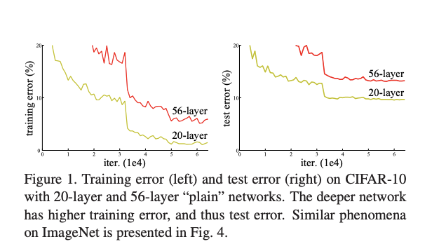
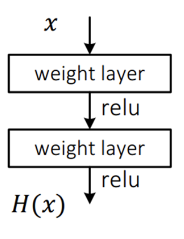
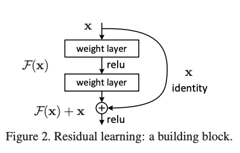
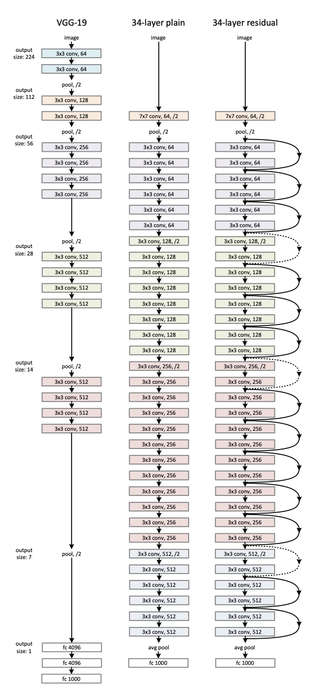
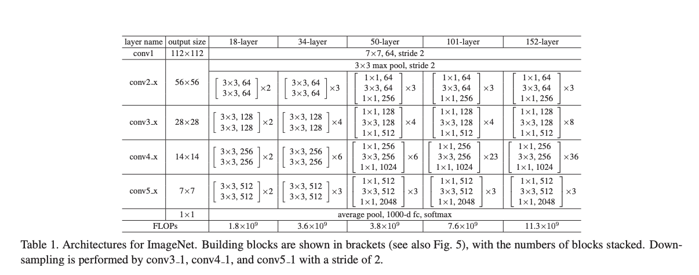
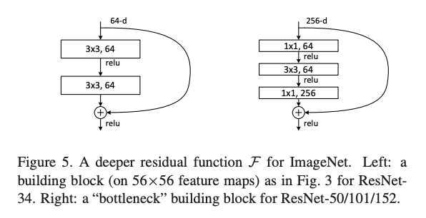
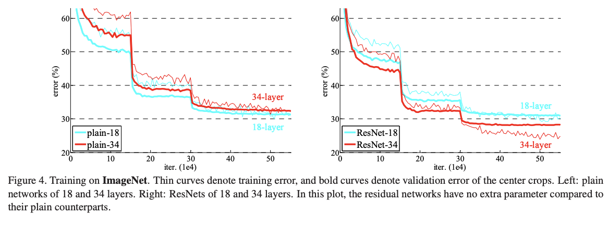
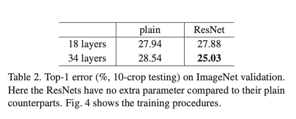
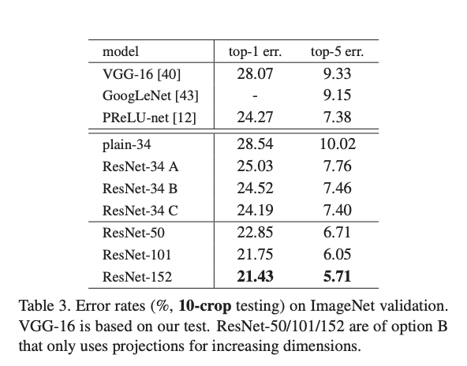
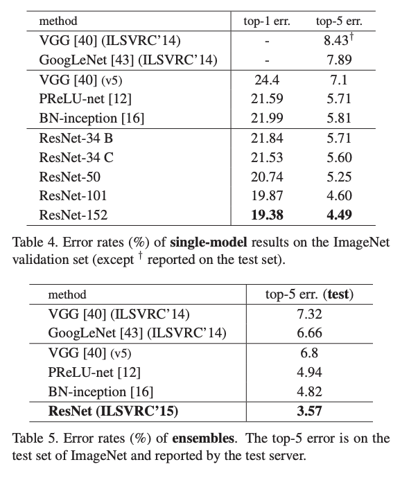

# ResNet

- 망이 깊어졌을 경우 학습에 어떤 영향을 줄까?

- 간단한 CIFAR-10 학습 데이터를 20-layer, 56-layer에 대해 비교 실험을 해봤다.

  

- 오히려 학습 결과가 나빠진것을 확인했다. 

- 왜 이런 결과가 나왔을까 궁금했고 이를 해결하기 위해 deep residual learning 의 개념을 만들었다.

## Residual Learning

- 설계팀은 100 layer 이상으로 깊게 만들어 깊이에 따른 학습 효과를 얻을 수 있는 방법을 고안했다.

- 평범한 CNN 망 : 입력 x를 받아 2개의 weight layer을 거쳐 출력 H(x)를 만든다.

  

- 이 네트워크를 H(x)를 얻는것이 목표가 아니라 H(x) - x를 얻는 것으로 목표를 수정해보자. 다음과 같이 변한다. F(x) = H(x) - x

  

- 입력에서 출력으로 바로 연결되는 shortcut이 추가되었다. 이렇게 관점을 조금 바꿨지만, 꽤 많은 효과를 얻을 수 있다. F(x)가 0이 되어야 하기 때문에 학습 방향이 미리 결정되어, 이것이 pre-conditioning 구실을 하게 된다. 입력의 작은 움직임을 쉽게 검출할수 있다.

  - 깊은 망도 쉽게 최적화가 가능하다.

  - 늘어난 깊이로 인해 정확도를 개선할 수 있다.

    

## ResNet 팀의 실험

- VGGNet 의 설계 철학을 많이 이용했다.

- 비교 실험을 하기 위해 평범한 망(plain network)와 residual network로 구별했다.

- 평범한 망은 vgg보다 filter의 수도 줄이고 복잡도도 낮췄다. 

  

- 또한 실험에는 18, 34, 50, 101, 152 layer에 대해 수행을 했으며 각가에 대한 layer구성은 다음과 같다.

  

- 18, 34 layer은 동일한 구조를 사용하고, 50, 101, 152 layer은 구조가 다르다. 구조가 다른 이유는 밑에 설명하겠다.

  

## 구조가 다른 이유 

- deeper bottleneck architecture : 학습에 걸리는 시간을 고려하여 50,101,152 layer의 구조를 조금 변경 시켰다. bottleneck 구조라고 불리는 이유는 차원을 줄였다가 뒤에서 차원을 늘리는 모습이 병목처럼 보이기 때문이다. 이렇게 구성한 이유는 연산 시간을 줄이기 위함이다. 

  

  

## 실험 결과

- ### 18, 34 layer 에 대한 Plain network vs. Residual network 의 실험 결과

  - Plain network : 34의 결과가 18보다 약간 나쁘다. 

  - Residual network : 34의 결과가 18보다 좋다. 

  - 학습 초기 단계에서 Residual network의 수렴 속도가 더 빠르다.

    

    

- ### 50, 101, 152 layer 에 대한 Plain network vs. Residual network 실험 결과

  - 152 layer 에 대한 top-5 error 율이 4.49 수준까지 떨어졌다.

    

    

## 결론 

기본적으로 VGG와 유사한 구조를 사용했지만, 연산량의 균형을 맞추기 위해 다른 모델로 발전했으며, residual network 구조를 사용하여 152 layer 라는 아주 깊은 망을 잉요해 아주 뛰어난 결과를 얻었고, 이렇게 깊은 망에서도 충분히 학습이 가능하다는 것을 확인할 수 있었다.

