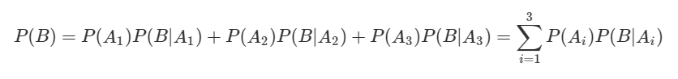
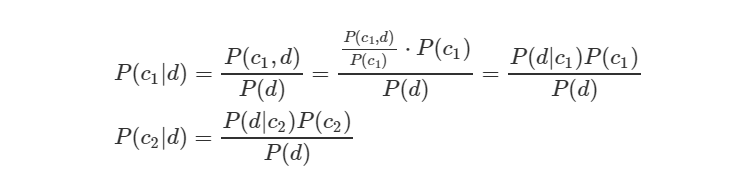
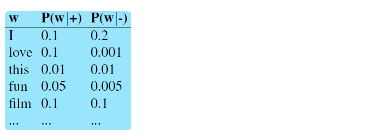
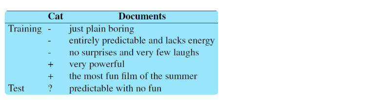
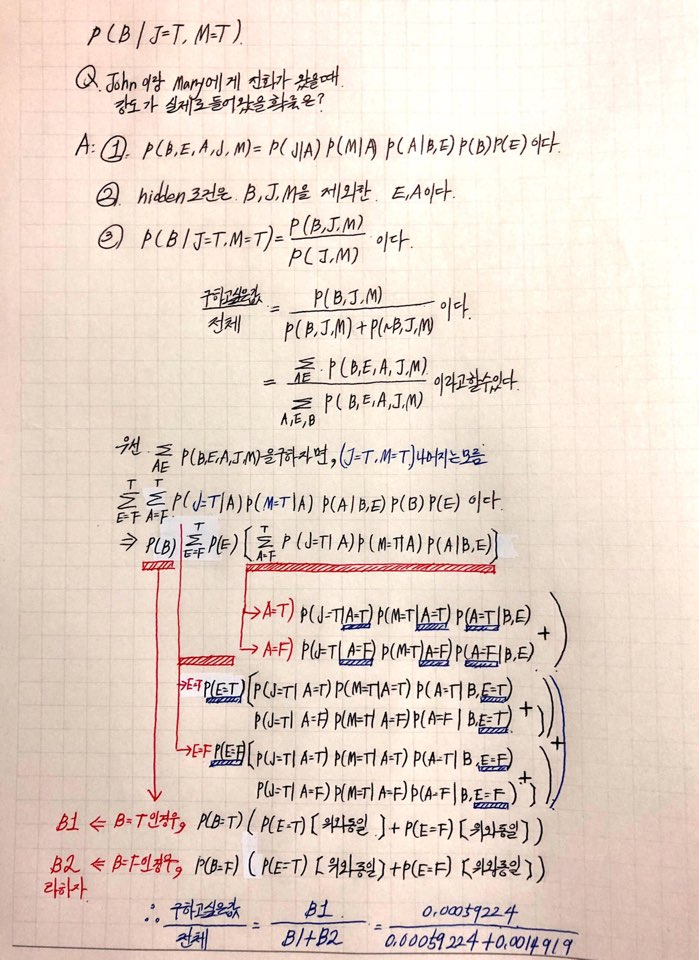

## Week 12 Naive Bayesian Network

1. #### Naive Bayes란

   - 지도 학습 알고리즘
   - 기초 이론: 베이즈 정리
   - Naive는 *순진하다* 라는 뜻을 가지고 있습니다. 이런 수식어가 붙인 이유는 데이터셋의 모든 특징들이 동등하고 독립적이라고 가정하기 때문입니다.

2. #### 기초 이론 베이즈 정리

   - 일반적으로 사건 **A1, A2, A3**가 서로 배반(mutually exclusive)이고 **A1, A2, A3**의 합집합이 표본공간(sample space)과 같으면 사건 **A1, A2, A3**는 표본공간 **S**의 **분할**이라고 정의합니다. 우리가 관심있는 사건 **B**가 나타날 확률을 그림과 식으로 나타내면 다음과 같습니다.

      

     P(B)P(B)를 조건부확률의 정의를 이용해 다시 쓰면 아래와 같습니다. 이를 **전확률 공식(Law of Total Probability)** 또는 베이즈 법칙이라고 합니다.

      

     보통 **P(A1), P(A2), P(A3)**는 미리 알고 있다는 의미의 **사전확률(prior probability)**로 불립니다. **P(B|A1), P(B|A2), P(B|A3)**는 **우도(likelihood probability)**라 부릅니다.

     그럼 우리가 관심있는 사건인 **B**가 **A1**에 기인했을 조건부확률은 어떻게 구할까요? 바로 아래와 같이 구할 수 있습니다.

      

     **P(A1|B)**는 사건 B를 관측한 후에 그 원인이 되는 사건 **A**의 확률을 따졌다는 의미의 **사후확률(posterior probability)**로 정의됩니다. 사후확률은 사건 **B**의 정보가 더해진, 사전확률의 업데이트 버전 정도라고 생각하면 좋을 것 같습니다. *(Posterior probability is an updated version of prior probability)* 같은 방식으로 **P(A2|B), P(A3|B)**도 구할 수 있습니다.

     ##### *베이즈 규칙결론:* 
    
     P(A|B) = P(B|A) P(A) / P(B)
    
     P(disease | symptom) = P(symptom | disease) P(disease) / P(symptom)
    
     disease = 광우병 , symptom = 마비
    
      P(A) = P(A|B) P(B) + P(A|~B) P(~B) = P(A ^ B) + P(A ^ ~B)

3. #### 독립

   - A와 B는 독립이다. iff 

     P(A ^ B) = P(A) P(B)

     P(A|B) = P(A)

     P(B|A) = P(B)

     여러 개의 변수를 다루고 있는 확률 문제에서 중요한 요소 중 하나는 조건부 독립이다.
    
     > ex) C가 주어진 상황에서 A 과 B가 조건부 독립일 때
     >
     > P(A | B,C) = P(A|C)
     >
     > P(B | A,C) = P(B|C)
     >
     > P(A ^ B|C) = P(A|C) P(B|C)
     >
     > 
     >
     > Toothache(T)
     >
     > Spot in Xray(X)
     >
     > Cavity(C)
     >
     > 이 상태로는 a와 b는 독립이 아니다. 그런데 만약 c의 값이 이미 알려진 상태이면 결합확률은 조건부 결합확률이 된다. 따라서 다음과 같이 조건부 독립이 성립한다.
     >
     > 
     >
     > 이런 상태를 c가 a,b 사이를 막고있다(block)고 한다. 

4. #### Naive Bayes Model

   - P(Cause, Effect1,Effect2, ... , Effectn) 

     = P(Cause) P(Effect1|Cause) P(Effect2|Cause)...P(Effectn|Cause) 

     

   - 의대 교과서는 나이브 베이즈 모델로 가득차 있다고 한다. 환자가 기침을 하고 열이 많고 콧물은 안 났을때 감기일 확률을 몇 %일까?

     기침(Cough: Effect1) = T

     열(Fever: Effect2) = T

     콧물(Runny Nose: Effect3) = F 일 때, 감기(Cold)일 확률은? 

     (감기 | 기침, 열, ~콧물) 이 우리가 구하고 싶은 결과값이다.

5. #### 모델 예시 (1)

   - 문서 이진분류 문제를 예로 들어보겠다. 문서 d가 주어졌을때 범주 c1 혹은 c2로 분류하는 것이다. 지금까지 설명한 베이즈 법칙을 다시 쓰면 아래와 같다.

      

     위 식에서 P(ci)은 사전확률이다. 범주 ci인 문서 개수를 전체 문서 개수로 나눈 비율을 뜻한다. P(d|ci)은 우도 이다. P(ci|d)는 사후확률이다. 문서 d가 주어졌을 때 해당 문서가 범주 ci일 확률, 즉 우리가 알고 싶은 값이다.

     베이즈 모델은 P(c1|d)/P(d)와 P(c2|d)/P(d)를 비교해 큰 쪽으로 범주를 할당한다. 그런데 여기서 P(d)은 겹치므로 계산을 아에 생략할 수 있다. 

     

     이번엔 문서 d가 단어 w1,w2로 구성돼 있다고 하자.

     

     나이브 베이즈 분류기는 각 단어가 독립임을 가정한다. 모델 이름에 나이브라는 말이 붙은 이유이기도 한다. 이에 따라 식을 쓸 수 있다.

     

6. #### 모델 예시 (2) bag of words representation

   - 각 단어가 독립임을 가정하는 나이브 베이즈 분류기는, 문서표현 방식 중 가장 간단한 기법인 bag-of-words와 본질적으로 같은 접근을 취한다. 나이브 베이즈 분류기는 범주가 주어졌을 때 각 단어가 나타날 확률(우도)의 연쇄적인 곱으로 계산을 하는데, a다음에 b를 곱하든 그 반대로 곱하든 결과가 같다.

     bag-of-words도 나이브 베이즈 모델처럼 단어의 등장 순서를 무시한다. 그저 문저 내 빈도만을 따져서 문서를 표현한다. 문서를 어떤 가방(bag)안에 넣고 이를 뒤섞는다는 느낌 정도로 이해하면 직관적일 것 같다.

      

7. #### 모델 예시 (3) unigram model

   - 나이브 베이즈 분류기는 언어모델의 유니그램모델과도 접점이 많다. 유니그램 모델은 도메인별로 각 단어의 등장 확률을 구해놓은 아래 표와 같은 형태이다.

     

     임의의 문자열이 주어졌을 때 유니그램 모델은 단어별 등장 확률을 반복적으로 곱해 해당 문자열이 나타날 확률을 계산한다. 나이브 베이즈 모델과 비교해 생각해볼때 사전확률을 제오하면 그 과정이 동일하다. 
8. #### 계산예시 1

   - 다음과 같은 말 뭉치가 주어졌다고 하자.

     

     우선 사전 확률부터 구해보자. 학습 데이터 전체 5건의 문서 가운데 3개가 부정(-), 2개가 긍정 (+)이므로 다음과 같다.

     

     이번엔 우도를 구해보겠다. 우선 학습 데이터 문서 가운데 부정 범주의 전체 단어수는 14개이다. 이 가운데 각 단어가 몇 개 있는지 세어서 각가의 우도를 구한다. 

     

     이번엔 긍정 범주의 우도를 구해보자.

     

     이번엔 검증 데이터 문서를 예측할 차례이다. 각 범주에 해당하는 사전확률과 우도의 곱을 비교해 큰 쪽으로 분류하는 방식이다.

     

     그런데 실제 계산을 해보면 둘 모두 0이 될것이다. 우도 값 가운데 0이 되는 값이 있기 때문이다. 우도값이 0이되지 않도록 보정하는 **평활화(smoothing)**기법이 제안된다.  

     나이브 베이즈 모델의 학습은 학습말뭉치의 빈도 수를 세어서 위의 사전 확률과 우도를 모두 구해놓는 과정을 가리킨다. 추론(inference)은 사전확률과 우도의 곱을 계산하고, 큰 쪽의 범주를 할당한다.

     검증 데이터 문서에 학습 데이터에 없는 단어가 있을 경우엔 우도가 존재하지 않으므로 이를 뺴고 계산한다. 또한, 관사, 전치사 드 범주 분류에 불필요하다고 판단되는 단어들에 대해서는 불용어(stopwords)처리를 해서 뺴기도 한다.

9. #### 장단점 및 최적화

   - 나이브 베이즈 분류기는 앞선 예시의 우도 테이블 하나만 있으면 분류가 가능하다. 사전확률이 다르다면 전체 문서 범주 비율만 더 반영해주면 된다. 그만큼 계산 복잡성이 낮다는 얘기이다. 딥러닝 이전 자연언어처리 기법으로 각광 받았던 모델이다.

     다만 나이브 베이즈 분류기는 문서에 등장하는 단어 수만큼의 우도 확률 곱으로 분류를 수행하기 때문에 단어 수가 늘어날 수록 그 값이 0으로 수렴하는 경향이 있다. 1보다 작은 값은 곱할 수록 작아지는 게 당연한 이치이다. 특히 특정 범주, 가령 긍정 문서에 단 한번도 등장하지 않은 단어가 있다면 해당 단어의 우도는 0이 되기 때문에 분류 과정에 큰 문제가 된다. 이를 위해 *smoothing*을 수행한다.

     문서 내 중복단어를 없애 분석 정확성을 높이는 **Binary multinomial naive Bayes(binary NB)**기법도 있다. 한 단어가 문서 내에 등장했는지 여부만 따진다. 개별 문서에 한두차례 등장하지만 정보성이 높은 단어를 잘 포착하는 경향이 있어 성능 향상에 도움이 된다고 한다.

     나이브 베이즈 모델은 그 특성상 부정어(negation) 처리에 취약하다. 이 때문에 부정어가 등장한 위치에서 뒤에 나오는 모든 단어에 다음과 같은 처리를 하여 이 문제를 보완하는 방법도 제안돼었다. 이렇게 되면 *not_like*, *not_movie*와 관련된 우도가 *like*, *movie*와 따로 계산되고, 추론 과정에서도 따로 계산된 결과가 반영된다.

     > didn’t like this movie => didn’t not_like not_this not_movie

     또한 컴퓨터는 0에 가까운 **부동소수점(floating point number)** 을 제대로 처리하지 못하기 때문에 우도의 곱은 로그 우도의 합으로 처리한다. 

10. #### Bayesian networks

    - 위의 예시 보다 더 복잡하고 depth가 깊은 모델이다.

      

    - Variables: Burglary, Earghquake, Alarm, JohnCalls, MaryCalls

    - Network topology는 다음과 같다.
      - A burglar can make the alarm ringing
      - An earthquake can sometimes make the alarm ringing
      - The alarm can cause Mary to call
      - The alarm can cause John to call

    - 나는 일을 하러 나갔다. 내 집에는 강도가 들어오면 알람이 울리는 시스템을 설치하였다. 나의 이웃인 john이 내 집의 알람이 울린다고 전화가 왔다. 하지만 mary는 전화가 오지 않았다. 이때, 강도가 실제로 들어왔을 확률은?

      이렇게나 복잡하고 와닿지 않는 확률을 구할 수 있는 강력한 모델이 naive bayesian이다. 단 10개의 확률로 모든 확률을 구할 수 있다고 이해하면 된다.
      -  P(burglary | alarm)
      -  P(earthquake | JCalls, MCalls)
      -  P(JCalls, MCalls | burglary, earthquake)

    - ##### 문제를 풀어보자 

      - Express the joint distribution P(B,E,A,J,M) in terms of the
        conditional probabilities (and independencies) expressed in the Bayesian Network
        above.

        - P(B, E, A, J ,M ) = P( J | A) P(M | A) P(A | B,E) P(B) P(E)

          각 variable중 직접적으로 영향을 받는 부모만 신경쓴다. Alarm 의 부모는 Burglary와 Earthquake이다. 

      - We want to know the probability of a Burglary knowing that John Called and
        Mary Called. More precisely, Which variables are hidden?

        - hidden variables are E and A.

          P(B | JohnCalls = true, MaryCalls = true) 의 확률을 구하고 싶은것이다. 주어지지 않은 조건은 **알고 싶은 결과인 B와 이미 알고 있는 J, M을 제외한** E와 A이다. 

      - Calculate P(B|J,M), i.e., calculate P(Burglary=true | JohnCalls=true, MaryCalls=true) with at least two decimal orders.

        - 

            