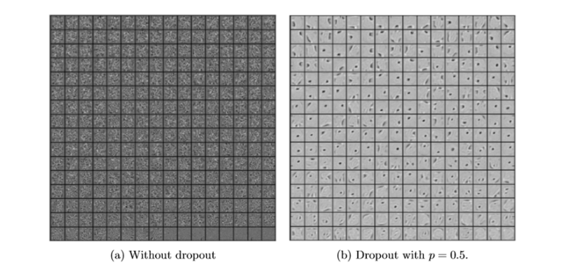
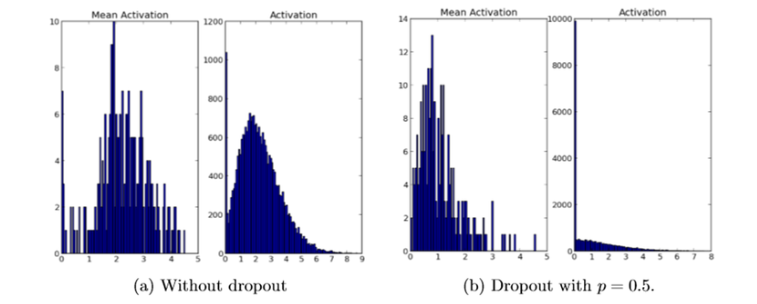
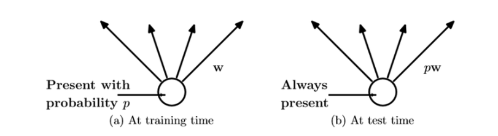
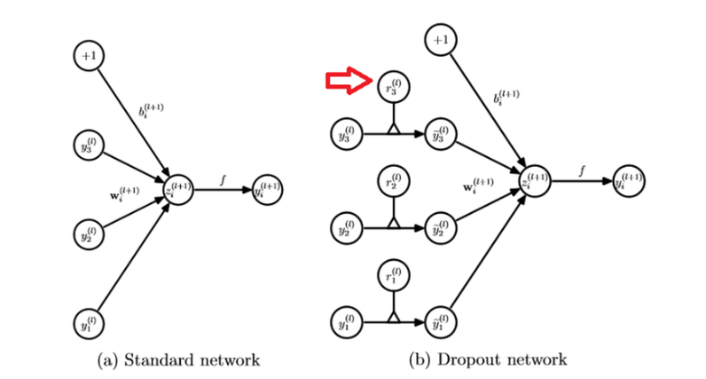
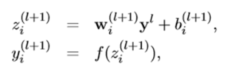
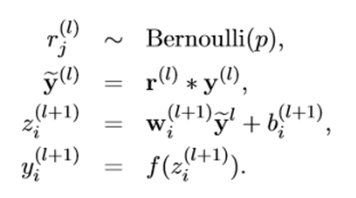

Week 13 Drop out

참조 논문: [A simple Way to Prevent Neural Networks from Overfitting](https://www.cs.toronto.edu/~hinton/absps/JMLRdropout.pdf)

1. #### 머신 러닝에서 학습을 시킬때 문제 중 하나는 Overfitting이다. 

   - Overfitting이란 통계나 기계 학습에서 사용되는 용어로서, 제한된 샘플(혹은 훈련에 사용한 한정된 데이터)에 너무 특화가 되어, 새로운 샘플에 대한 예측의 결과가 오히려 나빠지거나 학습의 효과가 나타나지 않은 경우를 말한다. 우리말로는 *과적합* 이라는 용어로 번역이 된다.  

     

   - (a)는 오류가 많아보인다. (c)는 모든 점들을 그래도 살려 오차가 없이 추정을 하는 경우이다. 이 경우 주어진 샘플(훈련 데이터)에 대해서는 최적의 결과를 나타낼 수 있지만, 새로운 샘플이 주어지는 경우는 엉터리 결과가 나올 수도 있다. (b)는 비록 약간의 오차는 있지만 새로운 샘플들이 들어올 때는 좋은 결과가 나올 수도 있다. 

2. #### overfitting을 해결하는 방법은?

   - 정답은 없다. (c)가 올바른 추정일 수도 있고, (b)가 올바른 추정일 수도 있다. 결과적으로는 샘플의 수를 늘리거나 훈련 데이터의 양을 늘리는 것이 정답일 것이다. 하지만 데이터의 양을 늘리는 것은 결과적으로 많은 비용과 노력이 필요하기 때문에, 여러가지 대안의 방법들이 제시되고 있다.

   - 위 그림처럼 (b)와 (c) 중 어느것을 택할 것인가 선택의 상황이 있을 때 흔히 적용되는 방법이 *Occam's Razor* 오캄의 면도날 방법이다. 

     > 14세기 영국의 신학자이자 논리학자인 오캄의 저서에 등장하며, 중세의 철학자와 신학자들이 복잡한 논쟁을 배제시키자는 뜻에서, 설명이 더 복잡한 이론을 배제할 때 흔히 사용이 된다. 물론 항상 진리는 아니지만, 필연성 없는 개념을 배제하려고 한 *사고의 절약의 원리*  라고도 불리며, 같은 현상을 설명하는 두 개의 주장이 있다면 간단한 쪽을 선택하라고 한다. 오캄의 원리에 의해서 주어진 점들을 추정한다면 당연히 (b)를 선택하는 것이 맞다. 

3. #### Overfitting 해결을 위한 Regularization(일반화) 방식

   - 통상적으로 기계학습이나 통계적 추론을 할 때 cost function 혹은 error function이 작아지는 쪽으로 진행을 하게 된다. 단순하게 작아지는 쪽으로만 진행을 하다 보면, 특정 가중치 값들이 커지면서 오히려 결과를 나쁘게 하는 경우도 있다. 아래 그림은 regularization을 통해 더 좋은 학습 결과를 가져오는 경우를 보여주는 그림이다.

     

   - Regularization에 대한 설명은 여기까지 overfitting 문제를 해결하는 방법 중 확실한 대책은 훈련 데이터의 양을 늘리는 것이다. 하지만, 훈련 데이터는 아무런 대가 없이 그냥 얻어지는 것이 아니다. 양질의 훈련 데이터를 얻으려면 많은 시간과 비용이 필요하며, 어떤 경우는 추가 데이터의 확보가 어렵거나 불가능한 경우도 있다. 그래서 제한된 훈련 데이터만으로 최적의 결과를 도출하기 위한 방법으로 Regularization이 있는것이다.

4. #### Overfitting 해결을 위한 지능적 훈련 데이터 만들기

   - ##### Affine Transform을 이용한 지능적 훈련 데이터 생성

     

     오른쪽 데이터는 왼쪽 데이터를 반시계 방향으로 15도 회전하여 얻은 데이터이다. affine transform은 아리와 같은 4가지 연산을 할 수 있으며 이것들을 조합하면 많은 훈련 데이터를 확보할 수 있다.

     

   - ##### Elastic Distortion을 이용한 지능적 훈련 데이터 생성

     마이크로 소프트에서 효과적인 훈련 데이터 생성을 위해 *elastic distortion* 이라는 방법을 개발하였고 특허 출원을 하였다. affine transform과 같은 단순한 변형이 아니라, 아래 그림처럼 다양한 방향으로의 displacement vector을 만들어 내고 그것을 통해 좀 더 복잡한 형태의 데이터를 만들어 낼 수 있게 되었다.

     

5. ####  신경망에서 Overfitting 해결을 위한 dropout 방식 

   - Dropout은 아래의 그림(a)에 대한 학습을 할 때, 망에 있는 모든 layer에 대해 학습을 수행하는 것이 아니라 그림 (b)와 같이 망에 있는 input layer나 hidden layer의 일부 뉴련을 생략하고 줄어든 신경망을 통해 학습을 수행한다. 일정한 mini-batch 구간 동안 생략된 망에 대한 학습을 끝내면, 다시 무작위로 다른 뉴련들을 생략하면서 반복적으로 학습을 수행한다.
   - 

6. ####  Dropout 의 효과

   - **Voting 효과**: 일정한 mini-batch 구간 동안 줄어든 망을 이용해 학습을 하게 되면, 그 망은 그 망 나름대로 overfitting이 되며, 다른 mini-batch 구간 동안 다른 망에 대해 학습을 하게 되면, 그망에 대해 다시 일정 정도 overfitting이 된다. 이런 과정을 무작위로 반복을 하게 되면, voting에 의해 평균 효과를 얻을 수 있기 때문에, 결과적으로 regularization과 비슷한 효과를 얻을 수 있데 되는 것이다.

   - **co-adaptation을 피하는 효과**: Regularization에서 살펴본 것처럼, 특정 뉴런의 바이어스나 가중치가 큰 값을 갖게 되면 그것의 영향이 커지면서 다른 뉴런들의 학습 속도가 느려지거나 학습이 제대로 진행이 되지 못하는 경우가 있다. 하지만 dropout을 하면서 학습을 하게 되면, 결과적으로 어떤 뉴런의 가중치나 바이어스가 특정 뉴런의 영향을 받지 않기 때문에 결과적으로 뉴련들이 서로 동조화(co-adaptation)이 되는 것을 피할 수 있다.

     이로써 좀 더 선명한 feature을 얻을 수 있다.

     

   - 또한 dropout을 하게 되면, hidden 뉴런들의 활성도가 좀 더 드문드문 해지는 경향이 생긴다. 아래 그림에서 왼쪽 그림은 dropout이 없는 일반 신경망에서 hidden layer의 활성도를 보여주고 있는데 히스토 그램이 좀 더 넓게 퍼져 있는 것을 확인 할 수 있므녀, 오른쪽은 0.5 확률로 dropout을 실행하였을 때 히스토그램이 좀 더 집중되는 것을 알 수 있다. 의도하지 않았지만, 좋은 성질을 얻게 된 것이다.

      

   - 특정 학습 데이터나 자료에 영향을 받지 않는 보다 강건한 망을 구성할 수가 있게 되는것이다.

7. #### CNN의 핵심 요소 기술 Dropout

   - 모델 결합을 하게 되면 학습의 성능을 개선 할 수 있다. 모델 결합의 효과를 얻으려면, 서로 다른 학습 데이터를 이용해서 학습을 하거나, 모델이 서로 다른 구조를 가져야 한다. 하지만, 망이 깊은 경우 1개의 망을 학습시키는 것도 만만치 않은데, 복수개의 망을 학습시키는 것은 매우 힘든 작업이 된다. 또한 어떻게 해서 다양한 모델을 학습시켰을지라도 다양한 모델을 실행시킬 때 시간을 작아먹기 때문에 빠른 response time이 요구되는 경우에 곤란하다.

     Dropout은 위 2 가지 문제를 해결하기 위해 개발된 것이다. 

     여러개의 모델을 만드는 대신에 모델 결합에 의한 투표 효과와 비슷한 효과를 내기 위해 학습 사이클이 진행되는 동안 무작위로 일부 뉴런을 생략한다. 그렇게 되면 생략되는 뉴련의 조합만큼 지수함수적으로 다양한 모델을 학습시키는 것이나 마찬가지 이기 때문에 모델 결합의 효과를 누릴 수 있다.

     또한 실제로 실행 시킬 때는 생략된 많은 모델을 따로 실행시키는 것이 아니라, 생략된 모델들이 모두 파라미터를 공유하고 있기 때문에 모두 각각의 뉴런들이 존속할 (dropout 하지 않을) 확률을 각각의 가중치에 곱해주는 형태가 된다. 

   - 그림으로 표현하면 아래와 같다. 학습시에는 뉴런은 존속할 확률 p로 학습을 진행하고, 실행할 때는 각각의 넷에 얻어진 가중치에 존속할 확률 p를 곱해준다.

     

8. #### Dropout 모델링

   

   -  Standard: 

     

   - Dropout:  

     

   - 베르눌리 랜덤 변수인 r을 곱해준다.  이는 유닛의 존재 유/무 두가지 값을 갖는 랜덤 변수이다. 유닛이 존재할 확률이 p라고 하면 평균은 p이고, 분산은 p(1-p)인 변수를 말한다.