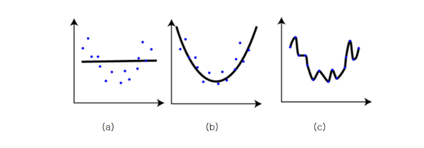
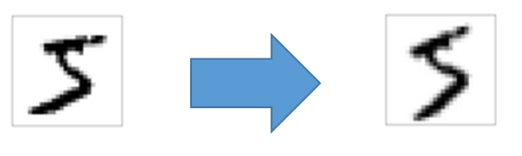
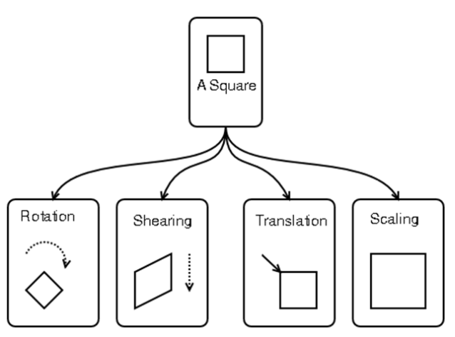
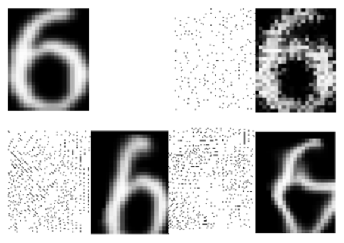
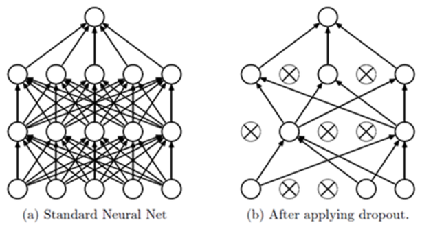

## Week 13 Drop out

1. 머신 러닝에서 학습을 시킬때 문제 중 하나는 Overfitting이다. 
   - Overfitting이란 통계나 기계 학습에서 사용되는 용어로서, 제한된 샘플(혹은 훈련에 사용한 한정된 데이터)에 너무 특화가 되어, 새로운 샘플에 대한 예측의 결과가 오히려 나빠지거나 학습의 효과가 나타나지 않은 경우를 말한다. 우리말로는 *과적합* 이라는 용어로 번역이 된다.  
   - 
   - (a)는 오류가 많아보인다. (c)는 모든 점들을 그래도 살려 오차가 없이 추정을 하는 경우이다. 이 경우 주어진 샘플(훈련 데이터)에 대해서는 최적의 결과를 나타낼 수 있지만, 새로운 샘플이 주어지는 경우는 엉터리 결과가 나올 수도 있다. (b)는 비록 약간의 오차는 있지만 새로운 샘플들이 들어올 때는 좋은 결과가 나올 수도 있다. 

2. overfitting을 해결하는 방법은?

   - 정답은 없다. (c)가 올바른 추정일 수도 있고, (b)가 올바른 추정일 수도 있다. 결과적으로는 샘플의 수를 늘리거나 훈련 데이터의 양을 늘리는 것이 정답일 것이다. 하지만 데이터의 양을 늘리는 것은 결과적으로 많은 비용과 노력이 필요하기 때문에, 여러가지 대안의 방법들이 제시되고 있다.

   - 위 그림처럼 (b)와 (c) 중 어느것을 택할 것인가 선택의 상황이 있을 때 흔히 적용되는 방법이 *Occam's Razor* 오캄의 면도날 방법이다. 

   - > 14세기 영국의 신학자이자 논리학자인 오캄의 저서에 등장하며, 중세의 철학자와 신학자들이 복잡한 논쟁을 배제시키자는 뜻에서, 설명이 더 복잡한 이론을 배제할 때 흔히 사용이 된다. 물론 항상 진리는 아니지만, 필연성 없는 개념을 배제하려고 한 *사고의 절약의 원리*  라고도 불리며, 같은 현상을 설명하는 두 개의 주장이 있다면 간단한 쪽을 선택하라고 한다. 오캄의 원리에 의해서 주어진 점들을 추정한다면 당연히 (b)를 선택하는 것이 맞다. 

3. Overfitting 해결을 위한 Regularization(일반화) 방식

   - 통상적으로 기계학습이나 통계적 추론을 할 때 cost function 혹은 error function이 작아지는 쪽으로 진행을 하게 된다. 단순하게 작아지는 쪽으로만 진행을 하다 보면, 특정 가중치 값들이 커지면서 오히려 결과를 나쁘게 하는 경우도 있다. 아래 그림은 regularization을 통해 더 좋은 학습 결과를 가져오는 경우를 보여주는 그림이다.
   - 
   - Regularization에 대한 설명은 여기까지 overfitting 문제를 해결하는 방법 중 확실한 대책은 훈련 데이터의 양을 늘리는 것이다. 하지만, 훈련 데이터는 아무런 대가 없이 그냥 얻어지는 것이 아니다. 양질의 훈련 데이터를 얻으려면 많은 시간과 비용이 필요하며, 어떤 경우는 추가 데이터의 확보가 어렵거나 불가능한 경우도 있다. 그래서 제한된 훈련 데이터만으로 최적의 결과를 도출하기 위한 방법으로 Regularization이 있는것이다.
   - 지능적 훈련 데이터 만들기
     - Affine Transform을 이용한 지능적 훈련 데이터 생성
     - 
     - 오른쪽 데이터는 왼쪽 데이터를 반시계 방향으로 15도 회전하여 얻은 데이터이다. affine transform은 아리와 같은 4가지 연산을 할 수 있으며 이것들을 조합하면 많은 훈련 데이터를 확보할 수 있다.
     -  
     - Elastic Distortion을 이용한 지능적 훈련 데이터 생성
     - 마이크로 소프트에서 효과적인 훈련 데이터 생성을 위해 *elastic distortion* 이라는 방법을 개발하였고 특허 출원을 하였다. affine transform과 같은 단순한 변형이 아니라, 아래 그림처럼 다양한 방향으로의 displacement vector을 만들어 내고 그것을 통해 좀 더 복잡한 형태의 데이터를 만들어 낼 수 있게 되었다.
     -  

4.  신경망에서 Overfitting 해결을 위한 dropout 방식 

   - Dropout은 아래의 그림(a)에 대한 학습을 할 때, 망에 있는 모든 layer에 대해 학습을 수행하는 것이 아니라 그림 (b)와 같이 망에 있는 input layer나 hidden layer의 일부 뉴련을 생략하고 줄어든 신경망을 통해 학습을 수행한다. 일정한 batch 구간 동안 생략된 망에 대한 학습을 끝내면, 다시 무작위로 다른 뉴련들을 생략하면서 반복적으로 학습을 수행한다.
   - 
   -  