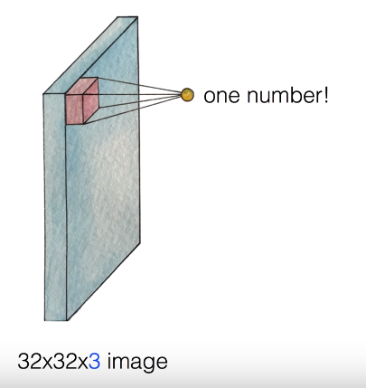
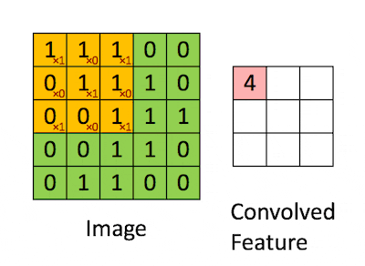
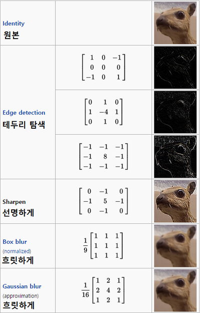
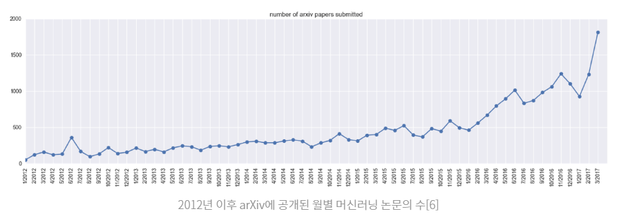

## CNN 이란

1. ### CNN 이란

   - 말 그대로 **convolution** 이라는 작업이 들어가는 NN을 의미한다.

     

   - CNN은 크게 2단계로 특징 추출(feature extraction)과 분류(classification)으로 나뉜다.

   - Feature extraction: 고유한 특징을 어떻게 찾을것인가?

   - convolution matrix을 이용하여 우리가 원하는 특징을 두드러지게 하는 방법으로 찾는다. 위의 그림을 보면, 입력 데이터로 주어진 '60 표지판'을 첫번째 feature maps 단계에서 숫자, 원 등을 두드러지게 하고 있음을 볼 수 있다.

   - feature extraction은 2가지 방법 kernel과 pooling으로 이뤄진다.

2. ### 그럼, ***convolution*** 이란?

   - 초창기에 CNN을 개발한 분들이 고양이가 보는 것마다 *자극 받는 **뇌의 위치*** 가 다른 것을 보고 아이디어를 얻어 CNN을 만들었다고 한다. 그것이 특징 표현 학습(feature representation learning) 이다. 컴퓨터 스스로가 특징 표현을 만들어 낸다는 것이다.

     

     즉, image 전체를 보는 것이 아니라 부분을 보는 것이 핵심 아이디어이다.

     이 부분 에 해당하는 것을 **filter** 라고 한다.

   - 그럼, ***filter*** 란?

      

     filter을 이용해서 하나의 값을 뽑아낸다. 이것이 filter가 하는 일이다.

     image는 32x32이니까 5x5 filter을 한 번 적용해서는 전체를 볼 수 없다.

     즉, filter(w)을 *옮겨가며* 작업을 반복해야한다. *얼마나 ?몇 칸씩?* 옮겨야 하는가는 **stride** 값이 정해준다. 위 예시에서 32x32 image에 5x5 filter를 stride 1로 준다면, 30x30의 output을 얻게 된다.

     

     

     

   - 위와 같이 계산해서 나온 output을 **convolution layer**라고 부른다. (k 가 정수가 아닌경우는 제외한다.

3. ### 어떻게 convolution을 이미지에 적용할 수 있을까?

   - 컴퓨터는 그림을 여러개의 픽셀로 이루어진 행렬로 본다.

     convolution matrix는 이 커다란 픽셀 배열에 작은 행렬을 통해 그 픽셀의 값을 수정하는 방법이다.

     

   - CNN은 이 커널을 자동으로 만들어 준다는게 핵심이다.

   - 추출할때는 다양한 여러장을  추출하여  강인한 특징(왜곡,변형같은 환경변화에 잘 적응하는)을 유도하는데  이것을 feature maps이라 한다. 

     

     이렇게 계속 줄여나가면 강인한 특징이 남게된다. 

4. ### subsampling이란?

   - 화면의 크기를 줄이는 과정이다.

     아래의 방법인 max pooling을 사용한다. (해당 영역의 최대치를 선택하는 기법)

     위 그림처럼 4개중 가장 큰 수를 선택한다. 이것은 뉴런이 가장 큰 신호에 반응하는것과 유사한다.

     

     이렇게 하면 노이즈가 감소하고 속도도 빨라지고 영상의 분별력이 좋아진다고 한다.

5. ### CNN으로

   - 우리의 커널이 정확하게 고정된 값을 갖게하는 대신 convolution net을 학습 시켜 점점 더 주어진 이미지 필터링을 잘 하게 된다. 

   - 이 프로세스는 자동적으로 이루어지므로 피처 학습이라고도 불린다.

     피처 학습은 자동으로 각각의 목적에 따라 생성된다. 

     > 예전엔 사람의 예측에 의해 뽑히던 이 특징들을 지금은 이마저도 기계학습을 이용해 뽑는다는 것입니다. 다시 말해, 예전엔 ‘선들을 추출해서 학습시키면 사물인식이 잘 될 거야.’와 같이 사람이 먼저 이 선들을 추출하는 알고리즘을 만들어 주었는데, 이제는 특징 추출과 학습 모두가 딥 러닝 알고리즘 안에 포함되었다는 것이죠.
     >
     > 다단계로 특징을 추출해 학습하는 컨볼루셔널 뉴럴 네트워크(Convolutional Neural Network)는 현재 딥 러닝의 대세로서 특히 이미지 인식에서 큰 발전을 이룩하고 있습니다.

     > 딥러닝계의 라이징 스타 중 한명인 OpenAI의 AndrejKarpathy의 간단한 조사에 따르면 공개 논문 저장소 arXiv을 통해 매월 공개되는 머신러닝 논문의 수가 5년 사이 100배 이상 늘었다고 한다. 다시말하면 10년 동안 나올 머신러닝 논문들이 지금은 한 달 안에 쏟아지고 있는 셈이다.
     >
     > 
