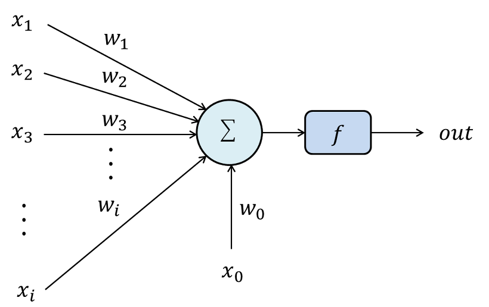
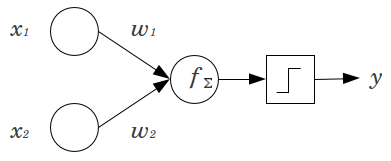
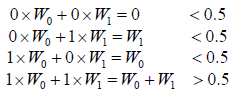
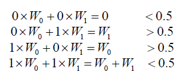

## *Artificial Neural Networks*

### *Introduction to ANN*

#### 1. Connectionism vs Symbolism

- 이 둘은 인공지능 분야를 대표하는 두 가지 고전적 접근 방법이다. 
- *Symblic AI*는 지식을 symbol과 그들간의 relation 또는 Logic으로 표현한 것이다.
  - 문제 해결 또는 새로운 지식 추론을 위해여 Symbolic instance와 그들간의 relation에 특정 algebraic Inference을 적용한다.
  - e.g. Logical Inference in Ontology, Probabilistic Inference, Fuzzy Inference
  - 고대 그리스 시대때 부터 시작된 학문이다.

- *Connectionist AI*는 지식을 network상에 분산된 형태로 표현한 것이다.
  - 생명체의 신경 구조를 모방하여 지능적 프로세스를 발현시킴으로써 인식/학습/추론 문제를 해결한다.
  - e.g. Artificial Neural Net

#### 2. Biological inspiration

- 100억개의 neuron과 60조의 synapse 로 이뤄진 인간의 두뇌를 모방한다.
- 생명체의 경우 주변 환경에 적응적 행동 및 학습을 수행한다.
- 생명체는 네트워크 형택의 신경구조(nervous system)을 사용한다.
- Artificial neural network는 이러한 동물의 신경구조(nervous system)을 모방하여 기존의 Symbolic AI로 해결하기 어려워 풀 수 없었던 문제를 해결하고자 하는 접근이다.
- 신경구조(nervous system)은 **뉴런(neuron)**이라 는 간단한 형태의 기본 unit의 연결망으로 구성되어 있다. 이러한 unit을 *Perceptron*이라 한다.
- 뉴런의 기본 형태를 모사하여 신경구조의 기능과 행동을 발현하고자 한다.

#### 3. Types of simple ANNs

<ANN 모델 분류 예>

| 입력 형식 | 학습방식     | Artificial neural network model            |
| --------- | ------------ | ------------------------------------------ |
| 이진 입력 | supervised   | Hopfield memory, BAM                       |
| 실수 입력 | supervised   | Perceptron, Backpropagation neural network |
| 실수 입력 | unsupervised | Self-Organizing Map(SOM)                   |


### *The Perceptron: The first generation of neural networks*

- Perceptron은 ANN을 구성하는 단위이다.
- 복수개의 Input을 입력 받은 뒤 처리를 거친 후, 하나의 Output을 반환한다.
- 입력신호 Xi와 가중치 Wi의 곱을 모두 합한 값에 따라 출력신호 out의 흥분여부가 결정된다. 


  - perceptron은 weights, summation prodessor, activation function으로 구성되어있다.
  - perceptron은 inputs와 outputs의 sum을 가중치로 가지고 있다.
  - sum 이 threshold value(theta) 보다 크면 -> 1 , otherwise는 0(or -1)이다.
  - 전체 출력 뉴런들에 대하여 계산된 출력값과 목표값과의 차이를 최소화시키는 방법으로 뉴런을 학습시킨다. 
  - 만일 계산된 출력값과 목표값 간에 차이가 없으면 연결 가중치(Wi)는 변경되지 않으며, 차이가 있으면 차이를 줄이는 방향으로 가중치를 변경한다.

> *delta rule*: 델타 규칙은 경사하강법 학습방법으로 싱글 perceptron에서 인공뉴런들의 연결 강도를 갱신하는데 쓰인다. [wikipedia](https://ko.wikipedia.org/wiki/%EB%8D%B8%ED%83%80_%EA%B7%9C%EC%B9%99)



>가장 오래된 neural network중 하나이며, 특정 상황에서는 정말 outperform한 결과를 보여주지만 한계가 분명한 알고리즘이다.
>이 한계에 부딪혀 한 동안 dark age of connectionism 이라고 불리는 기간이 있었다.
>1969년 Minsky가 perceptiron이 linear가 아니면 아무것도 할 수 없다는 것을 증명했었다. (ex, xor) 아무튼, perceptron은 매우 간단한 Feed forward 네트워크의 일종이다. (선형 분류기)

###### Example(AND Operation using Perceptron)



- 뉴런에 입력되는 가중치의 합이 임계치 (0.5라 가정)을 초과하면 1, 아니면 0이다.
- Activation function은 hard limiter이다.
- 초기 W1, W2를 각각 0.6,0.7라 가정한다.

 

delta rule을 사용해서 계산해보면, W0 = W0 +a[d(t)-y(t)]*X0 (a 알파는 0.1이라 가정)

갱신된 W0 = 0.6 + 0.1(0-1)*0 = 0.6 , W1 = 0.7 + 0.1(0-1)*1 = 0.6

갱신된 W0 = 0.6 + 0.1(0-1)1 = 0.5 , w1 = 0.6 + 0.1(0-0)0 = 0.6

갱신된 W0 = 0.5 + 0.1(1-1)1 = 0.5 , W1 = 0.6 + 0.1(1-1)1 = 0.6

갱신된 W0 = 0.5 (더이상 변화 없음) / W1 = 0.6 + 0.1(0-1) = 0.5 (더이상 변화 없음)

0.5,0.5 로 만족 

### *the role of weights and dias*

  - bias라는 또다른 input이 있다. input과 상관없이 늘 더해지는 값으로, b=1+W0 라고 봐도 무방하다. perceptron의 decision rule은 방금 계산한 값이 threshold를 넘으면 값을 activate, 넘지 못하면 값을 deacitive시킨다. 이 threshold를 결정하는것이 바로 bias이다. perceptron 알고리즘에서 learning하는 것은 weight와 bias이다.
    -간단하게 bias를 무시하고 weight만 학습시키는 방법이 있다. 원래 input vector 에 value 1을 추가하여 마치 input vector 가 하나 더 있고 그 componenet에 대한 weight가 존재하는 것처럼 trick을 사용할 수 있다. bias의 값을 1로 치환하는 것이다.

### *activation fuction종류*

  - Unit step(threshold)
  - Sigmoid
  - PieceWise Linear
  - Gaussian

### *how to learn the weight value*

  - input vector 가 들어왔을때 , 현재 weight로 맞는 값이 나온다면 weight는 update되지 않는다. (W t+1 = W t) 만약 1이 나와야하는데 0이 나온다면 weight vector 에 input vector를 더해준다. (W t+1 = Wt + V) 만약 0 이나와야하는데 1이 나온다면 weight vector 에서 input vector 를 빼준다. (W t+1 = Wt - V)
  - misclassified point가 발견될 때 마다 에러를 줄이기 위해 이 알고리즘을 반복한다. 그럼 얼마나 weight와 bias를 업데이트 해야할까 learning rate를 정해줘야 한다. 그 러닝 레이트가 다음 학습할 때 점프하는 거리랄까
``` optimizer=tf.train.GradientDescentOptimizer(learning_rate=0.01) ```


### *geometrical view of perceptrons*

  - 왜 input vector 를 더하거나 빼서 update를 해야할까? geometrical하게 해석하면 알 수 있다. [링크](http://sanghyukchun.github.io/40/)

### *perceptrons의 procedure*

  - weights값을 초기화한다. (0 이나 작은 랜덤 수)
  - learning rate를 선택한다. (0~1사이의 수)
  - update rule을 반복한다. fin 조건에 만족할때 까지
  - training 예시 (x, 정답 값) 
    1. 해당 activation function을 이용해 값을 구한다. f(w x)
    2. 만약 계산값이 정답과 다르다면, Find error  = output - actual , 같으면 no change
    3. b = b + m *error
    4. W(input) = W(input) + error * m* x(i)
      - W 는 weight의 vector값이고, x는 현재 input vector값, ouput은 계산값, actual은 원래 값 즉, 맞춰야하는 정답이다.
    
### *perceptrons의 한계*

  - binary threshold neuron이기 때문에 linearly separable하지 않은 문제를 풀 수가 없다. 단적인 예로는 XOR이다. 하나의 선을 그어서 판단해야하는데 아래 그림과 같이 하나의 선으로는 도무지 판단을 할 수가 없기때문이다. 또한 perceptron의 decision making은 summation으로 이루어지기 때문에 (1,1,2로 구성된 pattern A)와 (2,2로 구성된 pattern B)를 구분하는게 불가능하다. 이를 해결하는 방법은 hidden layer을 쌓는것이다. 확실히 learning이 훨씬 더 복잡하고 어려워지지만 훨씬 더 다양한 문제를 풀 수 있다. 

 ###### Example(AND Operation using Perceptron)


- 뉴런에 입력되는 가중치의 합이 임계치 (0.5라 가정)을 초과하면 1, 아니면 0이다.
- Activation function은 hard limiter이다.
- 초기 W1, W2를 각각 0.6,0.7라 



- 만족하는 W0, W1는 존재하지 않는다.
- 하나의 Perceptron으로는 간단한 XOR 문제도 해결하지 못한다.
- 이러한 문제를 해결하기 위해서 2개 또는 3개의 층을 사용한다.
- Backpropagation Neural Network (Multi-layer Perceptron) 
- Perceptron은 Multi-layer Perceptron및 Error Back progation Algorithm의 기반이다.


