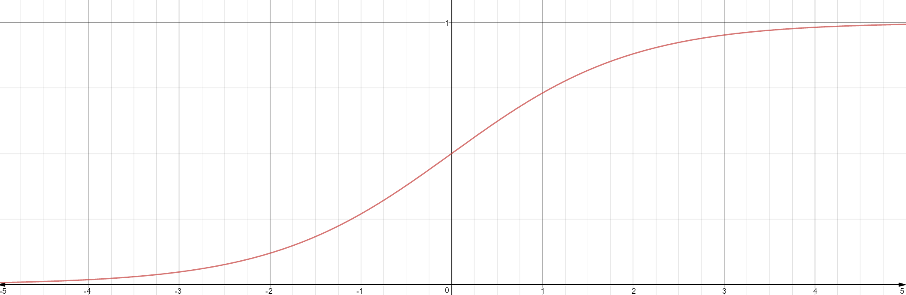
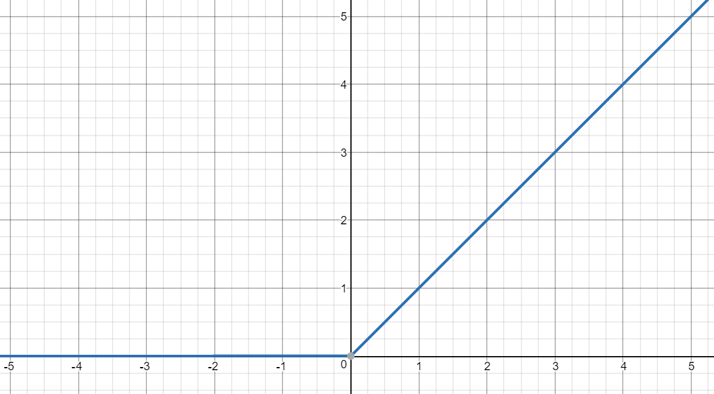
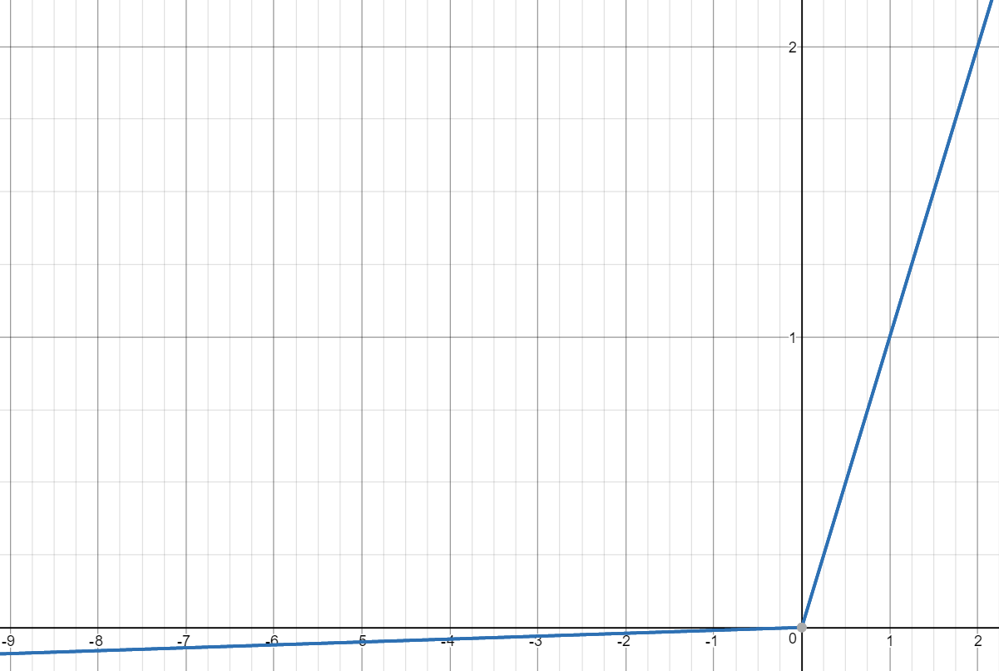
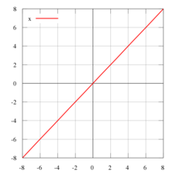

### *Activation function*

### 정의
  - 뉴럴 네트워크의 개별 뉴런에 들어오는 입력신호의 총합을 출력신호로 변환하는 함수를 활성화 함수라고 합니다. 활성화 함수 유무는 초창기 모델일 퍼셉트론과 뉴럴네트워크의 유일한 차이점이기도 한다. 
  - 활성화 함수는 대개 비선형 함수 (non-linear function)를 사용합니다.
  - 선형 함수를 사용하지 않는 이유는? 
  > *선형 함수인 h(x)= cx 를 활성화 함수로 사용한 3 층 네트워크를 떠올려 보세요. 이를 식으로 나타내면 y(x)=h(h(h(x)))가 됩니다. 이는 실은 y(x)=ax와 똑같은 식입니다. a=c^3이라고만 하면 끄이죠. 즉, 은닉층이 없는 네트워크로 표현할 수 있습니다. 뉴럴네트워크에서 층을 쌓는 혜택을 얻고 싶다면 활성화함수로는 반드시 비션형 함수를 사용해야 합니다. <'밑바닥부터 시작하는 딥러닝>*
  
  
### 종류
### 1. 시그모이드 함수(로지스틱 함수) : Curved in two directions, like the letter "S"
   - 수식 : $\sigma (wx+b)=\frac { { e }^{ wx+b } }{ 1+{ e }^{ wx+b } } $
   - 범위 : (0,1)
   - 시그모이드 함수는 완전히 값을 전달하지 않거나(0) 혹은 완전히 전달한다(1)는 특성 때문에 실제 인테의 뉴런과 유사하다고 생각되어 널리 사용되었으나, 현재는 점차 사용하지 않는 추세입니다. 
   - 이유 : 
  > Vanishing Gradient: sigmod함수는 뉴런의 활성화 값이 0 또는 1에 매우 가깝다면 해당 편미분 값이 0에 매우 가까워지는 특성이 있습니다. 인공신경망의 back propagation에서 가장 일반적으로 사용되는 gradient descent의 경우 chain rule을 이용하는데, 이 과정에서 0에서 매우 작은 갑싱 계속 곱해진다면 그 값은 0 으로 점점 더 수렴합니다. 즉, 학습의 결과가 back propagation 과정에서 전달되지 못하고 이에 따라 weight 값의 조정이 이루어지지 않습니다. 이는 학습의 과정에 문제가 됩니다. 그럼 우리의 신경망 모델의 정확도는 감소한다. 이것이 vanishing gradient problem입니다.
   - 
    
### 2. 하이퍼볼릭 탄젠트 : 
   - 수식 : 수식 : $tanh(x)=\frac { { e }^{ 2x }-1 }{ { e }^{ 2x }+1 } $
   - 범위 : (-1,1)
   - 하이퍼볼릭탄젠트는 시그모이드 함수의 크기와 위치를 조절한 함수입니다. sigmode처럼 비선형 함수이지만 결과값의 범위가 -1부터 1이기 때문에 sigmode와 달리 중심값이 0 입니다. 따라서 sigmode보다 학습 수렴 속도가 빠르다는 장점이 있고, 항상 선호됩니다. 하지만 여전히 vanisjing gradient 문제가 발생하기 때문에 다른 대안이 등장합니다. 
   - 
### 3. 렐루 : ReLu(Rectified Linear Unit)
   - 수식 : $ y = max(0,x) $
   - 범위 : (0, 무한대)
   - ReLu는 선형 그래프를 한 번 꺽은 형태입니다. 이 간단한 함수는 오랫동안 인공신경망의 발목을 잡던 vanishing gradient 문제를 해결해줍니다. 하지만 여전히 장,단점이 존재합니다. 
   - 장점 :
      1. 기존의 sigmode, tanh에 비해 converage 되는 속도가 빠릅니다.  saturated하지 않고 linear하기 떄문이다. 
      2. x값이 0 을 기준으로 선형발현/미발현 이라는 간단한 형태이기 때문에 상대적으로 연산량이 많은 exponential을 사용하지 않아, 컴퓨터의 연산에 대한 부담을 줄여줍니다.
   - 단점 : 
      1. "dying ReLu problem"이 발생합니다. 만약 학습 과정에서 weight가 특정 뉴런이 activate되지 않도록 바뀐다면, 해당 뉴련을 지나는 gradient도 0이 됩니다. 따라서 training과정에서 해당 뉴런이 한 번도 발현하지 않게 될 수도 있습니다. 심한 경우 네트워크 뉴런의 40%가 죽는 경우도 발생한다고 합니다. 이것을 막기 위해서는 learning rate를 크기 않게 조절하는 것이 중요한이다. 또 다른 해결방안으로 leaky relu와 같은 fuction을 사용할 수 있습니다. 
   - 
   
### 4. Leaky 렐루 :
   - 수식 : $ y = max (0.01x , x) $
   - 범위 : [0 , 무한대)
   - Leaky ReLu는 "dying ReLu"현상을 해결하기 위해 제시된 함수이다. ReLu는 x<0인 경우 항상 함수값이 0이지만, Leaky ReLu는 작은 기울기를 부여한다. 몇몇 경우에 이 함수를 이용하여 성능 향상이 일어났다는 보고가 있지만, 모든 경우에 그렇진 않다. 
   - 

### 5. 항등 함수 : identity function
   - 수식 : $ y = x $
   - 범위 : (-무한대 , 무한대)
   - 입력값을 그래도 출력해주는 함수이다. 이것은 뉴런에 공급되는 복잡한 데이터를 연산하지 않는다. 
   - 회귀에 사용되는 활성화 함수이다.
   - identity activation function은 ANN의 input layer에 쓰인다.
   - 
    
### 6. 소프트 맥스 : softmax
   - 수식 : 
   - 범위 : 
   - 소프트맥스는 뉴런의 출력 값에 지수합수를 적용하되 모든 뉴런에서 나온 값으로 정규화하는 형태를 가집니다. 모든 출력값들의 총합은 항상 1이됩니다.
   - 분류에 사용되는 활성화 함수이다. 모든 입력 신호로부터 영향을 받는다. 
   - 분류하고 싶은 클래스의 수 만큼 출력으로 구성합니다. ex class가 (개, 고양기 토끼)라면 3이다. 
   - 가장 큰 출력 값을 부여받은 클래스가 정답일 확률도 높다. ex ( 2.2 , 1.39. 0.85 ) 라면 고양이일 확률이 높다.
   - 쓰이는 이유 :
   >  A 학습 데이터에서 출력 레이어 (마지막 레이어)뉴런의 출력 값이 (개, 고양이, 토끼) = (0.5, 0.2, 0.1), B 학습 데이터에서 출력레이어 뉴런의 값이 (0.9, 0.8, 0.7)와 같은 결과가 출력되었다고 가정해보자. 둘 중 어떤 데이터가 강아지에 가까운 것일까? A 학습 데이터의 경우 강아지인 절대 확률(0.5)은 낮지만 고양이(0.2), 토끼(0.1)에 비해 더 가깝다고 할 수 있지만 B 학습 데이터의 경우 0.9, 0.8, 0.7로 3개의 클래스에 대한 확률이 거의 비슷해 구분하기가 어렵다. 이렇게 다중 클래스를 구분할 경우 마지막 뉴런의 활성화 함수로 sigmoid를 사용하면 출력 값을 공정하게 평가하기 어렵습니다. 따라서 뉴런의 출력 값을 지수함수를 통해 각각의 값의 편차를 확대시킨 뒤 정규화 하는 softmax function을 사용합니다.      

>> A 학습 데이터 sigmoid 함수 적용 

>> A 학습 데이터 softmax 함수 적용

>> B 학습 데이터 sigmoid 함수 적용

>> B 학습 데이터 softmax 함수
  - sigmoid 함수의 출력값에 비해 soft max 함수 출력값이 뚜렷하게 구분되어 보다 공정하게 평가할 수 있다. 
  
  - 
  

### total 

     
