## week5 수학공부!!!
## 1. 기초수학

- 로그

  : log는 수학함수의 일종으로, 어떤 수를 나타내기 우해 고정된 밑을 몇 번 곱하여야 하는지를 나타내는 함수이다.
  - 지수함수와 역의 관계이다.
  - 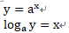
  
- 절대값, 유클리드 거리

  : absolute value는 실수가 실수선의 원점과, 복소수가 복소평면의 원점과 떨어진 거리를 나타내는 음이 아닌 실수이다.
  
  : Euclidean distance는 두 점 사이의 거리를 계산할 때 흔히 쓰는 방법이다. 
  - 
  
- 수열

  : seauence는 수 또는 다른 대상의 순서있는 나열이다. 나열 순서를 생각해야 하고 중복이 허용된다는 점에서 집합과 구분된다.
  - 수열의 각수를 '항'이라 한다.
  - 유한수열, 무한수열이 있다.
  - 일반항(n번째항) 
  - 
  - n번쨰항까지의 합
  - 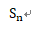
  - 수열의 합과 일반항과의 관계
  - 
  - 대표적으로 등차수열, 등비수열, 조화수열이 있다.

## 2. 미분 Differentiation

  : 미분은 함수의 최대값이나 최소값을 구하는 경우에 사용된다.

- 최댓값, 최솟값

  : 함수 f가 일정 구간 안의 모든 점에서 미분 간으하고 구간 내 임의의 점 c에서 1차 미분이 0이면 (f'(c) =0) 함수 f는 점 c에서 지역 최대값이나 최소값을 갖는다.
  - 함수 f(x)의 최대값은 함수의 양 끝 값과 극대값중 가장 큰 값이다.
  - 함수 f(x)의 최소값은 함수의 양 끝 값과 극소값중 가장 작은 값이다.
  - 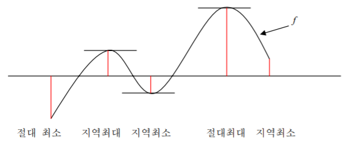
  
  
- 극대값, 극소값

  : 미분가능한 함수 f(x)가 x=a 에서 극값을 가지면 f'(a) = 0이다.
  - 극대점 f'(a)=0 이고 x=a의 좌우에서 f'(x)의 부호가 (+)에서 (-)로 바뀌면 f(x)는 x=a에서 극대이고, f(a)는 극대값이 된다.
  - 극소점 f'(b)=0 이고 x=b의 좌우에서 f'(x)의 부호가 (-)에서 (+)로 바뀌면 f(x)는 x=b에서 국소이고, f(b)는 극소값이 된다.
  - 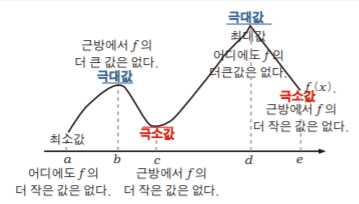
  
  
- 합성함수 미분
  - 합성합수의 미분법 1
  - 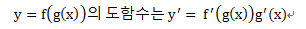
  - 
  
  - 합성합수의 미분법 2
  - 
  - 

- 상미분, 편미분 (유형에 의한 분류)
  - 상미분
  
  : 한 개 또는 그 이상의 종속변수의 단 하나의 독립변수에 대한 도함수들만을 포함하는 방정식을 상미분방정식(ODE: orfinary differential equation)이라 한다.
  - 
  
  [상미분방정식 모델링 예시](http://blog.naver.com/PostView.nhn?blogId=la6354&logNo=220605971726&categoryNo=21&parentCategoryNo=0&viewDate=&currentPage=1&postListTopCurrentPage=1&from=search)

  
  - 편미분
  
  : 한 개 또는 그 이상의 종속변수의 두 개 이상의 독립변수에 대한 편도함수들을 포함하는 방정식을 편미분방정식(PDE: partial differentail equation)이라 한다.
  - 
  

## 3. 선형대수

- 벡터, 스칼라

  : vector 방향과 크기의 의미를 모두 포함하는 표현 도구입니다.
  - 
  
  : scalar는 크기와 방향을 가지는 벡터에 대비하는 개념으로, 크기만 있고 방향을 가지지 않은 양을 말한다. 벡터의 크기는 스칼라이다. 
  
  좌표계가 변함에 따라 벡터의 각 성분은 바뀐다. 그러나 벡터의 크기는 스칼라이고 좌표계가 변해도 그 값은 불변이다. 이 그림에서 (x,y) 로 표현되는 좌표계에서 굵은 선으로 표시한 벡터의 성분은 (5,0)이지만, 벡터 자체가 변하지 않음에도 좌표계가 (x', y')으로 바뀌었을 때 각 성분은 (4,3)으로 바뀌었다. 하지만 두 좌표계에서 벡터v의 크기는 5로 불변이고 따라서 스칼라이다.
  
  - 
  - 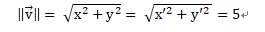
  
  
- 내적, 외적
  
  - 내적은 scalar product(스칼라곱) 또는 Dot product라고 한다. 
  - 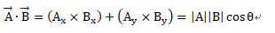
  - 내적값과 벡터의 크기를 안다면 사이각을 구할 수 있다. 이게 첫번째 내적ㅇ의 의의이다. 
  - 영이 아닌 두 벡터 사이의 각이 직각일 때 두 벡터는 서로 수직 또는 직교한다고 한다. 두 벡터가 수직할 필요출중조건은 
  - 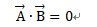
  - 정사영 문제 (수선의 발)
  
  - 외적은 3차원에서만 정의되는게 큰 특징이다. 유클리드 공간상에서만 쓸 수 있다.(오른손의 법칙)
  - 
  - 외적의 결과는 내적과 달리 벡터이다. 평행하지 않은 두 벡터를 외적한 결과는 그 두 벡터와 수직이기 때문이다.
  - 외적을 이용하면 두 벡터가 평행하다는게 아주 근사하게 설명된다. 
  
- L1 norm, L2 norm
  - Norm은 벡터의 길이 혹은 크기를 측정하는 함수입니다. Norm이 측정한 벡터의 크기는 원점에서 벡터 좌표까지의 거리 혹은 Magnitude라고 합니다.
  - 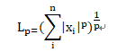
    * p는 Lorm의 차수를 의미합니다. p가 1dlaus L1 Norm이고 p가 2dlaus L2 Norm입니다.
    * n은 대상 벡터의 요소 수입니다.
   - L1 Norm을 Taxicab Norm 혹은 Manhattan norm이라고도 합니다. L1 norm은 벡터의 요소에 대한 절대값의 합입니다. 요소의 값 변화를 정확하게 파악할 수 있습니다. L1 regularization, computer visiton 영역에서 사용됩니다.
   - 
   - L2 Norm은 p가 2인 Norm입니다. n차원 좌표평면에서의 벡터의 크기를 계산하기 때문에 유클리드 노름이라고도 합니다. L2 regularization, KNN알고리즘, Kmean 알고리즘에서 사용됩니다.
   
    
  
- 행렬계산
   - 행렬 덧셈
   - 
   - 스칼라 곱
   - 
   - 전치
   - 
   - 행렬 곱셈
   - 

- 고윳값, 고유벡터

  : 고유 벡터는 그 선형 변환이 일어난 후에도 방향이 변하지 않는, 영벡터가 아닌 벡터이다. 
  - n차 정사각 행렬 A와 0 이 아닌 벡터 x (R^n차원에 속함)에 대해 Ax = cx를 만족하는 실수 c가 존재할때 c를 A의 고윳값이라 한다. 또한 고윳값 c에 대응하는 벡터 x를 A의 고유벡터라고 한다. 
  - 
  

## 4. 확률과 통계

- 확률
  : 하나의 사상 혹은 사건이 일어날 수 있는 가능성의 정도
  
- 확률변수와 학률분포
  : 무작위 실험을 했을때, 특정 확률로 발생하는 각각의 결과를 수치적 값으로 표헌하는 변수이다. 
  - ex) 동전을 무작위로 두번 던져서 그림 또는 숫자가 나오는 실험에서 일정한 확률(그림이 나올 확률 1/2 , 숫자가 나올 확률 1/2)을 가지고 발생하는 결과에 실수 값 (예: 앞=1, 뒤=0)을 부여하는 변수를 말합니다.
  - 주사위의 숫자와 같이 유한한 값을 취할 때, 이를 이산확률 변수라고 하고, 키나 몸무게처럼 실수로 연속된 무한한 값을 취할때 이를 연속 확률변수라고 한다.
  
  : 확률분포란 확률변수 x가 특정한 값을 가질 확률을 나타내는 함수를 의미합니다. 
  
  - 이산 확률 분포
    1. 베르누이 분포 
    2. 이항 분포 
    3. 초기하 분포 
    4. 기하 분포
    5. 포아송 분포 
  - 연속 확률 분포
    1. 정규 분포 
    2. T 분포
    3. 카이 제곱 분포
    4. F 분포
  
    [확률 분포](http://bcho.tistory.com/981)
    
- 결합확률과 조건부 확률
  
  : 2 이상의 확률적 사건을 동시에 고려하는 확률 표현이다. 결합 확률은 2 이상의 사건이 모두 일어날 확률 즉, 동시에 일어날 확률이다.
  
  
  : 조건부 확률이란 어떤 사건 B가 일어났을 때 사건 A가 일어날 확률을 일어난다. 사건 B가 발생했을 때 사건 A가 발생할 확률은 사건 B의 영향을 받아 변하는데 이를 조건부 확률이라 한다. 기호로는 P(A|B)라고 표현한다.
  - 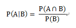
  
  - 독립사건에서의 조건부 확률 
  - 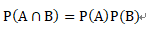
  
  
- 기댓값
  : 기댓값은 각 사건이 벌어졌을 떄의 이득과 그 사건이 벌어질 확률을 곱한 것을 전체 사건에 대해 합한 값이다. 이것은 어떤 확률적 사건에 대한 평균의 의미로 생각할 수 있다. 
  - 
  
  
- 평균, 분산, 공분산
  : 평균은 확률변수의 기댓값. 모평균이라고도 한다.
  
  : 분산은 그 확률변수가 기댓값으로부터 얼마나 떨어진 곳에 분포하는지를 가늠하는 숫자이다.기댓값은 확률변수의 위치를 나타내고 분산은 그것이 얼마나 넓게 퍼져 있는지를 나타낸다. 
  - 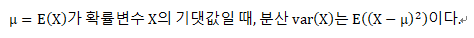
  
  
  : 공분산은 2개의 확률변수의 상관정도를 나타내는 값이다. 만약 2개의 변수중 하나의 값이 상승하는 경향을 보일 때, 다른 값도 상승하는 경향의 상관관계에 있다면, 공분산의 값은 양수가 될것이다. 반대로 2개의 변수중 하나의 값이 상승하는 경향을 보일때, 다른 값이 하강하는 경향을 보인다면 공분산의 값은 음수가 된다.
  - 
  
  
- 상관계수
  : 상관분석은 두 변수가 서로 어떠한 관계인지를 파악하는 분석이다. 점들이 흩어져 있는 모습을 보고 두 변수의 관계를 파악하는데, 기울기에 따라 양의 상관관계와 음의 상관관계로 나눌수가 있다. 점들이 모여있는 밀도를 표현하는 숫자가 상관계수이다. 부호 r을 사용하고 밀도를 표현한다. (-1 <=r <= 1)이다.
  
- 최대 가능도 추정
