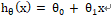
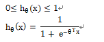
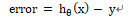
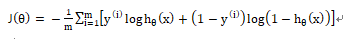
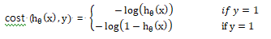
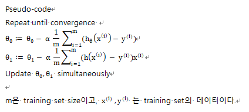

## week 6 Gradient Descent Algorithm

### 우선
- the hypothesis funcion이란: input(feature)과 output(target)의 관계를 나타내는 함수이다. output값이 나오게 하는 진짜 변수들과 그 변수와 output 사이의 관계식을 정확히 정의하는것은 불가능하다. 우리는 어마어마한 변수들을 모두 고려하고 그 변수들 간의 복잡한 방정식을 찾는 대신 주로 이러이러한 변수들이 output에 영향을 미칠거야 하고 추정하는 일종의 가설을 세우기 때문에 hypothesis라고 부르기 시작한 것으로 여겨진다. 

- linear regression에서의 hypothesis function:

- logistic regression에서의 hypothesis function:

## Cost functions
- linear regression 의 const function:
  - 주어진 데이터에 가장 잘 맞는 직선을 선택하려면 일정한 기준이 있어야 한다. 우리의 hypothesis funcgion의 정확도를 측정하기 위해 cost function을 이용할 것이다. 
  

   - training example 들이 parameter 추정에 이용된다,
   - h(x)가 y와 비슷해지는 세타를 고르는 것이다. 
   - error 값을 최소화하는 값을 찾는것이다. 하지만 error값은 양수값이 될수도 있고 음수값일 수도 있기때문에 제곱값의 합을 구하여 그 합이 최소가 되는 parameter를 찾는 방법이 일반적이다. 이를 LSE(least squared error) criterion이라고 한다.
  

   - 이 cost function은 mean-squared-error (MSE) 이다. 즉 (error)^2의 평균이 cost값이 된다.     
   - 여기서 error란, 추정한 y값과 y.hat 값의 차이를 말한다. 
 

   - 다만 평균이라면 data 갯수인 m으로 나누어야 하는데 2m으로 나누었다. 2는 계산상의 편의를 위한 것으로 나중에 약분되는 것을 확인하게 될것이다.
  
  
- logsitic regression 의 cost function:
  - linear regressio의 cost function의 LSE criterion을 그래도 사용하면 logsitic regression의 cost function은 non-convex function이 된다. 그래서 조금 다르게 정의한다.
  

  - 이 cost function의 특징은 
    - Maximum likelihood estimation criterion
    - Convex
  

## Gradient Descent Algorithm
- Gradient Descent 는 cost funcgion을 최소화하기 위해 이용할 수 있는 방법 중 하나이며, cost function말고도 각종 optimization에 이용되는 일반적인 방법이다. 

- Gradient Descent Outline : 
  - start with some Theta0, Theta1 ( Theta0 = 0 , Theta1 = 1) 
  - keep changing Theta0, Theta1 to reduce J(Theta0, Theta1) until we hopefully end up at minimum.
  
  - *주의해야할 점은 parameter들을 한번에 업데이트해야한다는 점이다. 만약 Theta0을 먼저 업데이트하여 hypothesis가 바뀌고, 그 hypothesis에 숫자를 대입해 Theta1을 구하면 예상치 못한 문제가 발생할 수 있다.*
  - Gradient descent 가 local optima (slope =0)에 이르면 편미분향이 0이 되므로 더이상 업데이트되지 않는다.
  - 대부분의 경우 최적값에 수렴할수록 편미분항의 크기가 작아져서 조금씩 업데이트되기 떄문에 Alpat값을 수동으로 조절하지 않아도 된다.
  

- linear regression에 gradient descent적용해보기
  - linear regression에서 정의한 cost funcgion을 J(Theta0, Theta1)에 대입하면 된다.
  - linear regression cost function은 convex이므로 항상 global optimal에 수렴한다.

- logsitic regression에 gradient descent적용해보기
  - cost function을 최소화하는 parameter Theta를 찾는 것이 목적이다. J(Theta)가 Convec이므로, gradient descent에 의해 optimal Theta를 찾을 수 있다. 
  

  

## Learning rate alpha
- 상수 Alpha > 0 은 learning rate라고 한다. 이 크기가 클수록 한번에 더 많이 움직이게 되는 것이다.
- 편미분항은 다음에 이동할 방향과 크기를 결정한다. 기울기의 반대방향으로 움직이는데, 기울기가 클수록 더 많이 움직인다.

- learning rate Alpha가 너무 작으면 수렴하는데에 오래걸리는 문제가 생기고, 너무 크면 최소값에 이르지 못해, 수렴하지 못하거나 심지어 발산하는 문제가 생길수 있다. 그러므로 적절한 learning rate를 고르는 것이 중요하다.

## Batch and Mini batch
- "Batch" : Gradient descent의 매 단계에서 모든 training example을 사용한다.
