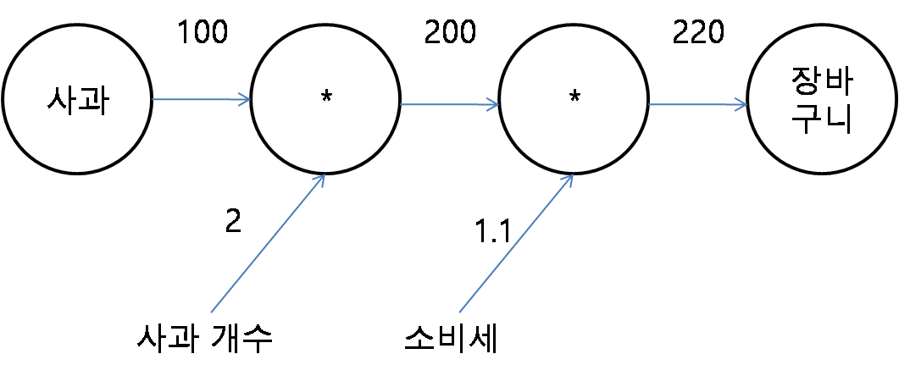
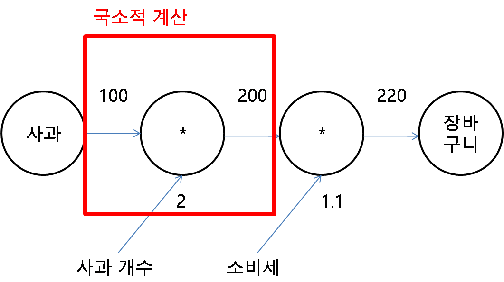
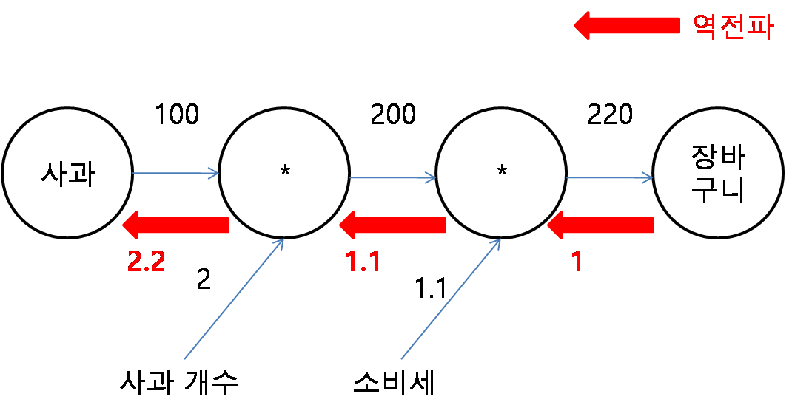
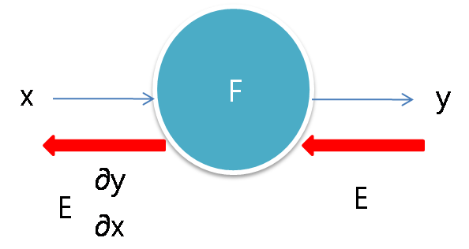
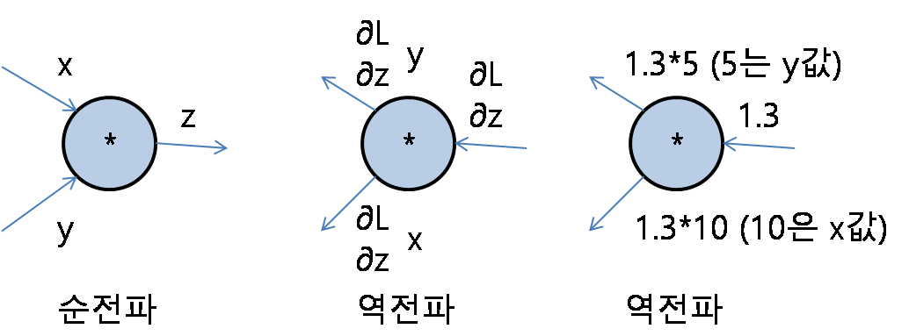

## 순전파

1. 신경망을 통과해서 도달한 결과값은 오차를 포함한다.
2. 최종적으로 나온 오차는 여러 계산 과정들을 거치며 합산된 값이다.
3. 각 계산 과정마다 어느 정도의 오차가 발생했는지를 관찰해서 계산과정을 다시 수정해준다.
4. 즉, 오차가 많이 발생되게 한 요인들은 큰 폭으로 값을 변화시킨다.
5. 수치미분 대신 오차역전파 사용으로 효율을 좋게 한다. 

### 계산그래프란?
- 계산과정을 그래프로 나타냄
- 노드와 에지로 표현
 {:width="100" height="100"}

### 국소적 계산이란?
- 노드에 직접 관계된 정보만으로 계산
- 노드입력(100,2)으로 출력(200) 생성
- 전체가 복잡해도 노드의 단순 계산에 집중 --> 문제 단순화 가능 
- 중간계산결과 보관
- 노드 하나하나의 미분의 효울적 계산 가능 

## 역전파
- 1* 1.1(소비세) = 1.1
- 1.1 * 2(사과개수) = 2.2
- 2.2는 입력값에 대한 결과에 대한 영향력의 값이다. 100에서 2.2만큼 영향을 받아 220이 된것이다.
- 2.2는 미분의 값이다. 기울기값이다. x쪽으로 1만큼 커졌을때 y가 얼마나 변화할까?의 대한 답이다.
- 2.2는 미분값이지만 실제로 우리는 미분을 사용하진 않았다. 단순한 곱셈으로 계산하였다.

### 연쇄법칙

### 덧셈노드의 역전파
- 그대로 전달

- 덧셈계층 코드 예시

### 곱셈노드의 역전파
- x,y 값 바꿔서 계산

- 곱셈계층 코드 예시

- 사과가게 python 코드 예시

### 마지막에 나온 110, 2.2, 3.3, 165, 650 의 의미
- 단위 1 이 변경되었을때, 결과값에 미치는 영향력
- 사과의 개수가 2에서 3으로 증가하면 결과값이 715에서 825로 변경된다. 이 차이는 110 이다. 
- 사과의 가격이 100에서 101로 증가하면 결과값이 715에서 717.2로 변경된다. 이 차이는 2.2이다.
- 귤도 마찬가지이다. 

