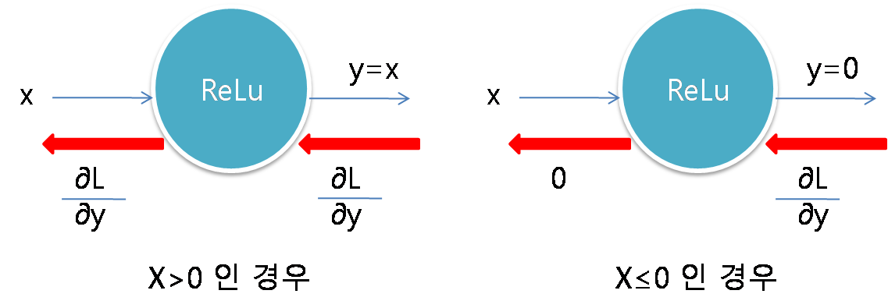
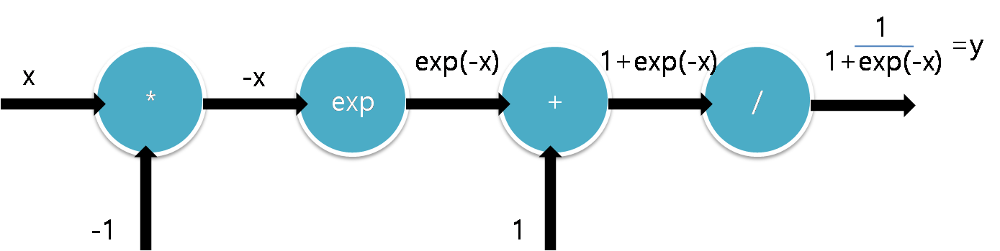
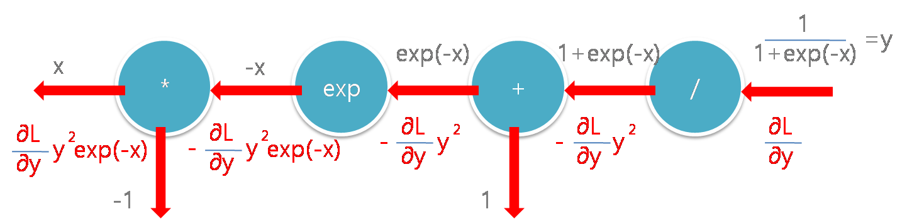
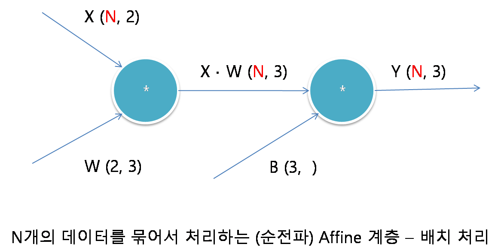
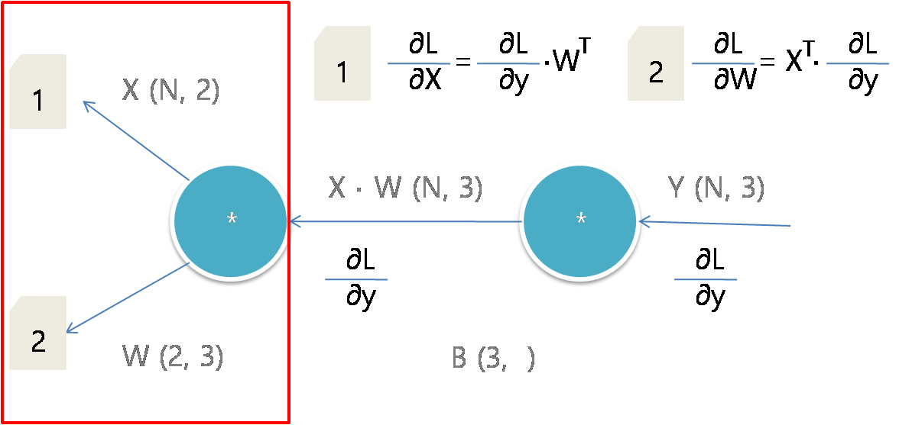
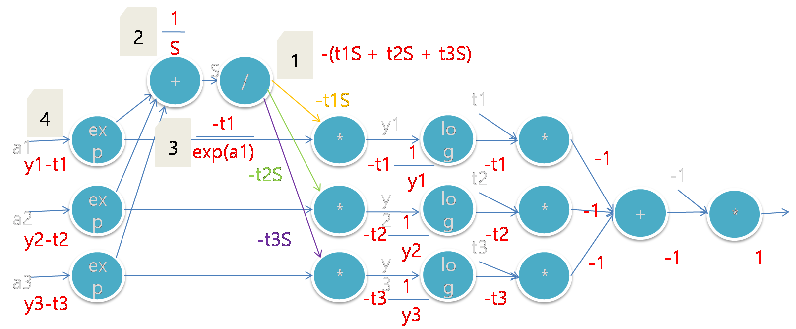
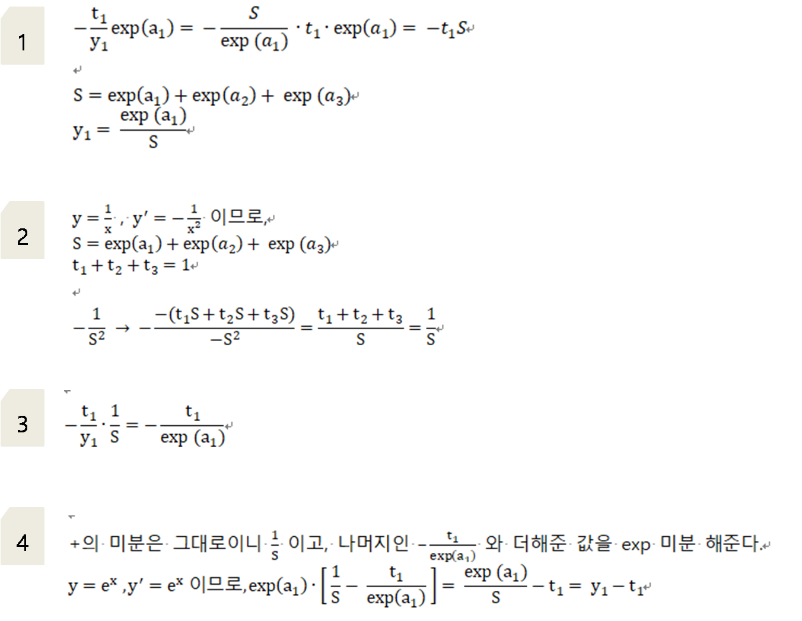

## 순전파


1. 신경망을 통과해서 도달한 결과값은 오차를 포함한다.
2. 최종적으로 나온 오차는 여러 계산 과정들을 거치며 합산된 값이다.
3. 각 계산 과정마다 어느 정도의 오차가 발생했는지를 관찰해서 계산과정을 다시 수정해준다.
4. 즉, 오차가 많이 발생되게 한 요인들은 큰 폭으로 값을 변화시킨다.
5. 수치미분 대신 오차역전파 사용으로 효율을 좋게 한다. 


### 1. 계산그래프란?


- 계산과정을 그래프로 나타냄
- 노드와 에지로 표현


### 2. 국소적 계산이란?


- 노드에 직접 관계된 정보만으로 계산
- 노드입력(100,2)으로 출력(200) 생성
- 전체가 복잡해도 노드의 단순 계산에 집중 --> 문제 단순화 가능 
- 중간계산결과 보관
- 노드 하나하나의 미분의 효울적 계산 가능 


## 역전파


- 1* 1.1(소비세) = 1.1
- 1.1 * 2(사과개수) = 2.2
- 2.2는 입력값에 대한 결과에 대한 영향력의 값이다. 100에서 2.2만큼 영향을 받아 220이 된것이다.
- 2.2는 미분의 값이다. 기울기값이다. x쪽으로 1만큼 커졌을때 y가 얼마나 변화할까?의 대한 답이다.
- 2.2는 미분값이지만 실제로 우리는 미분을 사용하진 않았다. 단순한 곱셈으로 계산하였다.


### 1. 연쇄법칙


### 2. 덧셈노드의 역전파


- 그대로 전달


- 덧셈계층 코드 예시
```python
class AddLayer:
    def __init__(self):
        pass
    
    def forward(self,x,y):
        out = x+y
        return out
    
    def backward(self,dout):
        dx = dout*1
        dy = dout*1
        return dx,dy
```

### 3. 곱셈노드의 역전파


- x,y 값 바꿔서 계산


- 곱셈계층 코드 예시
```python
class MulLayer:
    def __init__(self):
        self.x=None
        self.y=None
        
    def forward(self, x, y):
        self.x =x
        self.y =y
        return x*y
    
    def backward(self, dout):
        dx = dout *self.y
        dy = dout *self.x
        return dx,dy
```


[사과가게 python 코드 예시](https://github.com/jominjimail/ausg/blob/master/ML/week7/forward_backward.ipynb)


### 4. 마지막에 나온 110, 2.2, 3.3, 165, 650 의 의미


- 단위 1 이 변경되었을때, 결과값에 미치는 영향력
- 사과의 개수가 2에서 3으로 증가하면 결과값이 715에서 825로 변경된다. 이 차이는 110 이다. 
- 사과의 가격이 100에서 101로 증가하면 결과값이 715에서 717.2로 변경된다. 이 차이는 2.2이다.
- 귤도 마찬가지이다. 


## 활성화 함수 계층 구현


### 1. ReLu 함수 구현


- 순전파에서 입력값이 0 이상인 경우는 들어온 값을 그대로 전달한다.
- 순전파에서 입력값이 0 이하인 경우는 0을 전달한다.
- 역전파에서 입력값이 0 이상인 경우는 들어온 값을 그대로 전달한다.
- 역전파에서 입력값이 0 이하인 경우는 0을 전달한다.



### 2. sigmoid 함수 구현

- 순전파


- 역전파


- 간소화


- 코드 구현
```python
import numpy as np
class Sigmoid:
    def __init__(self):
        self.out = None
    
    def forward(self, x):
        out = 1/(1+np.exp(-x))
        self.out = out
        return out
    
    def backward(self, dout):
        dx = dout*(1.0 - self.out)*self.out
        return dx
```


### 3. affine, sofrmax 함수 구현


> Affine 계층은 행렬 내적을 기하학에서 어파인 변환(affine transformation)이라고 하고, 어파인 변환을 수행하는 처리를 Affine 계층이라는 이름으로 만든다. 즉, 이전 계층의 모든 뉴런과 연결되어 있어 행렬의 내적(np.dot())을 사용하여 계산하는 계층/레이어를 Affine 계층/레이어라 부른다.
```python
import numpy as np
X = np.random.rand(2)
W = np.random.rand(2,3)
B = np.random.rand(3)
Y = np.dot(X,W) +B
```
 - 배치처리란? 입력값이 10000개라면 하나하나 언제 계산하고 있을까. 컴퓨터가 처리할 수 있는 정도의 양을 배열로 묶어서 한번에 처리하는게 배치처리라한다.
 - X(2) 에서 (N,2) 로 수정한다. N묶음을 한번에 처리하는것이다. (Batch)
 
 
 
 
 [affine python 코드 예시](https://github.com/jominjimail/ausg/blob/master/ML/week7/affine.ipynb)
 
### softmax-with-Loss 계층

- 추론: 가장 좋은 결과를 찾아 내는 것
- 학습: 앞의 변수들(W,B)을 수정해서 추론에서 나온 가장 높은 값을 크게하고 다른 값들은 작게 만드는 과정 (정답지, 라벨이 필요함)
> 예시 '2'라는 숫자를 데이터화해서 000000001100010010000010000100001000011110000000 을 input으로 넣는다. Affine -> ReLu -> Affile -> ReLu -> Affine -> Softmax 계층을 지난다. 여기서 마지막 Affine의 출력값이 각각 (5.3, 0.3, 10.1 ...) 이라고 하자 이 값은 추론시 사용되고 Softmax의 출력값 (0.008, 0.00005, 0.991 ...)은 학습시 사용된다. 즉, (5.3, 0.3, 10.1 ...)을 보고 10.1인 2의 점수가 가장 높기때문에 이 값은 '2'라고 추론을 할 수 있고, (0.008, 0.00005, 0.991 ...)을 보고 '2'일 확률이 99.1%이고, 0일 확률이 0.8%라는걸 알 수 있다. 이를 토대로 W,B를 조절해서 2일 확률을 높이고, 0일 확률을 낮추도록 학습시키는것이다. 단, 들어온 입력값이 '2'라는 사실을 알고 있어야한다.


 
 
- sofrmax 함수로 교차 엔트로피 오차를 사용하면 역전파가(y1-t1, y2-t2, y3-t3)로 간단해진다. 이렇게 계산 결과를 단순하고 쉽게 만들기 위해 설계된 것이 교차 엔트로피 오차이다.

- sofr max Cross Entropy Error 예시


입력값 (a1, a2, a3) 

순전파


역전파 




