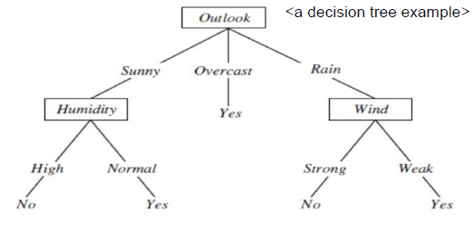
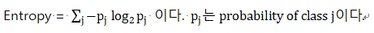
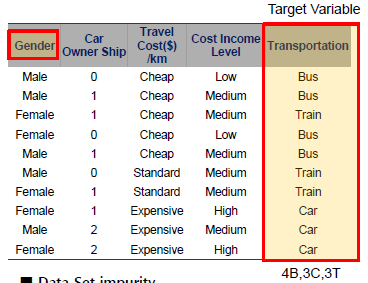
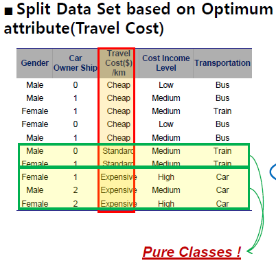
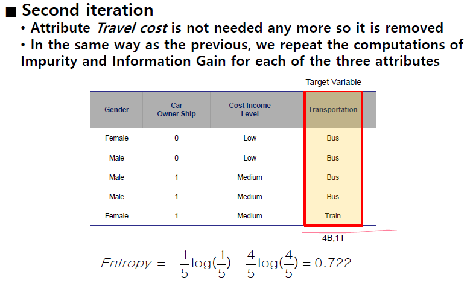
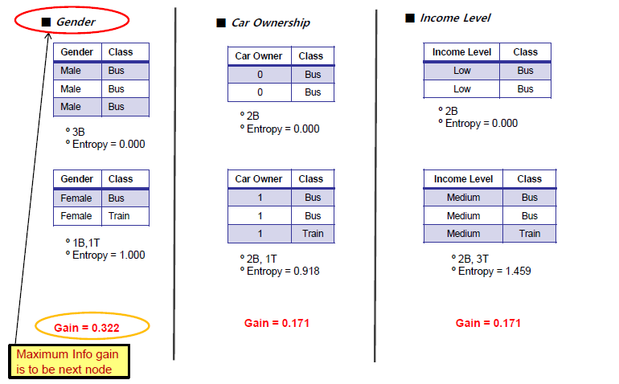
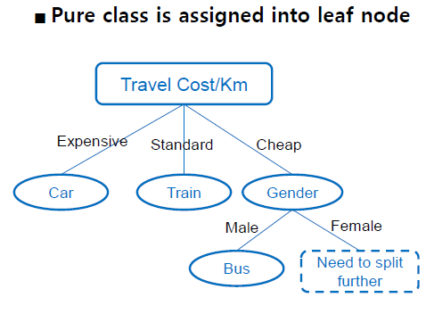
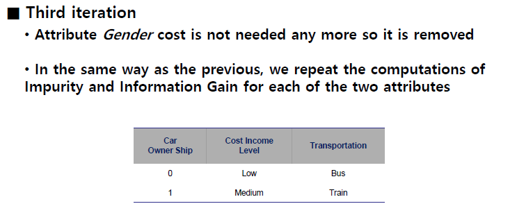
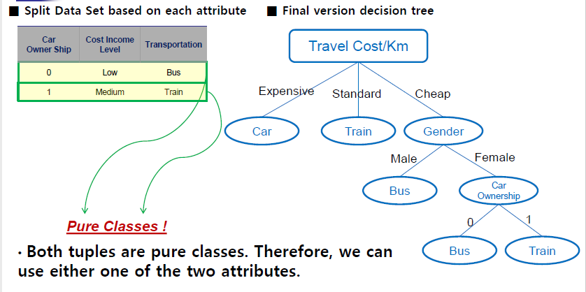

## Decision tree ##

## 1. 의사결정 트리란?

   - 결정트리는 의사 결정 규칙과 그 결과들을 트리 구조로 도식화한 의사 결정 지원 도구의 일종이다. 목표에 가장 가까운 결과를 낼 수 있는 전략을 찾기 위해 주로 사용된다.

   - 분류(classification)기술 중 가장 일반적으로 사용되는 방법이다.

   - eager learning과 관련있다. 미리 분류해놓은 tree를 가지로 query가 들어오면 tree를 거쳐 답을 내준다.


## 2. 의사결정 트리 알고리즘이란?

   - 결정 트리를 구성하는 알고리즘에는 주로 하향식 기법이 사용되며, 각 진행 단계에서는 주어진 데이터 집합을 가장 적합한 기준으로 분할하는 변수값이 선택된다. 

   - 서로 다른 알고리즘들은 '분할의 적합성'을 측정하는 각자의 기준이 있다.(ex.동질성 측정)


## 3.  의사결정 트리의 장점은?

   - 계산 비용이 적다.

   - 결과를 해석하고 이해하기 쉽다.

   - 자료를 가공할 필요가 거의 없다.

   - 수치 자료와 범주 자료 모두에 적용할 수 있다.

   - 대규모의 데이터 셋에서도 잘 동작한다. 특히 속성이 많은 data를 유연하게 다룰 수 있다.

## 4. 의사결정 트리의 단점은?

   - 각 노드에서의 최적값을 찾아내는 탐욕 알고리즘같은 휴리스틱 기법을 기반으로 하고 있어 최적 결정 트리를 알아낸다고 보장할 수 없다. (local maximum에 갇히는 문제)

   - 훈련 데이터를 제대로 일반화하지 못할 경우 너무 복잡한 결정 트리를 만들 수 있다.

   - 배타적 논리합이나 패리티, 멀티 플렉서와 같은 문제를 학습하기 어렵다.

   - 약간의 차이에 따라 트리의 모양이 많이 달라질 수 있다.


## 5. 표현방법

   - internal node는 attribute variable을 적는다.
   - each branch는 attribute value을 적는다.
   - each leaf node는 classification value을 적는다.

   아래 예시는 'outlook' 속성이 있고 이 속성의 value 값으로 sunny, overcast, rain이 있고 리프 노드의 값은 날씨에 따라 테니스를 치러 나갈것인가 YES, 안 나갈것인가를 NO정하는 classification value 이다.
   
   

   ```c
   #play tennis rule in your brain:
   if(Outlook == Sunny && Humidity == Normal) 
   || (Outlook == Overcast)
   || (Outlook == Rain && Wind = Weak) then Yes
   else No
   ```


## 6. decision tree types
   - binary decision trees - only two choices in each split (성적 예시)
   
   
   - N-way or ternary decision trees - three or more choices in at least one of its split (테니스 예시)

## 7. tree split

   트리는 split 과정을 통해 좀 더 작은 자식을 생성한다. 하지만 잘 생각해보자 split을 그냥 멍청하게 자를것인가?

   - 아니다. 가장 정보력이 높은 속성으로 먼저 자르면 큰 뭉텅이로 자식을 나눌 수 있다. 그런다음 다음으로 정보량이 가장 많은 걸로 또 split을 한다.  (이런 방식이 top-down 방식이다.) 

   *이제는 정보력이 높은 속성을 어떻게 detect를 하느냐가 문제인 것이다.* 

## 8. tree split 똑똑하게 하기

   - best split을 하기 위해 각 속성으로 분류했을때 나오는 자식들의 homogeneous 속성을 평가하면 된다. 즉, 동족성이다. 이 속성을 purity 순도라고 한다. 

   - 간단한 예시를 들어보자

     불투명한 주머니에 흰 공 10개, 검은 공이 10개가 들어있다고 하자. 어떤 속성으로 인해 이 주머니가 2개로 나눠졌다. 아래그림을 보면 오른쪽 Good Split 의 자식 주머니의 purity가 왼쪽 Poor Split 보다 높은것을 알 수 있다. 

   - 만약 data group 이 여러개의 classes(several target values)를 가지고 있다면 이것은 impure하다고 말한다.

   - 만약 data group 이 one class(one target value)를 가지고 있다면 이것은 pure하다고 말한다.

   - *purity를 increase 하는 방향으로 split을 한다면 이것은 best split방법이 될 것이다.*

## 9. 순도를 어떻게 측정 할 것인가?

   - **information gain based on entropy** 개념을 다룰 것이다.

   - **Gini (population diversity)**개념을 다룰 것이다.

   - Information Gain Ratio(as simple variation of Information Gain)

   - Chi-square Test based(on chi-square distribution in Statistics)

## 10. Information Gain이란?

   - Entropy란?
      impurity를 측정하는 단위이다.
      

      > 엔트로피 개념을 좀 더 이해하기 쉽게 설명하자면, 불투명한 주머리가 있다고 가정하자. 이 주머니 속에 하얀색 공만 있다면?
      >
      > 에잇! 이미 다 알고 있다. == 에너지가 0 이다. 에너지가 낮다.
      >
      > 하지만 주머니 속에 하얀 공 5개, 검은 공 5개가 있다면?
      >
      > ...??!?!?! 모른다. == 에너지가 1이다. 에너지가 높다.
      >
      > 즉, 확률이 높을 수록 에너지가 낮고, 로또에 당첨되는 것처럼 확률이 낮으면 에너지가 굉장히 높다.

   - information gain이란?
      split을 함으로써 부모와 자식의 불순도가 얼마나 차이나는지 비교하기 위해서 고안한 식이다.
      

## 11. information gain: Example

   - data set
   
      target variable인 Transportation의 엔트로피 값은 **1.571**
      
   
   - 만약, Gender로 split을 할 경우 Target인 버스, 전철, 차고 각각 분류해서 
     
      남성5명 (버스3 + 전철1 + 차1)의 Entropy를 구해 1.37
     
      여성5명 (버스1 + 전철2 + 차2)의 Entropy를 구해 1.522

   Information gain 식에 대입하면 
   
   
   
   
   
   

   - 만약, Car ownership으로 split하면 Gain이 0.534

   - 만약, Travel Cost로 split하면 Gain이 **1.210**

   - 만약, Income Level로 split하면 Gain이 0.695

   - 즉, Gain이 가장 높은 1.210이 채택되면서 root는 Travel Cost가 된다. 
   

   근데 아마 Expensive와 Standard는 깔끔하게 pure하게 나오는데 cheap부분이 딱 떨어지지 않을 거다. 그럼 또 반복한다.

   분류된 부분은 제거하고 계산이 필요한 부분만 남겨서 다시 Target Variable의 Entropy(S)를 새로 구하고 똑같이 계산해준다. 
      
      

  - Entropy(S) =**0.722**
     

     - Gender의 Gain =**0.322**

     - Car ownership = 0.171

     - Income level = 0.171

     - 가장 높은 Gender가 다음 속성 node으로 선정되고 또 나눈다. Target Variable인
        Transportation이 pure하게 딱 떨어질 때까지 반복한다. 
        
        
        
     - 3회차 반복
     
     
     *fin*
