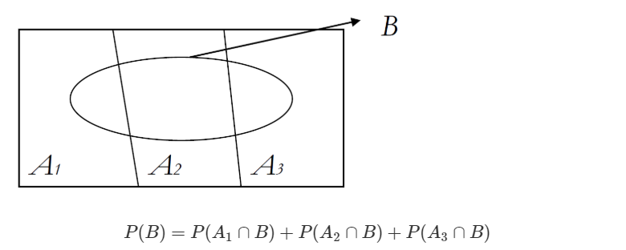
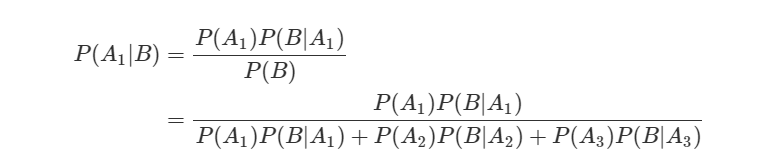
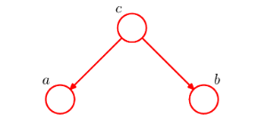
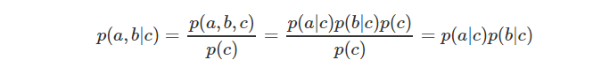
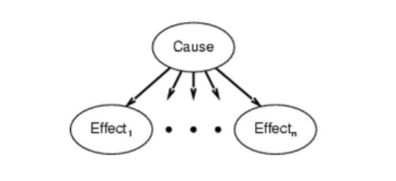

## Week 12 Naive Bayesian Network

1. Naive Bayes란
   - 지도 학습 알고리즘
   - 기초 이론: 베이즈 정리
   - Naive는 *순진하다*라는 뜻을 가지고 있습니다. 이런 수식어가 붙인 이유는 데이터셋의 모든 특징들이 동등하고 독립적이라고 가정하기 때문입니다.

2. 기초 이론 베이즈 정리

   - 일반적으로 사건 **A1, A2, A3**가 서로 배반(mutually exclusive)이고 **A1, A2, A3**의 합집합이 표본공간(sample space)과 같으면 사건 **A1, A2, A3**는 표본공간 **S**의 **분할**이라고 정의합니다. 우리가 관심있는 사건 **B**가 나타날 확률을 그림과 식으로 나타내면 다음과 같습니다.

      

     P(B)P(B)를 조건부확률의 정의를 이용해 다시 쓰면 아래와 같습니다. 이를 **전확률 공식(Law of Total Probability)** 또는 베이즈 법칙이라고 합니다.

      

     보통 **P(A1), P(A2), P(A3)**는 미리 알고 있다는 의미의 **사전확률(prior probability)**로 불립니다. **P(B|A1), P(B|A2), P(B|A3)**는 **우도(likelihood probability)**라 부릅니다.

     그럼 우리가 관심있는 사건인 **B**가 **A1**에 기인했을 조건부확률은 어떻게 구할까요? 바로 아래와 같이 구할 수 있습니다.

      

     **P(A1|B)**는 사건 B를 관측한 후에 그 원인이 되는 사건 **A**의 확률을 따졌다는 의미의 **사후확률(posterior probability)**로 정의됩니다. 사후확률은 사건 **B**의 정보가 더해진, 사전확률의 업데이트 버전 정도라고 생각하면 좋을 것 같습니다. *(Posterior probability is an updated version of prior probability)* 같은 방식으로 **P(A2|B), P(A3|B)**도 구할 수 있습니다.

     ##### *베이즈 규칙결론:* 
    
     P(A|B) = P(B|A) P(A) / P(B)
    
     P(disease | symptom) = P(symptom | disease) P(disease) / P(symptom)
    
     disease = 광우병 , symptom = 마비
    
      P(A) = P(A|B) P(B) + P(A|~B) P(~B) = P(A ^ B) + P(A ^ ~B)

   - 독립

     A와 B는 독립이다. iff 

     P(A ^ B) = P(A) P(B)

     P(A|B) = P(A)

     P(B|A) = P(B)

     여러 개의 변수를 다루고 있는 확률 문제에서 중요한 요소 중 하나는 조건부 독립이다.
    
     ex) C가 주어진 상황에서 A 과 B가 조건부 독립일 때  
     P(A | B,C) = P(A|C)
     P(B | A,C) = P(B|C)
     >
     > P(A ^ B|C) = P(A|C) P(B|C)
     >
     > 
     >
     > Toothache(T)
     >
     > Spot in Xray(X)
     >
     > Cavity(C)
     >
     > 이 상태로는 a와 b는 독립이 아니다. 그런데 만약 c의 값이 이미 알려진 상태이면 결합확률은 조건부 결합확률이 된다. 따라서 다음과 같이 조건부 독립이 성립한다.
     >
     > 
     >
     > 이런 상태를 c가 a,b 사이를 막고있다(block)고 한다. 

3.  Naive Bayes Model

   

   P(Cause, Effect1,Effect2, ... , Effectn) 

   = P(Cause) P(Effect1|Cause) P(Effect2|Cause)...P(Effectn|Cause) 

   > 의대 교과서는 나이브 베이즈 모델로 가득차 있다고 한다. 
   >
   > 환자가 기침을 하고 열이 많고 콧물은 안 났을때 감기일 확률을 몇 %일까?
   >
   > 기침(Cough: Effect1) = T
   >
   > 열(Fever: Effect2) = T
   >
   > 콧물(Runny Nose: Effect3) = F
   >
   > 일 때, 감기(Cold)일 확률은? 
   >
   > (감기 | 기침, 열, ~콧물) 이 우리가 구하고 싶은 결과값이다.
   >
   >

