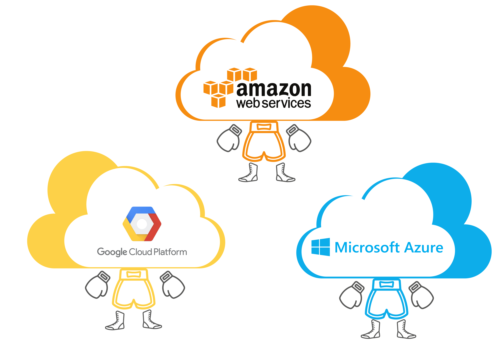
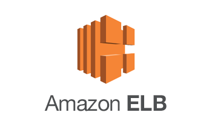
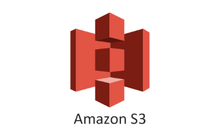

## AWS 란?

:Amazon Web Service 는 아마존에서 제공하는 클라우드 서비스

 

## 클라우드 컴퓨팅이란?

:기존의 물리적인 형태의 실물 컴퓨팅 리소스를 네트워크 기반 서비스 형태로 제공하는 것

여러분은 물리적인 컴퓨터가 없어도 100개의 컴퓨터를 사용하실 수 있습니다.

 

## AWS의 주요 서비스

1. Amazon Elastic Compute Cloud(**EC2**)
   - 가상 서버 자원을 제공하는 서비스, 이때 하나의 가상 서버 자원은 인스턴스(instance)로 분류되며, AMI(Amazon Machine Image)라고 부릅니다.
 

2.  AWS Elastic Load Balancing(**ELB**)
   - 트래픽 로드 밸런싱 서비스, EC2의 앞에 위치 시키고 여러개의 EC2 인스턴스에 대해 트래픽을 분산해 줍니다.
 

3. Auto Scaling(**ASG**)
   - CPU 또는 메모리 등의 사용량에 따라 EC2 인스턴스의 개수를 자동으로 증설/축소 하는 서비스입니다. 
 

4. Amazon Simple Storage Service(**S3**)
   - 온라인 스토리지 서비스입니다. 
 

## AWS 무료 서비스 - Free Tier

- AWS는 처음 가입 후 12개월 동안 주요 서비스에 대한 무료 서비스를 제공합니다.

- 주요 서비스에 대해 기본적인 테스트와 블로그 같은 작은 서비스 운영이 가능합니다.

  - EC2 서버: 원 750시간 t2.micro 운영 가능 
  - S3 스토리지: 5GB (다운로드 2만회, 업로드 2천회)

- 여러분이 사용 중 프리 티어를 초과하지 않으면 이용 요금이 부과되지 않습니다.

- 해당 세미나는 프리 티어를 초과하지 않습니다.

STEP 1. [AWS 기초 개념](https://github.com/jominjimail/ausg/blob/master/hands_on/load_balance_full_understand/step1.md)

STEP 2. [EC2](https://github.com/jominjimail/ausg/blob/master/hands_on/load_balance_full_understand/step2.md)

STEP 3. [ELB]()

STEP 4. [CLImode_S3](https://github.com/jominjimail/ausg/blob/master/hands_on/load_balance_full_understand/step4.md)

