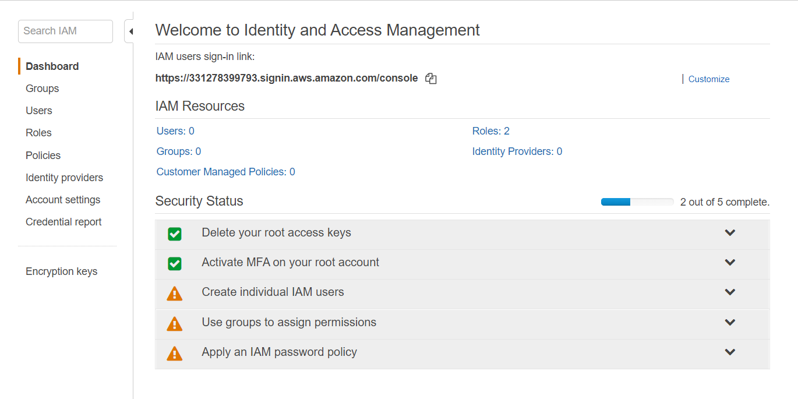

시작하기전에,

## 보안 설정 

서버에서는 보안이 굉장히 중요하다. 그래서 2중 보안을 설정해주는게 좋다.

*저희는 MFA를 이용해서 2중 보안을 설정해줄 것입니다.

1. AWS services 검색란에 **IAM** 이라고 검색한다. 
2. Security Status는 현재 보안 상태를 나태내준다. (여러분은 2번째가 초록색이 아닐것입니다.)

3. 2번째란에 있는 **Activate MFA on your root accut** 를 클릭한다.
4. **Manage MFA** 를 클릭한다.
5. **Activate MFA** 를 클릭한다.
6. 디폴트인 **Virtual MFA device** 가 체크되었는지 확인하고 **Comtinue ** 를 클릭한다.
7. 아이폰, 안드로이드 모두 호환된다. App store 에서 **Google Authenticator** 앱을 다운로드한다.
8. 앱을 실행하고 **설정 시작하기** 를 클릭한다.
9. **바코드 스캔** 을 클릭후 QR 코드를 스캔해준다. 
10. 앱에 나타난 6자리 번호를 **3. Type two conse... MFA code 1** 에 적어준다. 곧바로 새로 지정된 6자리 번호를 **MFA code2** 에 적어주고 **Assign MFA**를 클릭한다.
11. **You have successfully assigned virtual MFA** 문구를 확인했다면 성공한것이다. 
12. Security Status를 다시 살펴보면 초록색 박스가 2개 생겼다. 

로그아웃하고 다시 로그인을 해보자 비밀번호 입력후, MFA 코드도 입력해야 로그인을 할 수 있다.

## AWS 기초 개념

1. **Region**  지역이란?

   전 세계에 아마존 컴퓨터가 있는데 각 지역마다 가격이 다르고 속도도 다르다. 지역을 선택하는것은 굉장히 중요한 문제이다. 가장 가까운 Asia Pacific(Seoul)이 100ms로 가장 빠르고 가장 먼 US-West(Oregon)이 573ms로 가장 느리다. 

   [전세계 아마존 컴퓨터 속도 확인 해보기](http://www.cloudping.info)

2. **availability zone** 가용영역 이란?

   각 Region마다 건물이 한 개라고 하자 자연재해로 인해 건물이 부셔져서 cloud 데이터가 망가졌다. 이런 불상사를 막기 위해 백업을 해준다. az1, az2 같이 여러 건물을 두고 이 건물 사이에는 인터넷 보다 더 빠른 전용선으로 직접 연결되어 있다. 데이터를 굉장히 빠르게 주고 받아서 마치 az1과 az2가 같은 데이터를 

   > 같은 지역 (ex. Tokyo)에 있는 az_tokyo1 과 az_tokyo2는 데이터를 주고 받을 수 있지만 다른 지역끼리(ex. Tokyo 와 Oregon)는 데이터를 주고 받을 수 없다. 불가능한건 아니지만, 인터넷을 통해 *느리게* 전달 받을 수 있다.
