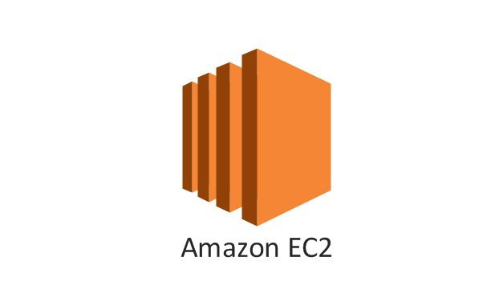 

## EC2 생성해보기

아마존 웹서비스에서 가장 먼저 생긴 서비스이고 가장 많이 사용되는 서비스이다.

독립적인 컴퓨터를 할당해주는 서비스이다. 컴퓨터 한 대를 instance 라고 생각하면 된다.

1. AWS services 검색란에 **EC2** 라고 검색한다. 

2. 오른쪽 상단에서 Region을 **Tokyo** 로 설정해준다. 

3. 왼쪽바에서 **Instances** 를 클릭한다. 

4. **Launch Instance** 를 클릭한다.

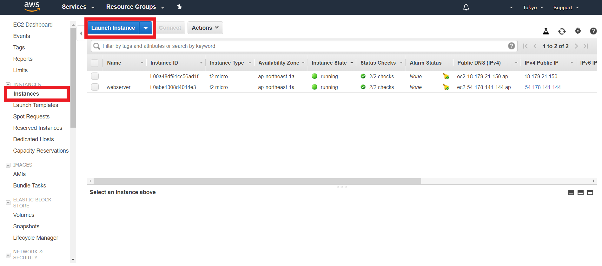 

   *Step1* 스크롤을 내려 **Ubuntu Server 18.04 LTS(HVM)..** 을 **Select** 해준다

   *Step2*  Free tier eligible 표시된것만 무료로 제공하고 이것 외 나머지는 클릭하는 순간부터 과금이 발생한다. **t2.micro** 는 1개의 cpu와 1GB의 메모리를 가지고 있다. **Next: Configure Instance..** 을 클릭한다.

   *Step3* **Number of instances** 는 몇개의 컴퓨터를 만들것인가를 나타낸다. 우리는 1개를 만들것이다. 그대로 두고 **Next:Add Storage** 을 클릭한다.

   *Step4*  **Size** 가 **8** 임을 확인하고 **Next:Add Tags** 을 클릭한다.

   *Step5* 해당 instance가 어떤 역할을 하는지 누가 관리하는지를 적어놓는 곳이다. **Add Tag**를 클릭하고 Key값에 **Name**  Value값에 **Webserver** 을 적어준다. **Next: Configure Security Grop**을 클릭한다.

   *Step6* 방화벽과 같은 역할을 하는 부분이다. 해당 instance에 접근가능한 port를 명시해주는것이다. **Assign a security grop** 중 **Create a new security grop** 이 체크되있는걸 확인하고 **Security group name** 을 **web** , **Description**을 **for web**이라 적어준다.

   우리는 web 서버를 만들것이므로 **Type**에서 **HTTP**를 클릭하고 **Source** 부분은 **Anywhere**을 추가해준다.

   *Step7* 최종적으로 문제가 있는지 없는지 확인을 하고 **Launch**를 클릭하면 된다.

   - **Select an exising key pair...** 창이 뜬다. 이것은 해당 instance에 네트워크를 통해 접속했을때 사용할 비밀번호를 지정하는것이다. 서버는 매우 중요하기때문에 간단한 비밀번호를 지정하면 안된다. **Choose an existing..**을 클릭해 **Create a new key pair**을 선택한다.
   - **Key pair name** 은 간단하게 **aws_pwd** 라고 지정해준다. **aws_pwd.pem** 이라는 파일이 다운받아 진다. 이 비밀번호를 절대 잃어버리지 않도록 조심한다. aws는 비밀번호 파일을 단, 한번만 준다고 한다. **Launch Instances**을 클릭한다.

   *Step8*  뱅글뱅글 조금만 기다리면 **instance State** 가 pending에서 running으로 바뀌고 instance생성이 완료되었다.  

## EC2 instance에 접속해보기

#### 1. 맥에서 접속해보기

   - 생성한 instace 에 왼쪽 클릭을 하면 **Connect** 가 나온다. 클릭한다.

   - terminal을 킨다.

   - 다운로드 파일에 aws_pwd_pem.txt 파일이 있는지 확인한다. 이 파일은 중요한 파일이기에 따로 관리해준다. 도큐먼트에서 dev라는 폴더를 새로 만들고 그 안에 key라는 폴더를 만들어 aws_pwd_pem.txt파일을 옮겨준다. *.txt는 지워준다. 지워도 상관없다.

   - terminal에서 해당 파일이 있는곳으로 이동한다. $cd ....Documnets/dev/key

   - $sudo chmod 400 aws_pwd.pem

   - 파일을 보면 **-r--------@** 로 변경된걸 볼 수 있다.

   - $ssh -i "aws_pwd.pem" ubuntu@ec2-18-179-174-191.ap-northeast-1.compute.amazonaws.com

   - **Welcome to Ubuntu 18.04.1 LTS.....** 을 확인하면 접속이 완료된것이다.

   - 이 후로 내리는 모든 명령어는 여러분의 컴퓨터에 적용되는게 아니라 aws cloud에 올라가있는 컴퓨터에 적용되는 것이다.

   - 접속을 끊고 싶으면 $exit 을 하면 된다.

#### 2. window에서 접속해보기

   - window는 ssh가 내장되어 있지 않기때문에 프로그램을 따로 깔아야 한다.

   - xshell 을 설치한다. [설치링크](https://www.netsarang.co.kr/download/down_form.html?code=612) 설치는 굉장히 빨리된다.

   - 생성한 instace 에 왼쪽 클릭을 하면 **Connect** 가 나온다. 클릭한다.

   - 다운로드 파일에 aws_pwd_pem.txt 파일이 있는지 확인한다. 이 파일은 중요한 파일이기에 따로 관리해준다. (C)에서 dev라는 폴더를 새로 만들고 그 안에 key라는 폴더를 만들어 aws_pwd_pem파일을 옮겨준다.

   - 왼쪽 상단에 새로 만들기 (Alt+N)을 클릭한다.

   - **Connect** 4번에 있는 Public DNS 정보를 **호스트**에 적어준다.

     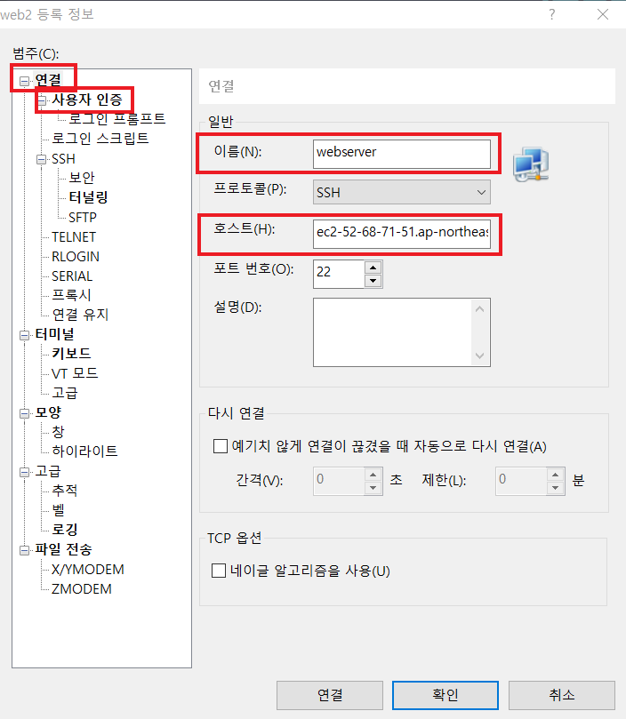

   - 왼쪽 범주에서 **사용자 인증** 을 클릭하고  **방법**은 **Public Key** 선택,  **사용자 이름**은 **ubuntu** 로 적어준다. **사용자 키**는 **찾아보기** 를 클릭해 >**가져오기**>**aws_pwd.pem** 파일클릭>**확인** , 암호는 적어주지 않는다. **확인** 클릭

     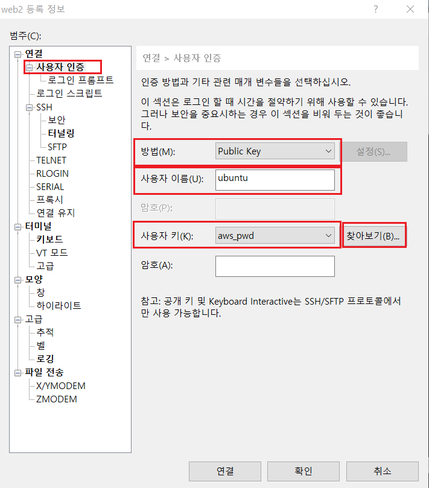

   - 세션관리에서 **web server** 을 더블클릭하면 **알 수 없는 호스트 키** 창이 뜬다. **수락 및 저장(S)** 을 클릭한다. 

   - **Welcome to Ubuntu 18.04.1 LTS ...** 을 확인하면 접속이 완료된것이다.

   - 이 후로 내리는 모든 명령어는 여러분의 컴퓨터에 적용되는게 아니라 aws cloud에 올라가있는 컴퓨터에 적용되는 것이다.

   - 접속을 끊고 싶으면 $exit 을 하면 된다.

## EC2에 아파치 설치

- terminal or xshell을 이용해서 해당 instance에 접속한다.
- $sudo apt-get update
- $sudo apt-get install apache2
- *** Starting web server apache2 ** 를 확인하면 설치가 완료된것이다.
- 잘됐는지 확인하기 위해 접속을 해보자 
  - 해당 instance를 클릭하면 아래 부분에 **Description** 항목을 볼 수 있다. 
  - 이중 **IPv4 Public IP or Public DNS(IPv4)** 를 복사해서 새창에 띄워보자
  - 아래와 같은 화면이 나오면 설치가 잘 된것이다.
  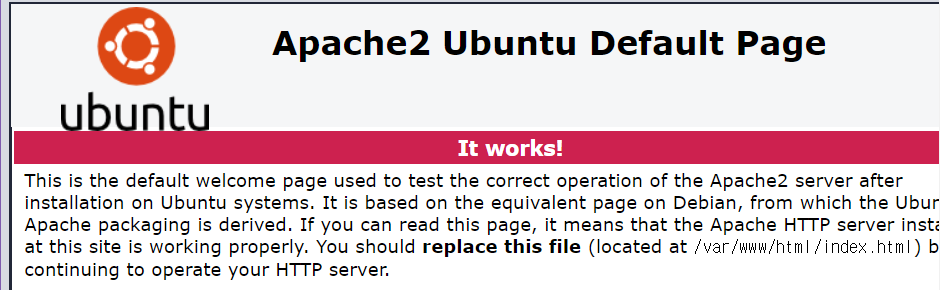 
  
  - 해당 페이지는 /var/www/html 에 있는 index.html파일이다. 
  - 이파일을 지우면 $sudo rm index.html
  - 재 접속시 파일이 없기때문에 아래와 같은에러페이지가 뜬다.
  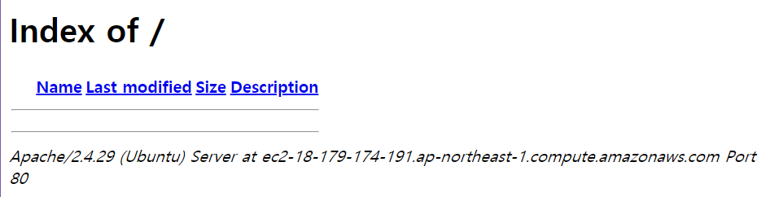
  
  - $sudo nano index.html 
   
  
  - 새로운 파일을 생성해주고 저장 후, 나온다.
  - 재 접속을 시도하면 아래와 같은 페이지가 뜬다.
   
  

## AMIs

사실 'EC2 생성해보기' 과정에서 

(Step1* 스크롤을 내려 **Ubuntu Server 18.04 LTS(HVM)..** 을 **Select** 해준다) 

이 부분은 AMI를 선택하는 부분이다. 

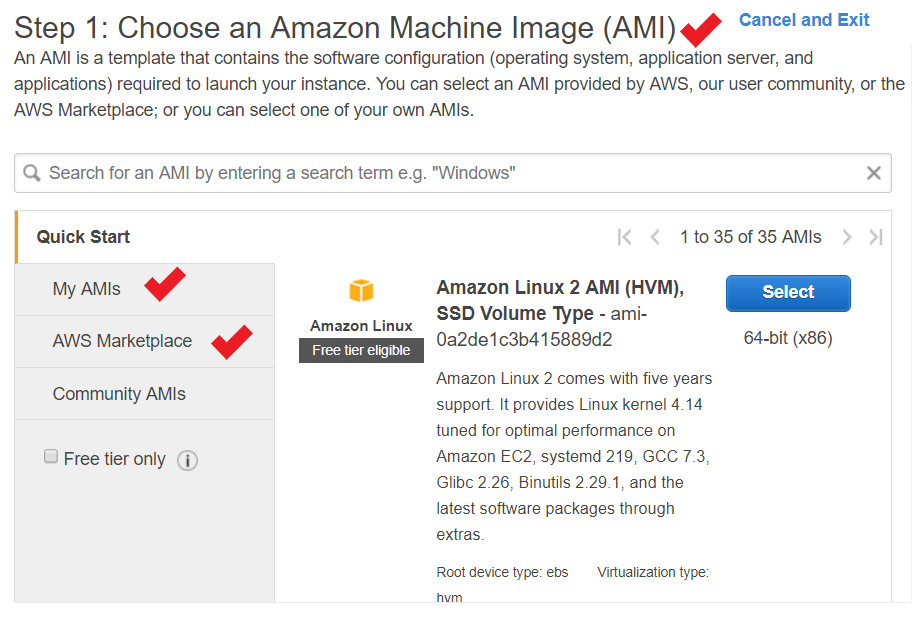 

> AMI란, 미리 만들어둔 아마존 가상 머신의 이미지입니다. AWS의 경우 EC2 인스턴스를 만들때 완전히 빈 가상 컴퓨터를 만드는 것이 아니라, 빈 가상컴퓨터에 최소한 이미 만어진 OS가 설치 되어 있는 이미지를 설치하도록 되어 있습니다.

유저가 직접 만든 MY AMIS를 선택할 수도 있고, 타 유저들이 만든 AMI도 AWS Marketplace를 통해  유/무료로 구입하여 설치 할 수 있다.

#### AMI 만들어보기

1. 이미지를 만들 instance를 오른쪽 클릭
2. **Image** 클릭
3. **Create Image** 클릭
4. **Image name** 작성 ex) Webserver_20181125
5. **Image description** 작성 ex) Web server image
6. **Create Image** 클릭
7. **IMAGES > AMIs** 에서 **avaliable**을 확인할 수 있다.

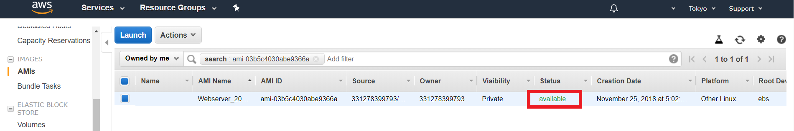 

> 주의할 점: image를 만드는 동안은 해당 instance가 일시정지된다. 일시적으로 web application이 동작하지 않는다. 서버이기에 반드시 알고 있어야 한다. 

#### AMI 로 instance 만들어 보기

1. 해당 image에서 오른쪽 클릭
2. **Lanch**클릭
3. 이 후는 (EC2 생성해보기)와 동일한 과정을 거친다.
4. 다만, (*Step6* 방화벽과 같은 역할을 하는 부분이다.) 과정에서  **Select an existing security group** 을 선택해 기존에 만들었던 보안그룹을 사용한다. (꼭 안그래도 된다. 하지만 이번 핸즈온에서는 기존의 그룹을 선택해주세요.)

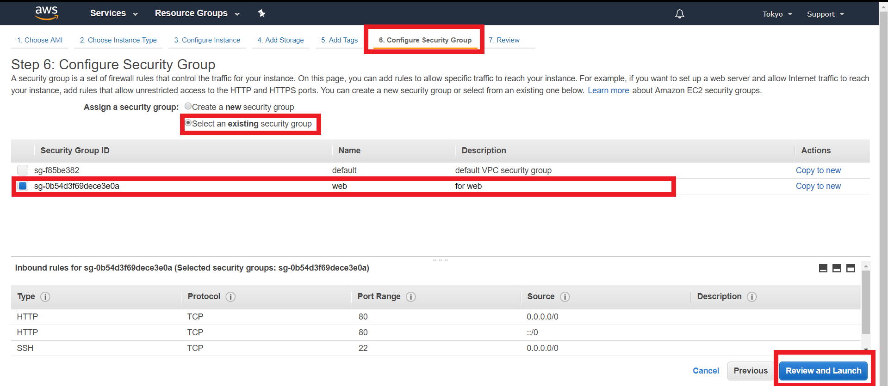 

여기까지의 상태

2개의 동일한 instance가 생성되었다.

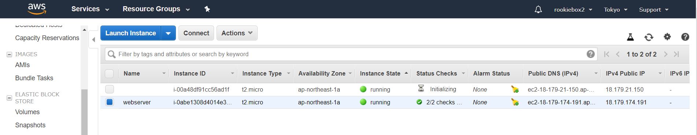 

## Elastic IPs란?

  : 동적 클라우스 컴퓨팅을 위해 고안된 고정 IPv4 주소 입니다. 

이게 무슨 소리일까요. 동적 클라우드는 무슨소리이고 고정 IP는 무슨소리일까요 

이를 이해하기 위해 상황을 가정해봅시다.

#### 상황 가정하기

1. webserver의 IPv4 Public IP는 54.238.241.74입니다. (제 컴퓨터 기준)
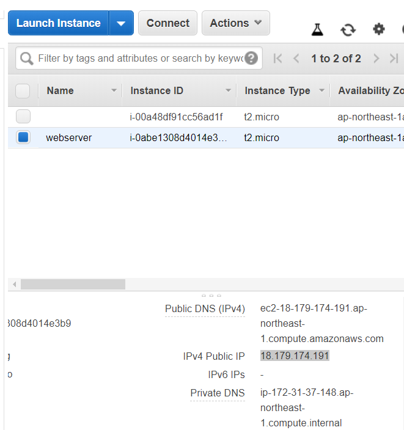 

2. 해당 instance에서 오른쪽 클릭
3. **Instance State** 클릭
4. **Stop** 클릭 (stop을 하는 순간 요금이 발생하지 않습니다. 말그대로 stop하는겁니다.)
5. **stopping >> stopped** 을 확인하고
6. 다시 >instance 오른쪽 클릭 > Instance State 클릭 >  **Start** 클릭
7. 앗, webserver의 IPv4 Public IP가 18.179.61.240로 변경되었습니다.
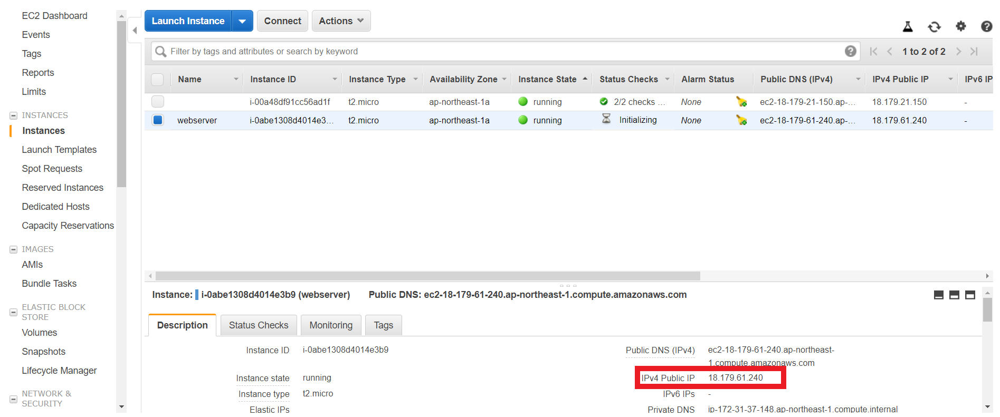 

8. 더이상 기존 IP로 (18.179.174.191) 접속이 불가능합니다.
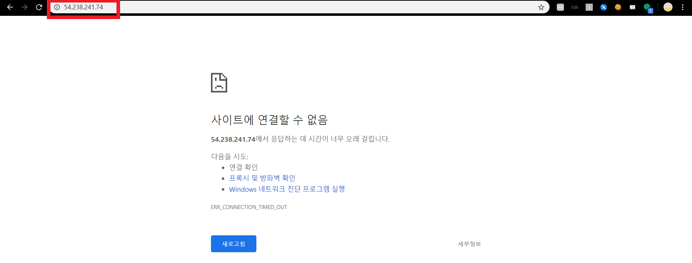 

왜 이렇게 만들었을까요? 서버의 경우 ip가 계속 변하면 사용자들이 엄청 불편한데 말이죠.

- ip의 고갈 문제때문에 이런 설정이 해줬습니다. 
- 그럼 계속 ip가 바꿔나요? 고정안되나요?
- 고정 ip를 원한다면, Elastic IP 서비스를 사용하면 됩니다.

#### Elastic IP 할당받기

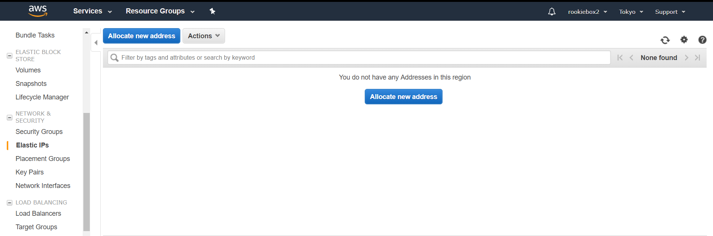

- **Elastic IPs** 클릭
- **Allocate new address** 클릭
- **Allocate**클릭
- **Close**클릭
- 저는 18.182.22.89 ip를 할당 받았습니다.

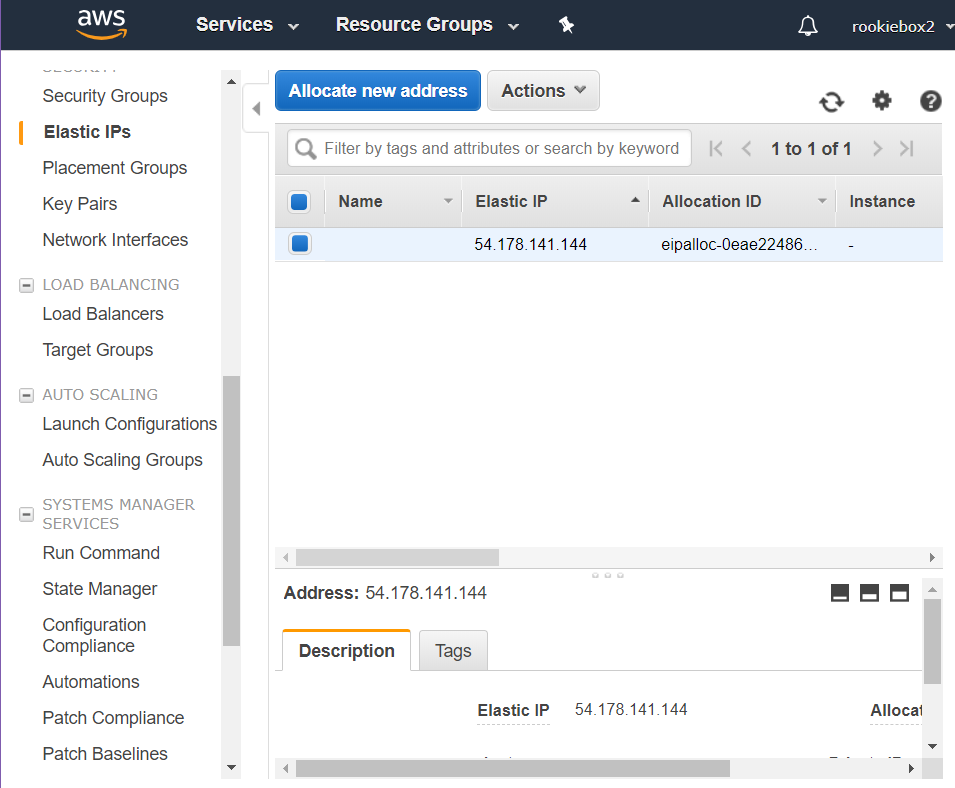

- 해당 elastic ip에 오른쪽 클릭
- **Associate address** 클릭
- **Instance** 란에 webserver 선택해주기
- **Associate**클릭
- **Close**클릭

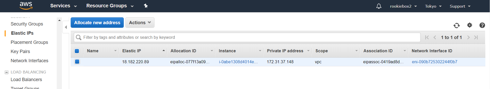

- webserver 인스턴스의 **Description**을 보면 **Elastic IPs** 가 추가되있는걸 확인할 수 있습니다.

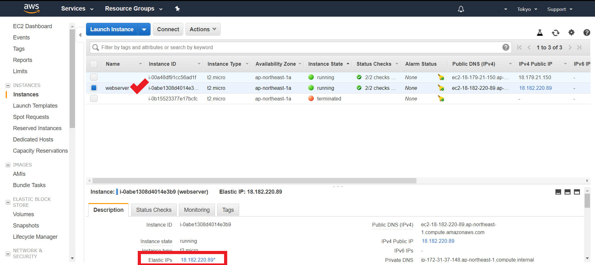

- '상황 가정하기'부분을 다시 해봅니다.
- 이제는 ip가 변하지 않습니다. 

> 주의 : 해당 서비스는 유로 서비스입니다. 하지만, 한 개의 Elastic ip를 할당받아 한 개의 instacne에 연결하는거 까지만 무료 입니다. 즉, 위 실습은 무료 입니다.

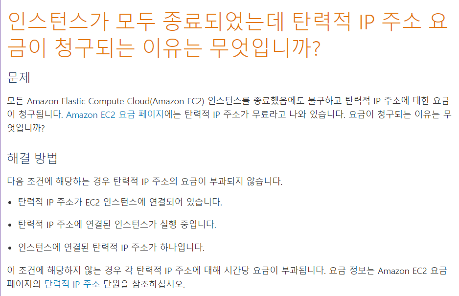

[STEP 3](https://github.com/jominjimail/ausg/blob/master/hands_on/load_balance_full_understand/step3.md)
