## ELB

:Elastic Load Balancing은 들어오는 애플리케이션 트래픽을 Amazon EC2 인스턴스, 컨테이너, IP 주소와 같은 여러 대상에 자동으로 분산시킵니다.

ELB는 3 가지 유형의 로드 밸런서를 지원합니다.

- Application Load Balancer
- Network Load Balancer
- Classic Load Balancer

저희는 마지막, Classic Load Balancer를 다룰것 입니다.

## Load Balancer란?

우선, 왜 Load Balancer가 필요할까?

clinet가 한 두명인 경우 시스템은 아래와 같이 동작한다.

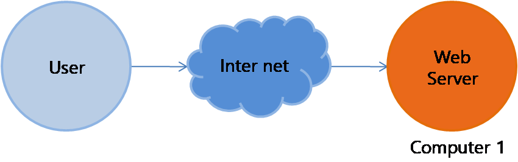 

하지만, clinet가 수천만명이라면? server는 모든 사람들의 응답을 해주려고 노력하지만 결국엔 파업을 한다. 멈춰버린다.

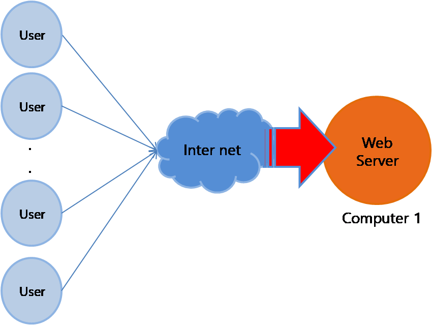

그럼, 서버의 파업을 막기위해 어떻게 해야할까?

- Scale-up: Server가 더 빠르게 동작하기 위해 HW성능을 올리는 방법
- Scale-out: 하나의 server 보다는 여러 대의 server가 나눠서 일을 하는 방법

scale-up은 한 대의 컴퓨터의 HW성능을 올리는것이라, 유지보수가 쉬운편이다. 하지만 금전적, 기술적 한계가 있다. 

*AWS에서는 클릭 몇번으로 scale-up이 가능하다. 이 과정을 실습하다 과금이 나온바람에 실습에서는 제외했다. [궁금하신 분들을 위한 SCALE-UP링크](https://docs.aws.amazon.com/ko_kr/AWSEC2/latest/UserGuide/ec2-instance-resize.html)*

우리는 scale-out 해결법을 사용할 것이다. 이의 장점은 무엇일까?

- 하드웨어 향상하는 비용보다 서버 한대 추가 비용이 더 적다. (현실적)
- 여러 대의 server 덕분에 무중단 서비스를 제공할 수 있습니다. (여러대의 server가 있으니 안전)

즉, 하나의 인터넷 서비스가 발생하는 트래픽이 많을 때 여러 대의 서버가 분산처리하여 서버의 로드율 증가, 부하량, 속도저하 등을 고려하여 적절히 분산처리하여 해결해주는 서비스 입니다. 

Computer 1 이 혼자 해결했던 문제를 Computer 1,6,7과 나눠서 해결하는 모습을 볼 수 있습니다.

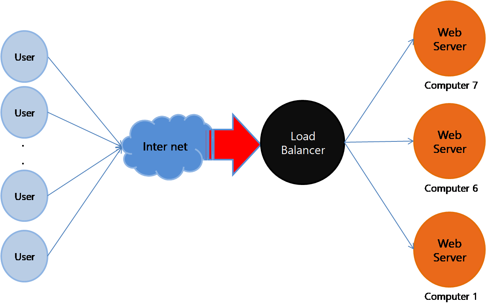

Scalue out 이라는 용어는 Web server에서만 한정해서 사용하는 용어가 아니라 여러 분야에서 사용될 수 있습니다.

아래와 같은 예시도 Scalue out의 예시입니다.

 

하지만 왜, Web server의 Scale out에는 Load Balancer 가 붙는걸까요?

> 오 눈치가 빠르시군요. 굉장히 좋은 질문입니다. 
>
> 예를 들어보겠습니다. www.naver.com을 입력하면 즉, 도메인 주소를 입력하면 컴퓨터는 알아서 ip로 바꿔서 해당 서버에 접속합니다.  
>
> Scalue-out을 통해 Web server을 2대로 만들어 clinet를 분산시켰다면 아래와 같은 그림이 나오겠죠? User1이 접속하면 Computer 8의 ip를 알려주고, User2가 접속하면 Computer 1 의 ip를 알려줍니다. 
>
> 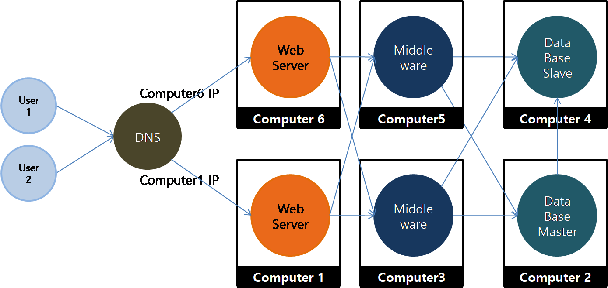
>
> ''알려준다'' 라는 자체는 서버의 셋팅입니다. (DNS 서버 셋팅) 여러분이 직접 코딩을 해서 분산시켜야한다는 것이죠 하지만, AWS의 Load Balancer 서비스를 사용하면 쉽게 셋팅할 수 있습니다.
>
> 결론, Load Balance 방법은 2가지 입니다. 
>
> 1. 직접 DNS 서버를 셋팅한다. (위 그림)
> 2. AWS의 Load Balancer를 사용한다. 

## Load Balancer 만들기

1. Ubuntu instance를 2개 만듭니다. (attack, web1)

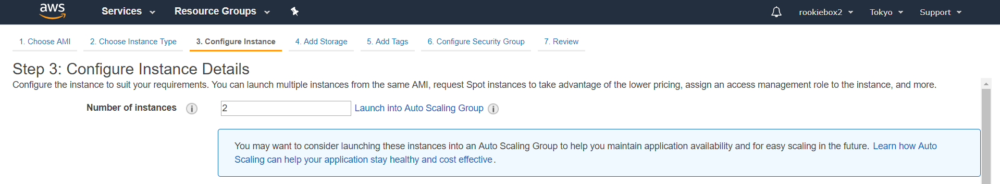

- 2개를 만들어야 하니깐 2라고 수정해줍니다.

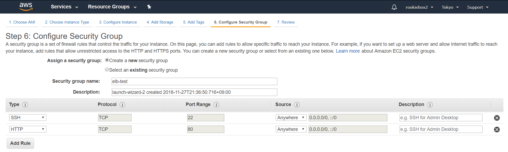

- elb-test를 새로 만들고, HTTP를 추가해줍니다. 

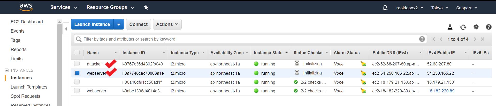

- 완성

2. web1, attack instance에 각각 접속합니다.

   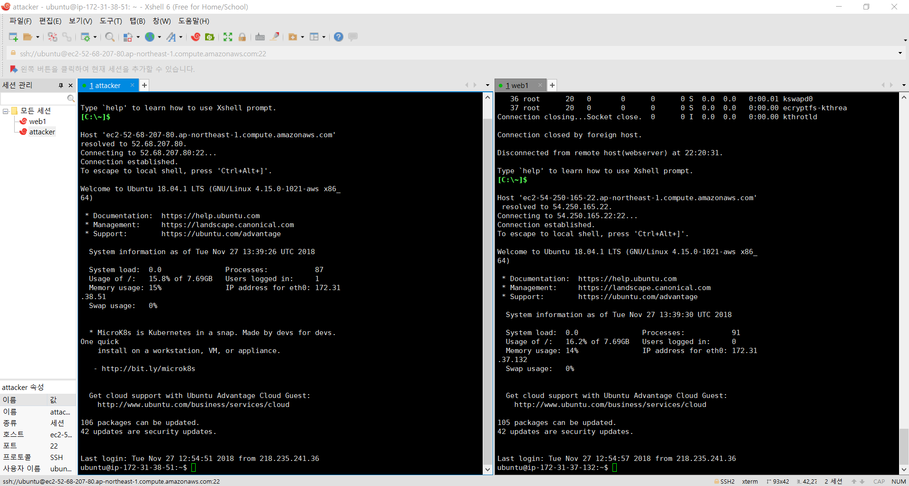

3. attack 셋팅
   - attack $sudo apt-get install apache2-utils

4. web1 셋팅

   - web1 $sudo apt-get install apache2

   - web1 $sudo apt-get install php   // 헛일 하게 만들기 위해

   - web1 $cd /var/www/html

   - web1 $sudo nano index.php

     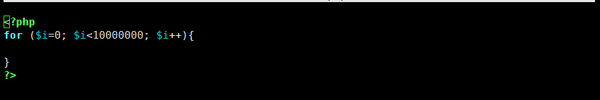

     - 저장하고 나오기

5. web1 괴롭혀보기

   - web1 $top  // CPU 점유율 확인가능

   - attack $ab -n 100 -c 1 http://**web1의 public DNS**/index.php

     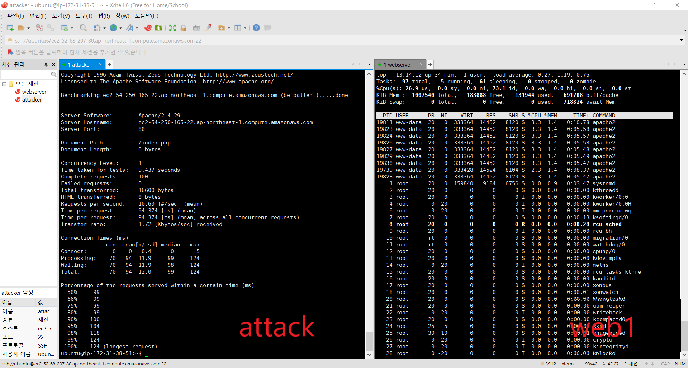

   - attack $ab -n 1000 -c 10 http://**web1의 public DNS**/index.php

     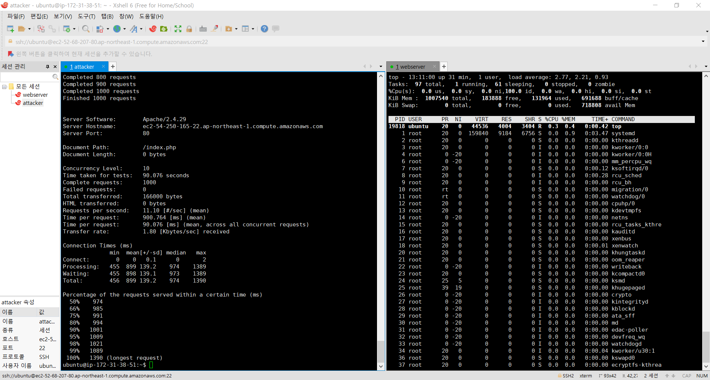

   - attack $ab -n 1000 -c 50 http://**web1의 public DNS**/index.php

     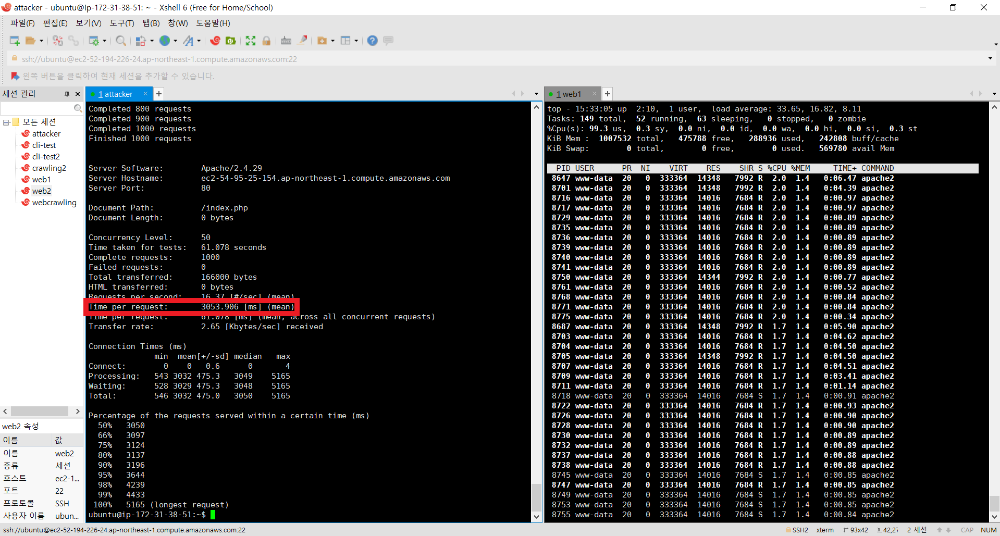

   - attack $**Ctrl+C**  // 너무 오래 걸리면 이렇게

     > 분석: Time per request를 확인하면 각각 94.374 / 900.764 / 5168.919 ms 가 걸린다. 5000 ms 는 5초이다. 

4. web2 를 만들어보자 

   - web1의 **Image**를 만들고 launch하자

   - web2의 security group은 elb-test로 web1과 동일하게 해준다.

     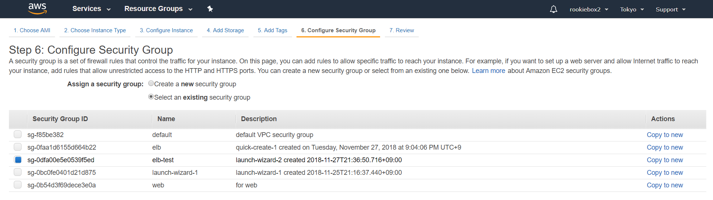

     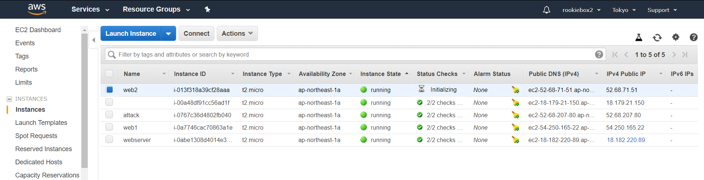

   - web2 instance에 접속하자

     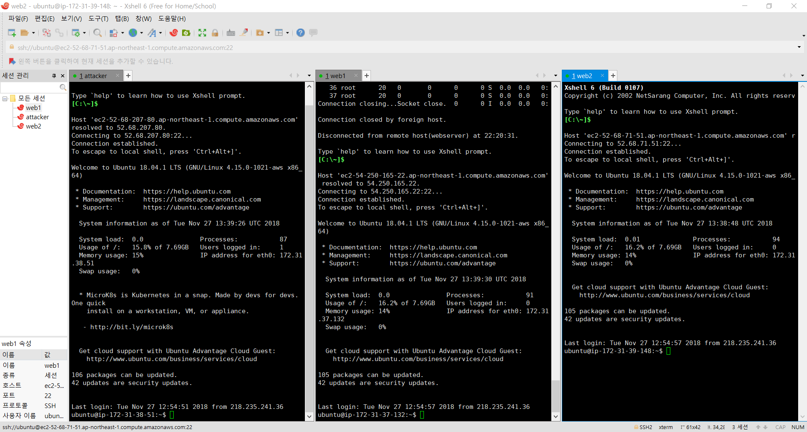

5. 이제, load balancer를 만들어 보자

   1. **Load Balancers** 클릭

   2. **Create Load alancer** 클릭

      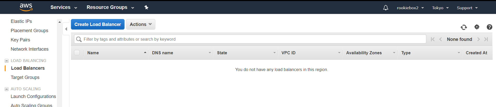

   3. 3번째 Classic Load Balancer **Create** 클릭

      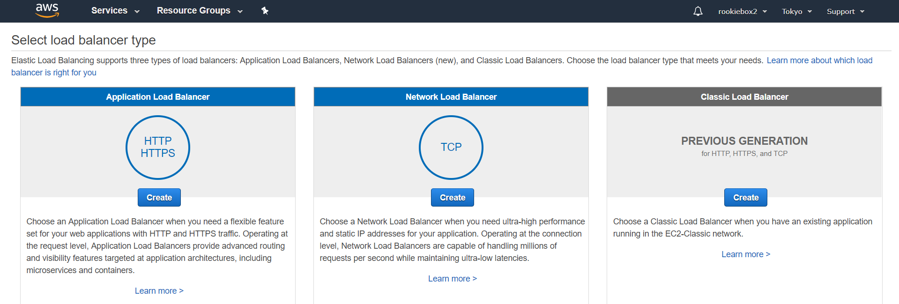

   4. name: **webserver-elb** 라고 적어주고 **Next: ..** 클릭

      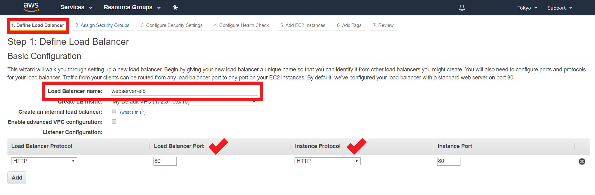

   5. **Create a new security grop** 을 클릭하고 name: **elb** 라고 적어주고 Type **HTTP**를 선택해줍니다.

      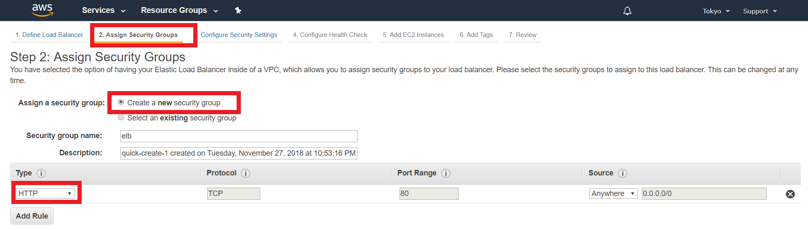

   6. 완성

      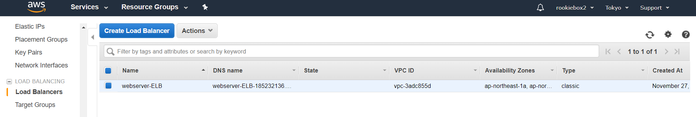

6. 만들어준 load balancer 에 web1, web2 instance를 추가

   1. **Instances** 클릭

   2. **Edit Instances**클릭

      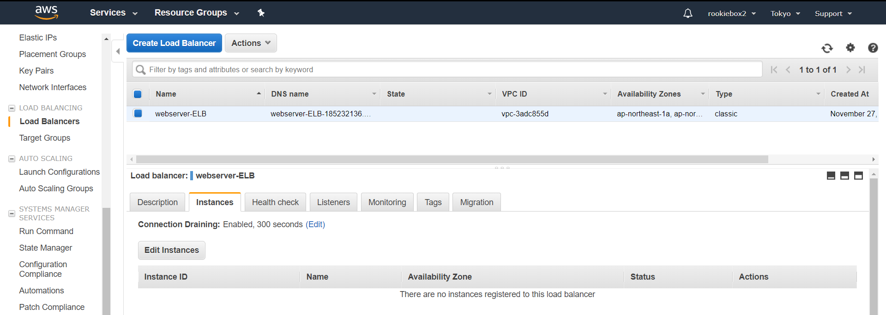

   3. web1, web2 클릭 , **Save** 클릭

      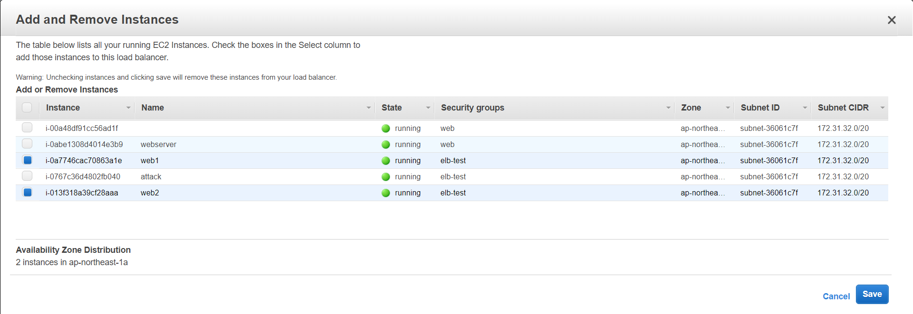

   4. Load Balancers의 DNS name으로 접속해보자

      

7. web1, web2 에 각각 접속해보자

   - web1 $sudo tail -f /var/log/apache2/access.log

   - web2 $sudo tail -f /var/log/apache2/access.log

   - web1의 Public DNS에 접속해보면 web1의 화면이 변할것이고, web2에 접속해보면 web2의 화면이 변할것이다.

     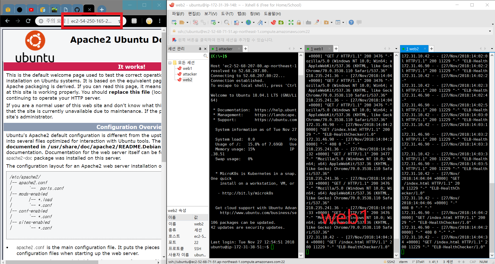

8. 과부화 상황일때 어떻게 분산시킬지 살펴보자

   - attack $ab -n 100 -c 1 http://**Load Balancer의 DNS**/index.php

     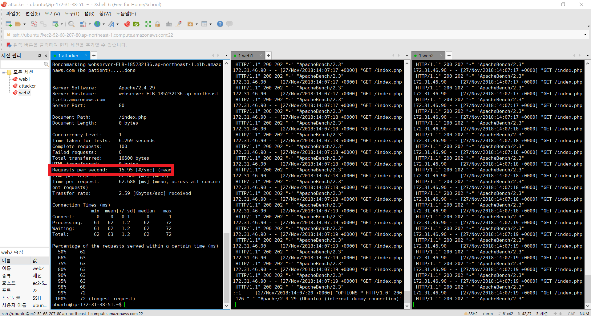

   - attack $ab -n 1000 -c 10 http://**Load Balancer의 DNS**/index.php

     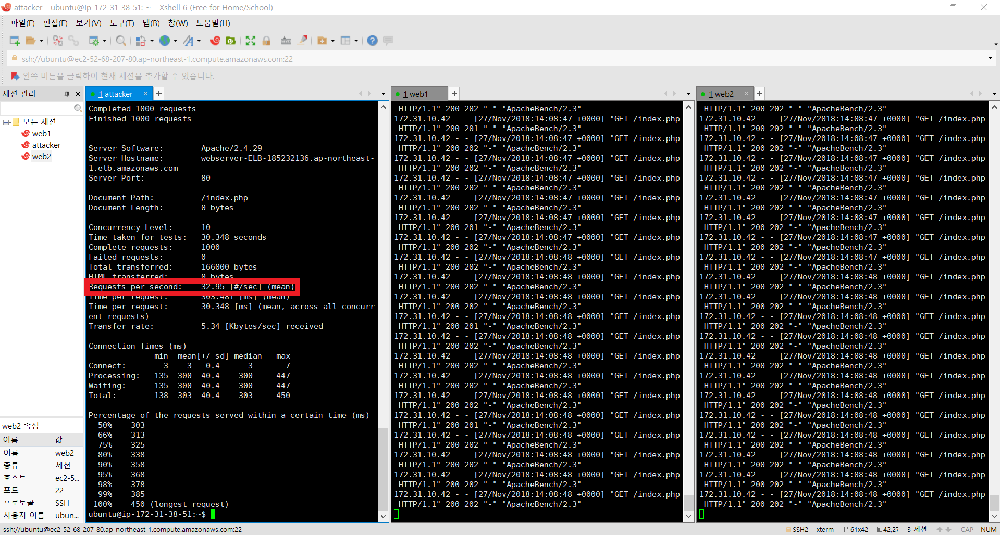

   - attack $ab -n 1000 -c 50 http://**Load Balancer의 DNS**/index.php

     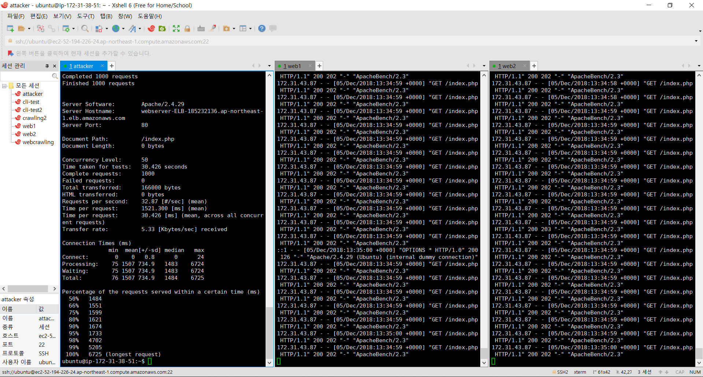

   - 확실히 빠르다. Ctrl+C 가 필요없다.

[STEP4](https://github.com/jominjimail/ausg/blob/master/hands_on/load_balance_full_understand/step4.md)
