### CLI 으로 S3 파일 업로드 다운로드

#### AWS CLI란?

CLI(Command LIne Interface)는 AWS 서비스를 관리할 수 있는 통합 도구이다.

AWS의 제어, 관리를 Command Line으로 할 수 있다.

하지만 보통 사용자들은 CLI보다는 화면상에서 버튼을 클릭하거나 드래그&드롭 할 수 있는 GUI(Graphic User Interface)에 익숙해져 있어서 어려워 보이지만 익숙해지면 나름 괜찮다. CLI를 미워하지 말자. 

#### AWS cli 설치

1. ubuntu instance를 하나 생성한다. (security grop은 web을 선택해줬다. 새로 생성해도 무관)

2. 생성한 instance에 접속한다. (terminal or Xshell)

3. ubuntu 명령어

   - $pip install --upgrade --user awscli   

     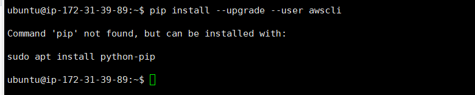 

     - 아 역시 쉬운일 하나도 없죠. recommand 대로 해봅시다.

   - $sudo apt install python-pip

     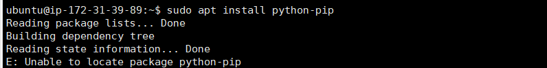 

     - ? Unable to locate packa..? 구글링을 해보니, [stackoverflow 짱](https://stackoverflow.com/questions/52394543/pip-install-problem-with-ubuntu-18-04-and-python-3-6-5)

   - $sudo add-apt-repository universe

   - $sudo apt-get update

   - $sudo apt install python-pip    

     // 여기서 python3-pip 라 치면 python3.x  버젼(pip3)입니다.저흰 2.x 버젼(pip)으로 설치했습니다.

   - $pip install --upgrade --user awscli 

   - 설치가 잘 됐는지 버젼을 확인해볼까요

   - $aws --version

     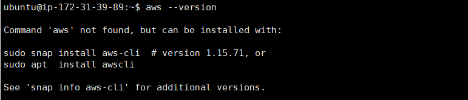 

     - 아..뭘 또 하라고하네요. 해줍니다. 여러분은 평정심을 유지해야합니다. 그래야 해요.

   - $sudo apt  install awscli 

   - $aws --version

     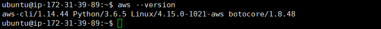 

     - 설치 완료

#### IAM 유저 생성

- 설치 완료 후 바로 사용할 수 있으면 좋겠지만, 중요한 과정인 계정 access key 셋팅+ 기타 설정 과정을 완료해야 cli를 사용할 수 있습니다. access key를 만들기 위해 IAM 유저를 생성해봅시다.

1. aws service 검색창에 **IAM** 이라고 검색

2. **Users** 클릭

3. **Add user**  클릭

   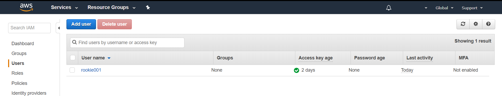 

4. name에 **user1** 이라 적어주고, **Programmatic access**  클릭

   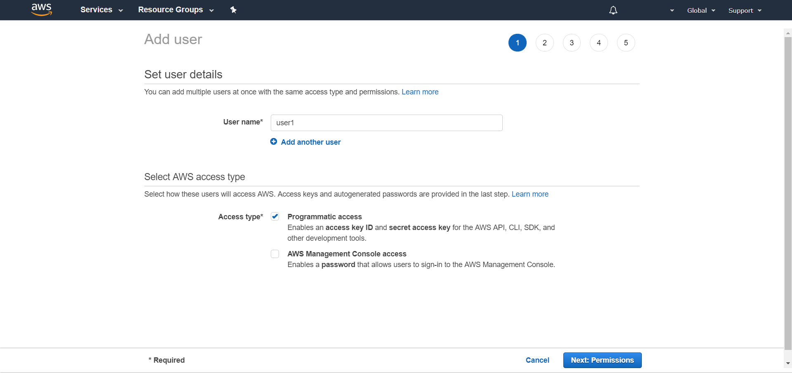 

5. **Create group** 클릭

6. Group name에 **CLImode-s3** 이라 적어주고, **s3** 검색 후 **[AmazonS3FullAccess]**체크, **Create group** 클릭

   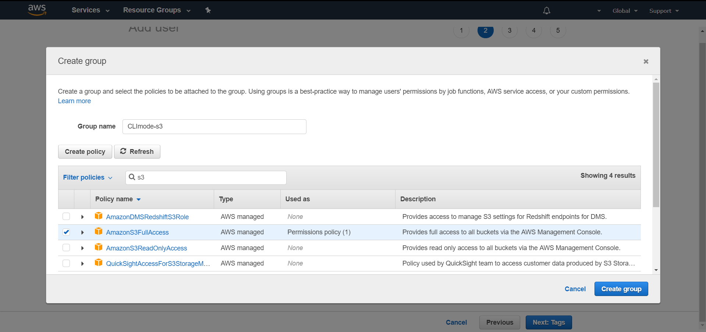 

7.  방금생성한 group 클릭 후, **Next**클릭

   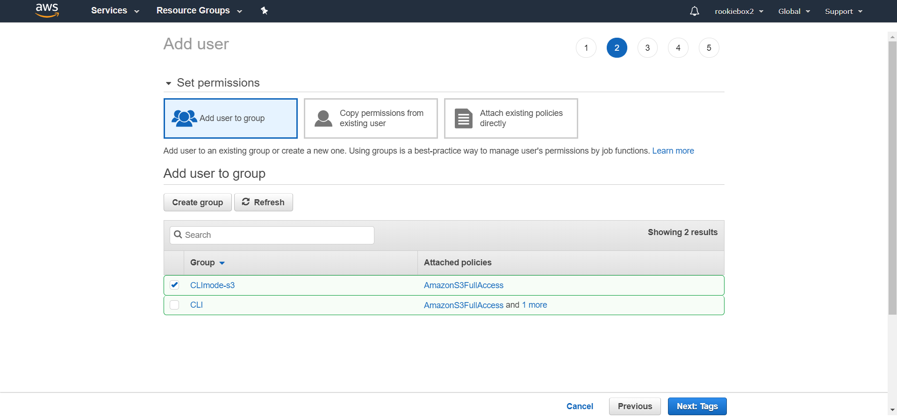 

8. **Next**

9. **Create User** 클릭

10. **Download.csv** 다운받기 (꼭)

    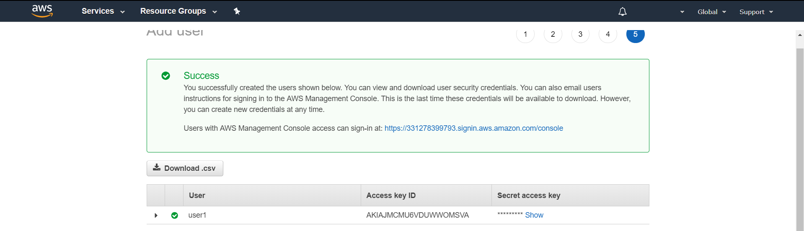 

#### user1 으로 s3에 접속하기

- terminal 임, 다운로드한 .csv 파일 참고하기

1. $aws configure

2. AWS Access Key ID [None]:  **.csv 에 있는 Access key ID 입력**

3. AWS Secret Access Key [None]:  **.csv 에 있는 Secret access key 입력**

4. Default region name [None]: **ap-northeast-1**  // tokyo region임 

   [다른 region이름 참고](https://docs.aws.amazon.com/ko_kr/AWSEC2/latest/UserGuide/using-regions-availability-zones.html)

5. Default output format [None]: **걍 엔터**
6. $aws s3 help // man page 입니다.

1. aws 에서 s3 저장소를 bucket 이라고 합니다. bucket을 생성해봅시다.

- $aws s3 mb s3://ausg-test

  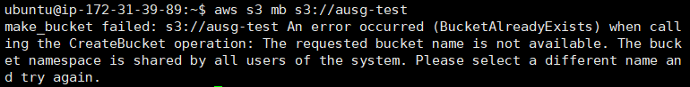 

- 주의: 같은 region에 있는 모든 bucket의 이름은 중복되면 안됩니다. 누가 이미 ausg-test를 사용했네요. 저는 *aust1977-tset*로 만들어줬습니다.

   

2. 업로드를 해봅시다. 

- 업로드를 하기전에 업로드 할 파일을 생성해봅시다.

- $sudo nano test.txt // 내용입력 후 저장, 나오기

  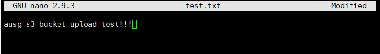 

- $aws s3 cp test.txt s3://**각자 bucket 이름**

3. 잘 올라갔는지 확인 해봅시다.

- aws service 검색창에 **s3** 라고 검색

  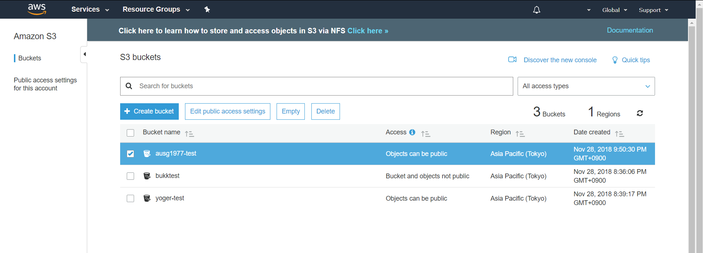

   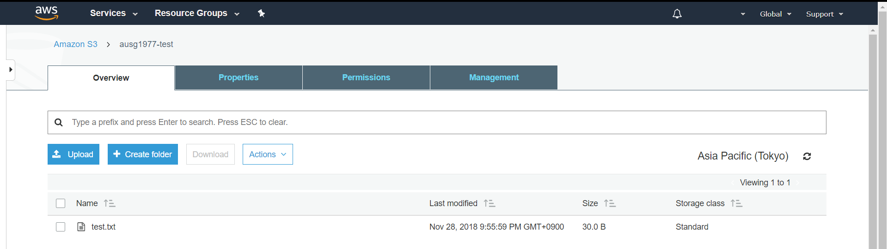 

4. GUI 상 파일을 업로드 해보고 CLI에서 다운로드 받아 봅시다. 

   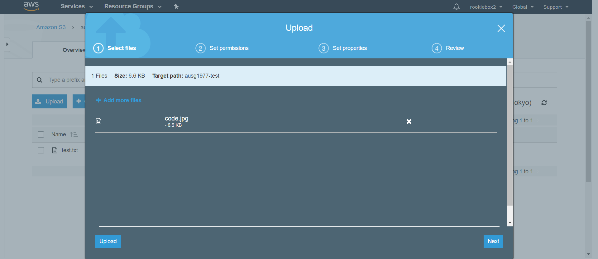 

5. 올라간 파일을 CLI에서 확인해봅시다.

- $aws s3 ls s3://**각자 bucket 이름**

  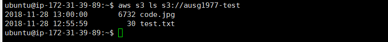 

6. 다운로드 해봅시다.

- $aws s3 cp s3://**각자 bucket 이름**/**해당 bucket에 업로드한 파일이름** ./

- $ls -l

  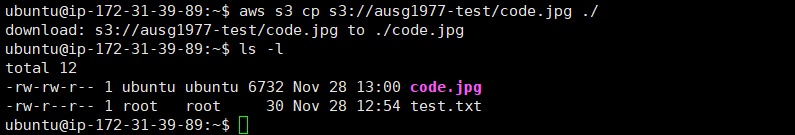 

